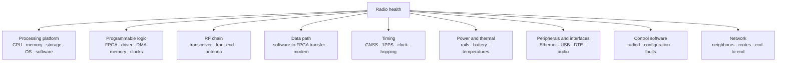
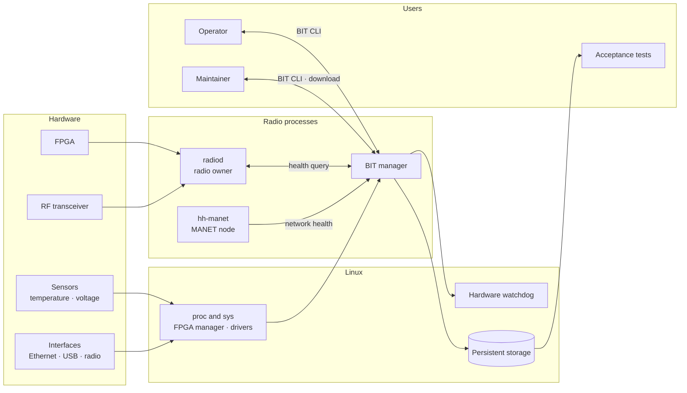
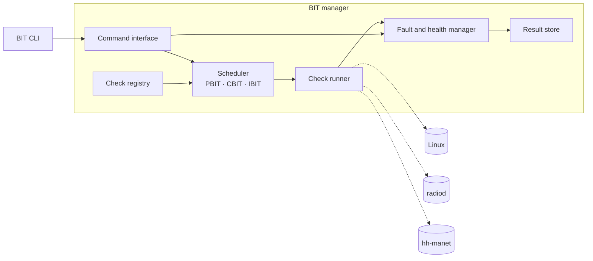
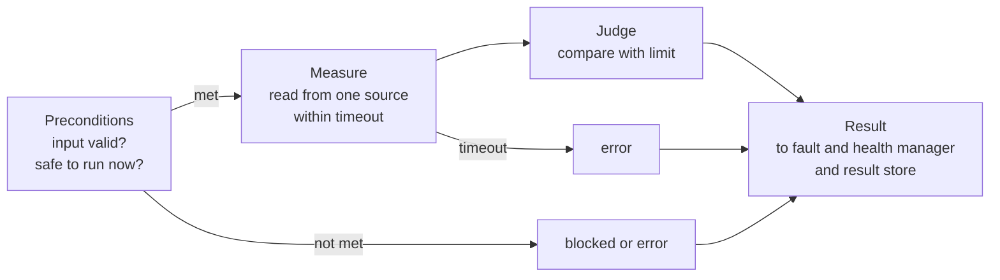
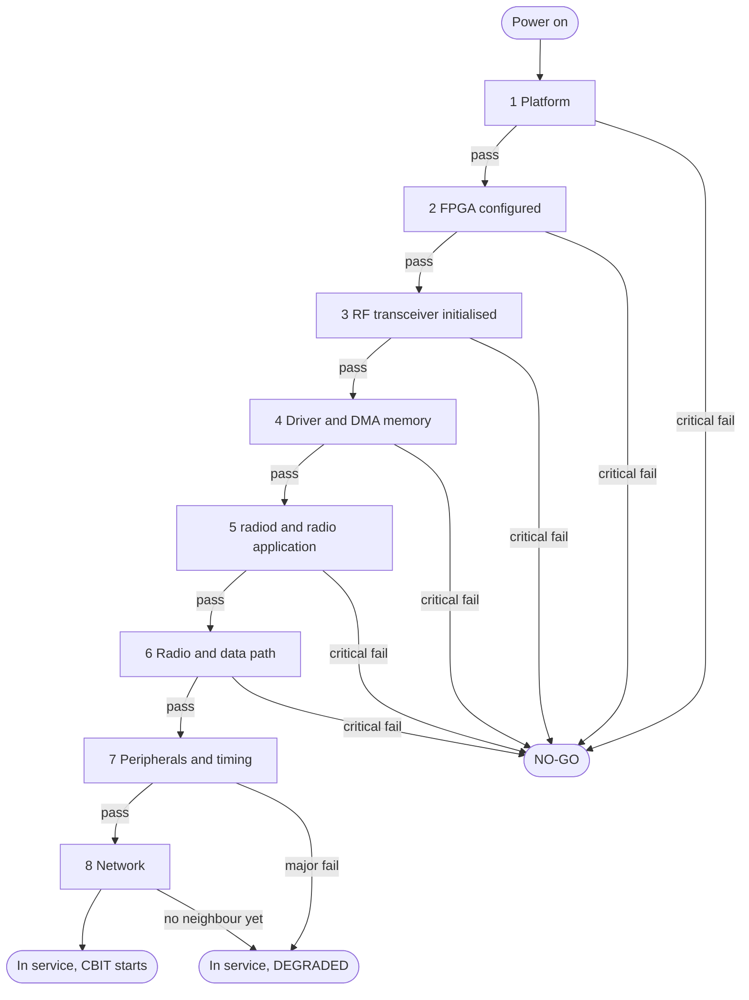
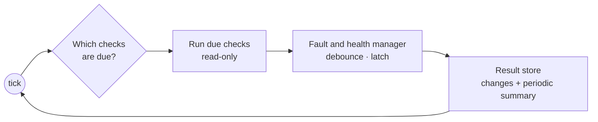
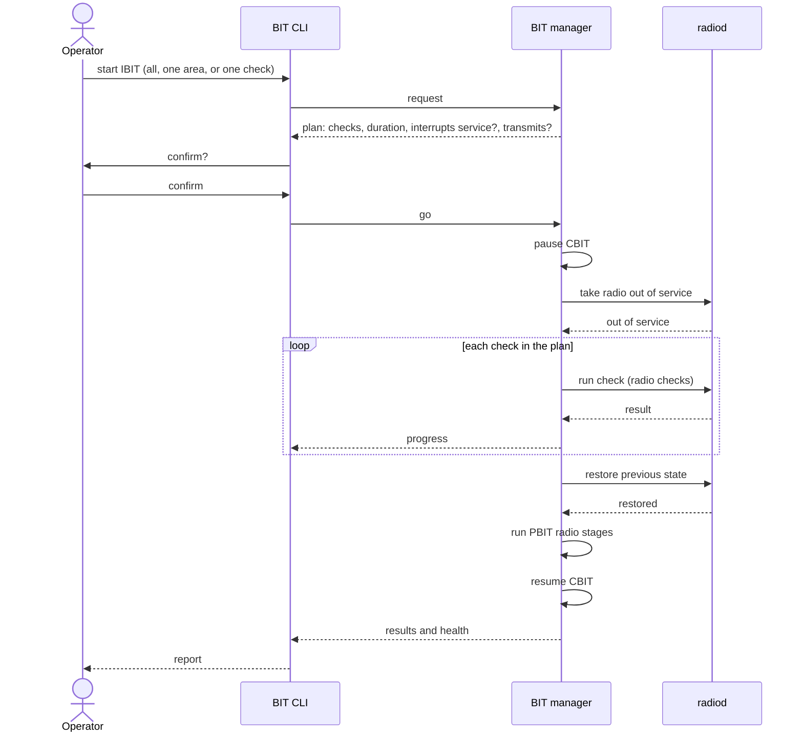
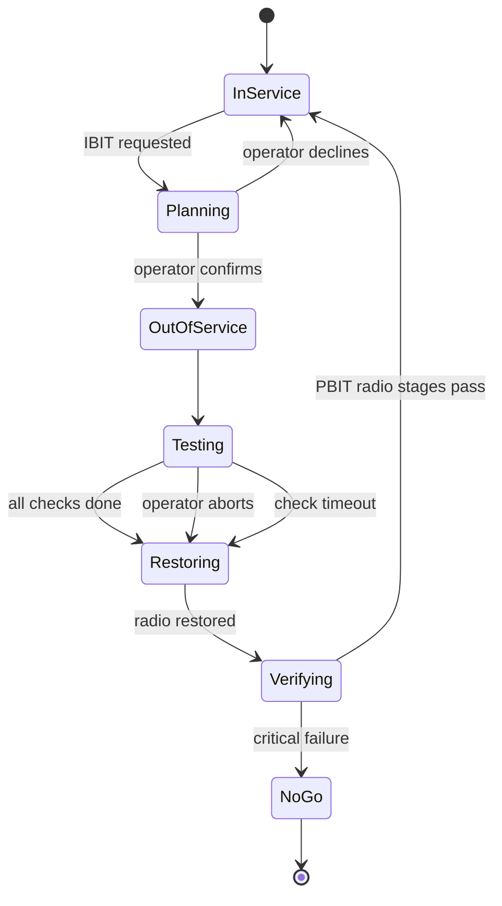
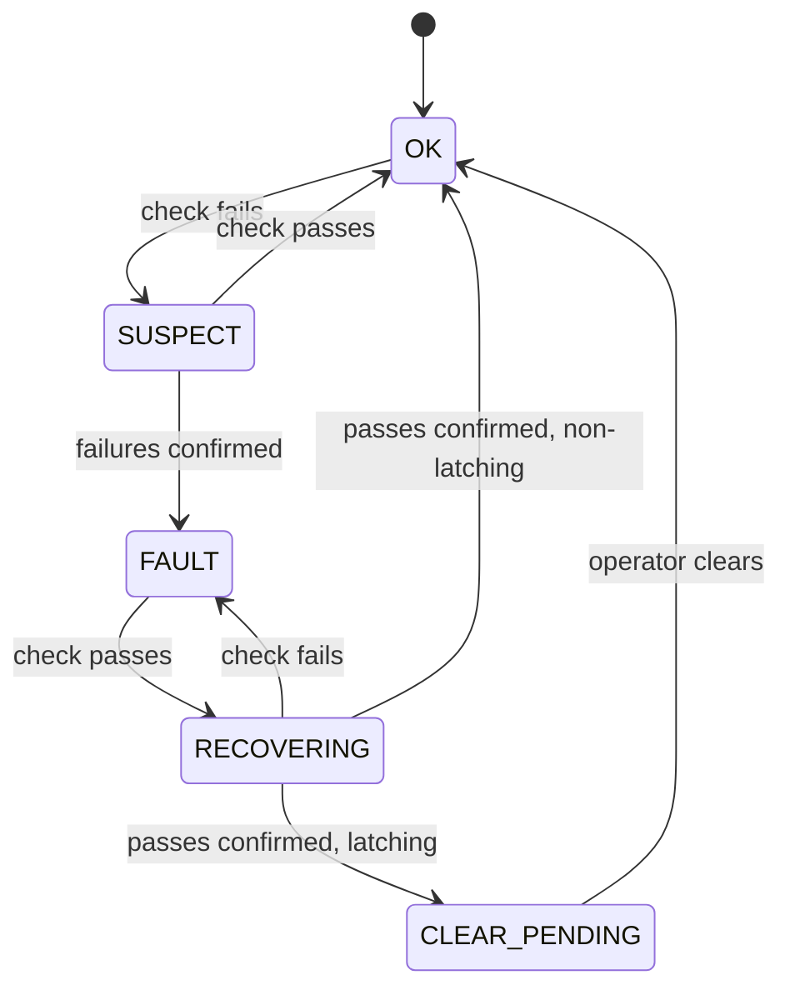
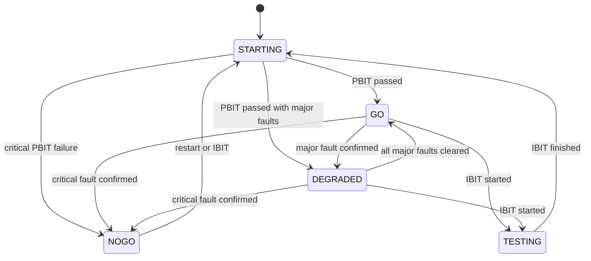

# Built-In Test (BIT) Architecture

Built-In Test checks that the **whole radio is healthy**: hardware,
interfaces, software and network, not only the communication link. It runs
at power-on, continuously in service, and on operator command, and it reports
one health state for the radio: **GO**, **DEGRADED** or **NO-GO**.

This document describes how BIT is structured, how its parts talk to each
other, and how each BIT mode behaves.

## Contents

- [1. Scope](#1-scope)
- [2. BIT modes](#2-bit-modes)
- [3. Design rules](#3-design-rules)
- [4. System context](#4-system-context)
- [5. BIT manager](#5-bit-manager)
  - [5.1 Internal structure](#51-internal-structure)
  - [5.2 Modules](#52-modules)
- [6. Interfaces](#6-interfaces)
- [7. Check model](#7-check-model)
  - [7.1 Check definition](#71-check-definition)
  - [7.2 Check execution](#72-check-execution)
  - [7.3 Results](#73-results)
- [8. Power-on BIT (PBIT)](#8-power-on-bit-pbit)
- [9. Continuous BIT (CBIT)](#9-continuous-bit-cbit)
- [10. Initiated BIT (IBIT)](#10-initiated-bit-ibit)
  - [10.1 Flow](#101-flow)
  - [10.2 Radio states during IBIT](#102-radio-states-during-ibit)
  - [10.3 Rules](#103-rules)
- [11. Fault management](#11-fault-management)
- [12. Health roll-up](#12-health-roll-up)
- [13. Results and logging](#13-results-and-logging)
- [14. Safety](#14-safety)
- [15. Open decisions](#15-open-decisions)

## 1. Scope

BIT covers every part the radio depends on, grouped into areas. Each area has
its own health, and the areas together give the radio's health.



## 2. BIT modes

| Mode | Name | Started by | When | Interrupts service? | Purpose |
|---|---|---|---|---|---|
| **PBIT** | Power-on BIT | The BIT manager, automatically | Once at every power-up or restart, before the radio enters service | Yes, the radio is not in service yet | Prove the radio can be put into service |
| **CBIT** | Continuous BIT | The BIT manager, automatically | Periodically, all the time the radio is in service | Never | Detect a fault as soon as it appears |
| **IBIT** | Initiated BIT | An operator or maintainer | On command | Yes, after the operator confirms | Deeper checks and fault isolation that cannot run in service |

A check can belong to more than one mode. For example, "FPGA configured" runs
in PBIT and is then re-checked in CBIT.

## 3. Design rules

1. **Only `radiod` touches the radio hardware.** Every read of the FPGA or
   the RF transceiver goes through `radiod`, the single owner of the radio.
   No other process probes the FPGA; on this platform a side probe can hang
   the processor or crash the radio application.
2. **CBIT only reads.** It never changes state, never transmits and never
   interrupts traffic.
3. **Only IBIT may interrupt service**, and only after the operator has
   confirmed it.
4. **Check the input is valid first.** A check first proves that what it
   measures is real. For the data path, data must be proven to be flowing
   before any error count is trusted, because a stalled source can look
   perfectly healthy.
5. **No invented limits.** Limits come from the equipment specification or
   the component datasheet. A check without a limit reports `unjudged`, never
   `pass`.
6. **Missing is not passing.** A check whose hardware interface does not
   exist yet reports `blocked`.
7. **BIT proves its own detection.** Every fault detector is shown to fire by
   injecting its fault.
8. **One result format** for BIT, acceptance testing and maintenance.

## 4. System context

BIT is spread across the processes that already run on the radio. The BIT
manager is the only new process; `radiod` and `hh-manet` each answer for
their own domain.



| Process | BIT role |
|---|---|
| **BIT manager** | Owns BIT. Runs PBIT, CBIT and IBIT, confirms faults, computes health, stores results, serves the BIT CLI. Performs platform checks itself, read-only and outside the FPGA. Services the hardware watchdog. |
| **`radiod`** | The single owner of the radio. Performs every FPGA, RF transceiver and data-path check by reading values from the running radio application, runs IBIT radio checks on request, and moves the radio in and out of service. |
| **`hh-manet`** | Reports network health: neighbours, link quality, routes, partition, internal event loss. |
| **Linux** | Provides platform information (`/proc`, `/sys`), the FPGA manager and driver state, sensors, the watchdog device and persistent storage. |

## 5. BIT manager

### 5.1 Internal structure



### 5.2 Modules

| Module | Responsibility |
|---|---|
| **Check registry** | Holds every check definition, loaded from configuration so limits and periods change without a code change. |
| **Scheduler** | Decides what runs when: PBIT stages in fixed order, CBIT checks at their own periods, IBIT on request with out-of-service and restore. |
| **Check runner** | Runs one check with a timeout: preconditions, measure, judge. Reads Linux directly; asks `radiod` for radio values and `hh-manet` for network values. |
| **Fault and health manager** | Turns results into faults (debounce, latching, clearing) and computes area and radio health. |
| **Result store** | Writes results, fault changes and health changes to persistent storage. |
| **Command interface** | Serves the BIT CLI: read health, list faults, clear a latched fault, start and abort IBIT. |

The BIT manager kicks the hardware watchdog from its main loop only while that
loop is running normally, so a hung BIT manager resets the radio.

## 6. Interfaces

| From | To | Carries | Mechanism |
|---|---|---|---|
| BIT manager | `radiod` | Health query; radio values; IBIT radio check requests; out-of-service and restore requests | `radiod` control socket (the same one `radioctl` uses), extended with health and IBIT commands |
| BIT manager | `hh-manet` | Network health | Periodic telemetry from `hh-manet` |
| BIT manager | Linux | Platform values; watchdog kicks | `/proc`, `/sys`, sensor devices, watchdog device |
| BIT CLI | BIT manager | Health, faults, results, fault clear, IBIT start and abort | BIT manager control socket |
| BIT manager | Persistent storage | Result records, fault history, health changes | Files in a size-capped directory |
| Maintainer | Persistent storage | Download of results and logs | Maintenance connection |

Every request on every interface has a timeout. A peer that does not answer in
time gives an `error` result for the checks that depend on it, which makes the
affected area's health unknown rather than good.

## 7. Check model

### 7.1 Check definition

| Field | Meaning |
|---|---|
| ID | `BIT-<AREA>-<NN>`. Stable and never reused. |
| Name | Short description. |
| Area | One of the areas in the scope. |
| Modes | PBIT, CBIT, IBIT, or a combination. |
| Severity | **Critical**: failure makes the radio NO-GO. **Major**: failure makes the radio DEGRADED. **Minor**: reported only. |
| Source | Linux, `radiod` or `hh-manet`. |
| Preconditions | What must be true for the result to mean anything, and for the check to be safe to run. |
| Interrupts service | Yes or no. Only IBIT checks may say yes. |
| Transmits | Yes or no. A transmitting check needs explicit permission. |
| Limit | Where the pass/fail limit comes from. |
| Period | CBIT only: how often it runs. |
| Timeout | Longest time the check may take. |
| Debounce | Consecutive failures to confirm a fault, and consecutive passes to clear it. |
| Latching | Whether a confirmed fault stays until an operator clears it. |

### 7.2 Check execution

Every check, in every mode, follows the same steps.



### 7.3 Results

| Result | Meaning | Counts as healthy? |
|---|---|---|
| `pass` | Measured and within limit | Yes |
| `fail` | Measured and outside limit | No |
| `error` | The check itself could not run: timeout, no answer, bad data | No, health unknown |
| `blocked` | The interface the check needs does not exist yet | No, health unknown |
| `unjudged` | Measured, but no limit has been set | No, health unknown |

## 8. Power-on BIT (PBIT)

PBIT follows the radio's required bring-up order. Each stage must pass before
the next starts. Touching the FPGA before its clock is running hangs the
processor, so the order is fixed.



| Stage | Checks |
|---|---|
| 1 Platform | CPU, memory, storage, software and configuration integrity, watchdog, supply rails |
| 2 FPGA configured | Bitstream loaded and matching the installed software |
| 3 RF transceiver initialised | Transceiver ready; it provides the FPGA clock |
| 4 Driver and DMA memory | OpenCPI driver loaded, DMA memory reserved |
| 5 radiod and radio application | `radiod` reachable and configured, radio application running, no active faults |
| 6 Radio and data path | Transceiver status, data moving between software and FPGA with no loss |
| 7 Peripherals and timing | External interfaces, GNSS, audio |
| 8 Network | MANET node running, first neighbour found |

On a NO-GO the radio stays out of service with its transmitter off, the
failing check is reported by ID, and the log is kept for download. PBIT runs
again on every restart and after every IBIT.

## 9. Continuous BIT (CBIT)

CBIT starts when PBIT hands the radio into service and runs until shutdown.



| Rule | Detail |
|---|---|
| Own period per check | Matched to how fast the watched thing can change: a temperature slowly, a stalled data path quickly. |
| Spread load | Checks due at the same moment are staggered so BIT never causes a burst of work. |
| Read-only | No CBIT check changes state, transmits, or interrupts traffic. |
| Bounded cost | BIT's own processor and memory use is measured, and is itself a check. |
| Quiet when healthy | Passing results are summarised periodically; every change of result is written at once. |
| Suspended during IBIT | CBIT pauses while IBIT has the radio out of service, and resumes after the post-IBIT PBIT. |

## 10. Initiated BIT (IBIT)

IBIT runs checks that are too deep, too slow or too disruptive for CBIT: RF
transceiver built-in test tone, internal loopback and pattern tests, memory
pattern tests, end-to-end traffic tests, and operator-guided checks of
controls and indicators. It also lets a maintainer re-run any single check to
isolate a fault.

### 10.1 Flow



An operator can abort at any time. Abort stops the current check, restores the
radio and runs the PBIT radio stages, exactly as a normal finish does.

### 10.2 Radio states during IBIT



### 10.3 Rules

| Rule | Detail |
|---|---|
| Plan before running | The operator sees every check, the expected duration, and whether it interrupts service or transmits, before confirming. |
| Explicit confirmation | Nothing that interrupts service starts without it. |
| Always restore | Finish, abort or timeout all lead to restoring the radio and re-running the PBIT radio stages. |
| One at a time | Only one IBIT runs at once; a second request is refused while one is running. |
| Transmission permission | A check that transmits runs only in the mode the equipment specification allows: into a load, or on air at a set power. |
| Radio checks go through `radiod` | The BIT manager asks; `radiod` performs the check on the hardware. |
| Results kept | IBIT results are stored like every other result, marked with mode IBIT. |

## 11. Fault management

A single failed reading is not yet a fault. A fault is **confirmed** after a
set number of consecutive failures and **cleared** after a set number of
consecutive passes, so a noisy value cannot make the health state flicker.



| Property | Meaning |
|---|---|
| **Debounce** | Consecutive failures to confirm and consecutive passes to recover, set per check. |
| **Latching** | The fault stays reported until an operator clears it, even after the condition goes away. Used for faults that must not be missed, such as over-temperature or a hardware failure. |
| **Non-latching** | The fault clears itself when the condition goes away, such as a neighbour lost and regained. |
| **Fault record** | First seen, last seen, occurrence count, cleared time and who cleared it. |
| **Clearing** | Only an operator or maintainer clears a latched fault, through the BIT CLI, and every clear is logged. |
| **IBIT results** | An IBIT failure raises a fault immediately, without debounce, because IBIT runs each check deliberately. |

## 12. Health roll-up

Each area's health comes from its active faults, and the radio's health comes
from all areas.



| Radio health | Meaning | Rule |
|---|---|---|
| **STARTING** | PBIT in progress | |
| **GO** | Fully usable | No critical or major fault; every critical and major check has a `pass` |
| **DEGRADED** | Usable with reduced capability | No critical fault; at least one major fault, or a major check whose health is unknown |
| **NO-GO** | Not usable | At least one critical fault |
| **TESTING** | Out of service for IBIT | |

Minor faults are reported but never change the radio's health. The health
report always lists, by check ID, the faults that caused a DEGRADED or NO-GO
state.

## 13. Results and logging

Every result uses the same JSON record as the acceptance-test tools in
`tools/atp/`, so one set of tools reads both.

```json
{
  "schema": "hh-atp-evidence/1",
  "check": "BIT-PL-01",
  "result": "pass",
  "reason": "",
  "started_utc": "…",
  "finished_utc": "…",
  "time_source": "system",
  "host": "node-a",
  "params": { "mode": "PBIT", "boot_id": "…", "mono_ms": 0 },
  "metrics": { "fpga_state": "operating" },
  "thresholds": { "fpga_state": "operating" },
  "artifacts": []
}
```

| Requirement | Design |
|---|---|
| Survive power loss | Results, fault changes and health changes go to persistent storage. Routine log records stay in memory. |
| Bounded size | Storage is size-capped and rotates oldest first. |
| Correct order without a clock | Every record carries a boot identifier and a monotonic time, because the board has no battery-backed clock and its time is unreliable after power-up. |
| One log format | `key=value` log records, one per line, the format the software already uses. |
| Download | The maintainer downloads results and logs over the maintenance connection. |
| Nothing over the air by default | BIT results and logs are not sent over the radio network unless a management function is enabled. |

## 14. Safety

| Concern | Design |
|---|---|
| Hardware ownership | Only `radiod` reads or drives the FPGA and RF transceiver. The BIT manager never probes them directly. |
| Transmission | CBIT never transmits. An IBIT check that transmits needs operator confirmation and runs only in the transmission mode the specification allows. |
| NO-GO | The radio stays out of service with its transmitter off. |
| Software hang | The BIT manager services the hardware watchdog only while it is running normally; a hang resets the radio. |
| Software death | Stopping the radio application does not stop the transmitter, so software death alone is not a safe state. The safe action is an open decision. |
| BIT overload | Every check has a timeout, CBIT load is spread, and BIT's own resource use is monitored. |

## 15. Open decisions

| # | Decision |
|---|---|
| 1 | The `radiod` health and IBIT commands; its control socket has no health query today |
| 2 | How `hh-manet` publishes network health while running; today it reports only at exit |
| 3 | How often each CBIT check runs, and its debounce counts |
| 4 | Which faults latch |
| 5 | How the transmitter is made safe if the software dies |
| 6 | Whether transmitting IBIT checks may run on air or only into a load |
| 7 | Persistent storage size and how long results are kept |
| 8 | What the operator sees: indicator, display, or a message to the terminal |
