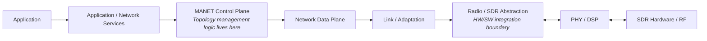

# HH-SDR MANET Network Topology
## Hardware/Software Interface Specification

---

## 1. Purpose and Scope

This specification defines the hardware/software (HW/SW) interfaces required for network topology management in a self-healing mobile ad-hoc network (MANET) node. It specifies what information crosses the boundary between the radio/PHY layer and the MANET networking software, who produces and consumes that information, when it is generated, and how it affects the node's view of network topology.

The scope covers:

- Node status
- Neighbor discovery
- Link-quality information (raw and derived)
- Neighbor and link state changes
- Route updates
- Route invalidation and withdrawal
- Failure events
- Recovery events
- Partition, merge, and rejoin events as they relate to topology management
- Radio/channel information required by topology management

This document is an interface specification, not a design document. It does not describe internal algorithms, complete software behavior, build/test infrastructure, or deployment procedures. Where an interface's exact wire encoding, unit system, or numeric threshold is not yet fixed, this is stated explicitly as implementation-defined rather than invented.

---

## 2. System Context

Topology management sits in the control-plane software layer, above the radio hardware and below the application:



**HW/SW boundary.** The boundary is the Radio/SDR Abstraction layer. Everything at or above this layer is topology-management software with no dependency on a specific radio implementation. Everything below it — PHY/DSP processing and RF hardware — is treated as a black box whose only contract with the rest of the system is the set of interfaces defined in this document.

Topology-management software consumes two categories of information from below the boundary:

1. **Received frames** — demodulated beacon and data traffic.
2. **Radio/PHY observations** — signal-quality measurements (e.g., RSSI, SNR, packet error indications) associated with received traffic and with the radio's own operating state.

It produces two categories of information back across the boundary:

1. **Transmit requests** — outbound beacon and data frames.
2. **Radio control requests** — channel or frequency change requests driven by topology-management decisions.

This specification does not define FPGA register maps, AXI or DMA interfaces, device driver APIs, or any radio-vendor-specific control protocol. The unit of exchange across the boundary is a frame and an associated metric set, not a sample buffer or hardware register value.

---

## 3. Topology Management Architecture

Topology management is implemented by a set of cooperating logical components. Each has a single clear responsibility and a single writer for the state it owns.

| Component | Responsibility |
|---|---|
| **Discovery Manager** | Schedules and transmits discovery beacons; validates and processes received beacons |
| **Neighbor Manager** | Maintains the one-hop neighbor table; the sole authoritative source of neighbor state |
| **Link Health Monitor** | Fuses raw PHY/MAC signal quality into a per-neighbor link-health state |
| **Failure Detector** | Confirms suspected link/node failures after a debounce period |
| **Topology Manager** | Maintains a read-only, eventually-consistent aggregate topology view for operator/management use |
| **Routing Engine** | Computes routes, selects next hops, and publishes the route table |
| **Self-Healing / Recovery Manager** | Orchestrates repair: alternate-route switching, rediscovery, and channel change |
| **Packet Forwarder** | Forwards data-plane traffic using the current route table snapshot only |
| **Radio/SDR Interface** | Owns radio control, frame transmit/receive, and PHY-metric acquisition; carries no topology semantics |
| **Management/Telemetry** | Out-of-band configuration input and status/telemetry export for operator visibility |

Information flows in one direction from the radio upward into topology decisions, and in a separate direction from routing decisions back down into forwarding and, where needed, radio control:

```
Radio/PHY information
        ↓
Radio/SDR Interface
        ↓
Discovery / Neighbor / Link Health
        ↓
Topology Manager
        ↓
Routing Engine
        ↓
Packet Forwarder
```

**Three distinct views of the network are deliberately kept separate:**

- The **Neighbor Table** (owned by Neighbor Manager) is the authoritative one-hop view, built only from direct, verified RF exchange. It is the richest and most current source of per-neighbor detail.
- The **Route Table** (owned by Routing Engine) holds next-hop and composite-metric information for reachable destinations, including multi-hop. It does not store full paths, and it is the only structure the data-plane forwarder reads.
- The **Topology Graph** (owned by Topology Manager) is a best-effort, eventually-consistent aggregate view assembled from neighbor and route information, intended for operator/management visibility. It is never consulted on the forwarding or routing decision path.

---

## 4. HW/SW Interface Model

Every interface in this specification is defined using the same set of attributes:

| Attribute | Meaning |
|---|---|
| **Interface ID** | Unique identifier (HTI-nn) |
| **Interface Name** | Short descriptive name |
| **Purpose** | Why the interface exists |
| **Producer** | Component that generates the information |
| **Consumer** | Component(s) that receive and act on the information |
| **Direction** | Inbound (hardware → software), outbound (software → hardware), or internal (software → software) |
| **Trigger** | Condition or event that causes the interface to be exercised |
| **Data Exchanged** | The semantic fields carried by the interface |
| **Expected Behavior** | How producer and consumer are expected to behave |
| **Topology-Management Effect** | How this interface changes or informs the topology view |

Interfaces fall into three groups:

1. **Radio/PHY → MANET software** — inbound observations (received frames, radio-reported metrics, radio status).
2. **MANET software → Radio/PHY** — outbound requests (frame transmission, channel control).
3. **MANET control plane → Management/Telemetry** — status export and configuration, off the real-time path.

Where the supplied architecture does not fix a wire encoding, byte layout, or numeric unit, this specification defines the semantic field only and marks the encoding **implementation-defined**. No interface below invents a register map, IDL, or binary layout that is not already implied by the architecture.

---

## 5. Required HW/SW Integration Interfaces

| ID | Interface | Classification |
|---|---|---|
| HTI-01 | Node Status | Required |
| HTI-02 | Radio Status | Required |
| HTI-03 | Beacon Transmission | Required |
| HTI-04 | Beacon Reception / Discovery Event | Required |
| HTI-05 | Link-Quality Metric Sample | Required |
| HTI-06 | Neighbor State Change | Required |
| HTI-07 | Link Health / State Change | Required |
| HTI-08 | Route Update / Installation | Required |
| HTI-09 | Route Invalidation / Withdrawal | Required |
| HTI-10 | Failure Event | Required |
| HTI-11 | Recovery Event | Required |
| HTI-12 | Partition Detected | Supporting |
| HTI-13 | Network Merge / Rejoin | Supporting |
| HTI-14 | Channel / Radio Control | Supporting |
| HTI-15 | Control Plane ↔ Management/Telemetry | Recommended |
| HTI-16 | Adaptive Cadence Feedback | Recommended |

**Required** interfaces are those without which node status, neighbor discovery, link-quality reporting, route management, or failure/recovery signaling cannot function and are therefore mandatory for milestone completion. **Supporting** interfaces extend topology management to network-level events (partition/merge) and radio control, and are necessary for a complete self-healing capability. **Recommended** interfaces improve efficiency and observability but are not on the critical data/control path for basic topology management.

All sixteen interfaces are defined below to ensure complete coverage of the topology-management integration surface.

---

## 6. Interface Definitions

### HTI-01 — Node Status

**Purpose:** Report overall node health for operator visibility and system-level diagnosis.

**Producer:** All control-plane components (aggregated).

**Consumer:** Management/Telemetry.

**Direction:** Outbound, asynchronous (software → management).

**Trigger:** Periodic refresh, and on any significant state change in a contributing component.

**Data:**

| Field | Description | Required/Optional |
|---|---|---|
| `node_id` | Identity of the reporting node | Required |
| Per-component health summary | Status of Discovery, Neighbor, Topology, Routing, Link Health, and Self-Healing components | Required |

**Behavior:** Reporting is asynchronous and read-mostly. Management/Telemetry is a passive subscriber; a missed report is not itself treated as a fault condition.

**Topology Impact:** Provides the operator-facing summary of the node's contribution to overall topology health; does not itself feed routing or neighbor decisions.

**Notes:** Exact refresh interval and payload encoding are implementation-defined.

---

### HTI-02 — Radio Status

**Purpose:** Expose radio operational state to the control plane and to management, for channel decisions and operator telemetry.

**Producer:** Radio/SDR Interface.

**Consumer:** Link/Adaptation (control plane), Management/Telemetry.

**Direction:** Outbound, asynchronous (radio → software).

**Trigger:** Periodic, and on any radio-level state change (e.g., completion of a channel switch).

**Data:**

| Field | Description | Required/Optional |
|---|---|---|
| Current channel/frequency | Active operating channel | Required |
| Active waveform | Waveform currently in use | Required |
| Tx/Rx activity indication | Whether the radio is actively transmitting/receiving | Optional |
| Error/status counters | Radio-level error indications | Optional |

**Behavior:** Status is polled or pushed on a periodic basis and on state transitions. A sudden absence of any received traffic across all neighbors and all channels is interpreted, in combination with radio status, as a possible own-radio failure rather than a neighbor or link failure.

**Topology Impact:** Informs the distinction between "my radio has failed" and "my neighbor/link has failed," which determines whether the correct response is local (radio recovery) or topological (route/neighbor update).

**Notes:** Exact status schema and refresh cadence are implementation-defined.

---

### HTI-03 — Beacon Transmission

**Purpose:** Transmit a discovery/heartbeat beacon over RF so neighboring nodes can discover and continuously validate this node.

**Producer:** Discovery Manager.

**Consumer:** Radio/SDR Interface (which hands the frame to the RF path).

**Direction:** Outbound (software → radio).

**Trigger:** Beacon schedule — a faster interval during initial network acquisition, relaxing to a steady-state cadence, and adaptively tightened or relaxed based on link-health feedback (HTI-16).

**Data:**

| Field | Description | Required/Optional |
|---|---|---|
| Framed beacon message | See Section 8 for beacon field contents | Required |

**Behavior:** Transmission is a fire-and-forget call into the Radio/SDR Interface; the Discovery Manager owns cadence policy, the framing of the beacon itself is owned at the boundary.

**Topology Impact:** Establishes the outbound half of neighbor discovery; cadence directly affects how quickly topology changes (new neighbors, mobility, failures) are detected.

**Notes:** Exact byte-level framing is implementation-defined.

---

### HTI-04 — Beacon Reception / Discovery Event

**Purpose:** Deliver a received, demodulated beacon frame into the control plane for validation and neighbor processing.

**Producer:** Radio/SDR Interface (via PHY/DSP demodulation).

**Consumer:** Discovery Manager.

**Direction:** Inbound (radio → software).

**Trigger:** On reception of a frame recognized as a beacon.

**Data:**

| Field | Description | Required/Optional |
|---|---|---|
| Parsed beacon fields | See Section 8 | Required |

**Behavior:** Received beacons are checked for freshness using a sequence number; a beacon that is not newer than the last accepted sequence from that sender is dropped. Malformed or invalid frames are dropped at ingress and never reach neighbor processing.

**Topology Impact:** This is the primary trigger for neighbor discovery and continued neighbor liveness — every valid, fresh beacon either creates a new neighbor table entry or refreshes an existing one.

**Notes:** Frame framing/encoding is implementation-defined; the sequencing and freshness rule is a fixed behavioral requirement.

---

### HTI-05 — Link-Quality Metric Sample

**Purpose:** Deliver raw, per-neighbor RF/MAC quality measurements into the control plane as input to link-health evaluation.

**Producer:** Radio/SDR Interface / PHY (raw measurement), delivered through the Link Metrics Provider.

**Consumer:** Link Health Monitor.

**Direction:** Inbound (radio → software).

**Trigger:** Per received frame, and/or periodic PHY-level sampling.

**Data:**

| Field | Description | Required/Optional |
|---|---|---|
| Neighbor identifier | Which neighbor the sample pertains to | Required |
| RSSI | Received signal strength | Required |
| SNR | Signal-to-noise ratio | Required |
| Packet Error Rate (PER) | PHY/MAC-level error rate | Required |
| Retransmission count | MAC-layer retransmit count | Required |
| PHY error indications | Distinct from MAC-layer packet loss | Optional |
| ACK/heartbeat success ratio | Delivery confirmation success | Optional |
| Latency trend | Recent latency behavior | Optional |

**Behavior:** Samples are raw measurements — not yet a health verdict. A missing sample stream (not just an out-of-range value) is itself meaningful: it contributes to the pattern used to diagnose total signal loss.

**Topology Impact:** Serves as the sole factual basis for link-health fusion (HTI-07) and is also consumed directly by the Routing Engine as an input to route-metric computation.

**Notes:** Units and numeric encoding (e.g., dBm vs. raw value, ratio vs. percentage) are implementation-defined.

---

### HTI-06 — Neighbor State Change

**Purpose:** Communicate one-hop neighbor table changes to every dependent component without requiring each to query the Neighbor Manager directly.

**Producer:** Neighbor Manager.

**Consumer:** Topology Manager, Routing Engine, Link Health Monitor, Management/Telemetry.

**Direction:** Outbound, fan-out (single writer, multiple independent readers).

**Trigger:** A new neighbor is validated; an existing neighbor expires (stale or failed); a neighbor's attributes change (capability or metric update).

**Data:**

| Field | Description | Required/Optional |
|---|---|---|
| Event type | NeighborUp / NeighborDown / NeighborChanged | Required |
| Neighbor identifier | The affected neighbor | Required |
| Timestamp | Time of transition | Required |
| Capabilities / radio capabilities | Carried forward from the validating beacon | Optional |
| Changed attributes | For NeighborChanged, which fields changed | Optional |

**Behavior:** The Neighbor Manager is the sole writer of neighbor state; every consumer treats it as read-only. Expiry follows a bounded, state-machine-driven process rather than a single missed beacon.

**Topology Impact:** This is the primary event driving both the Route Table and the Topology Graph — every consumer reacts to it independently, so a delay in one (e.g., topology rebuild) never blocks another (e.g., a route update).

---

### HTI-07 — Link Health / State Change

**Purpose:** Propagate a fused link-health state transition to every independent consumer that needs it.

**Producer:** Link Health Monitor.

**Consumer:** Failure Detector, Routing Engine, Topology Manager, Management/Telemetry.

**Direction:** Outbound, fan-out.

**Trigger:** The fused link-quality signal crosses a state-machine threshold (see Section 9).

**Data:**

| Field | Description | Required/Optional |
|---|---|---|
| Neighbor identifier | The neighbor whose link changed state | Required |
| Previous state | One of: Healthy, Degraded, Suspected Failure, Failed, Recovering | Required |
| New state | Same enumeration | Required |
| Cause hint | Diagnostic classification (e.g., node failure, RF interference, mobility, own-radio failure, asymmetric link/MAC contention) | Required |

**Behavior:** State transitions are hysteresis-guarded — entry and exit thresholds differ, and sustained evidence over a hold-down window is required before advancing to Failed or trusting a return to Healthy from Recovering.

**Topology Impact:** Drives failure confirmation (HTI-10), route re-evaluation (HTI-08/09), and the fused edge-quality annotation shown in the topology view. The Link Health Monitor determines *state*; it does not decide what action to take.

---

### HTI-08 — Route Update / Installation

**Purpose:** Publish a new best route (next hop) for a destination.

**Producer:** Routing Engine.

**Consumer:** Packet Forwarder (data plane), Topology Manager (as topology-view input).

**Direction:** Outbound.

**Trigger:** Proactive periodic update; immediate event-triggered update on a confirmed Link Health state change; or a freshness/metric comparison that yields a better route than the currently installed one.

**Data:**

| Field | Description | Required/Optional |
|---|---|---|
| Destination | Route destination node | Required |
| Next hop | Selected next-hop neighbor | Required |
| Composite metric | Combines RSSI/SNR, packet loss, retransmission rate, latency, hop count, and route age/stability | Required |
| Sequence number | Freshness/ordering value | Required |

**Behavior:** The route table is published as a versioned, atomically-swapped snapshot; the forwarder always reads a single consistent pointer and never blocks on an update in progress. Each route carries an expiry timer refreshed on use.

**Topology Impact:** This is the mechanism by which neighbor and link-health information becomes forwarding behavior; it also feeds the aggregate topology view.

---

### HTI-09 — Route Invalidation / Withdrawal

**Purpose:** Remove or mark invalid a route whose next hop has expired or failed.

**Producer:** Routing Engine.

**Consumer:** Packet Forwarder, Topology Manager.

**Direction:** Outbound.

**Trigger:** Neighbor expiry cascading to dependent routes; a confirmed Failed link state.

**Data:**

| Field | Description | Required/Optional |
|---|---|---|
| Destination | Affected route destination | Required |
| Invalidated next hop | The next hop that is no longer valid | Required |
| Reason | Expiry, failure cascade, or explicit invalidation | Required |

**Behavior:** Invalidation is two-phase: the route is marked invalid immediately, then deleted after a grace window. Every route whose next hop is the failed neighbor is invalidated as part of the same cascade.

**Topology Impact:** Prevents stale routes from being used after a neighbor or link failure, and triggers the search for an alternate route or rediscovery.

---

### HTI-10 — Failure Event

**Purpose:** Signal a confirmed (not merely suspected) failure requiring a route and topology response.

**Producer:** Failure Detector.

**Consumer:** Self-Healing / Recovery Manager, Routing Engine.

**Direction:** Outbound.

**Trigger:** A suspected failure persists past a confirmation hold-down period (state transition: Suspected Failure → Failed).

**Data:**

| Field | Description | Required/Optional |
|---|---|---|
| Neighbor/link identifier | The failed entity | Required |
| Cause hint | Carried forward from the confirming Link Health state change | Required |
| Confirmation time | When the hold-down period completed | Optional |

**Behavior:** The Failure Detector only confirms failures — it does not recompute routes itself. Node failure (as opposed to a single link failure) requires independent confirmation from every neighbor that could observe the node before it is removed from the aggregate topology.

**Topology Impact:** This is the single authoritative trigger for route invalidation (HTI-09) and recovery initiation (HTI-11); no single raw metric alone is sufficient to declare failure — it must pass through link-health fusion and confirmation first.

---

### HTI-11 — Recovery Event

**Purpose:** Communicate recovery orchestration progress: repair started, alternate route selected, rediscovery in progress, or recovery stabilized.

**Producer:** Self-Healing / Recovery Manager.

**Consumer:** Routing Engine, Topology Manager, Management/Telemetry.

**Direction:** Outbound.

**Trigger:** Entry into the recovery pipeline following a confirmed failure, through to stabilization.

**Data:**

| Field | Description | Required/Optional |
|---|---|---|
| Target | Affected neighbor or destination | Required |
| Recovery strategy | Alternate-route switch vs. rediscovery | Required |
| Hold-down status | Whether the recovered route is still under stabilization | Optional |

**Behavior:** If a warm alternate route already exists, recovery proceeds by an immediate switch; otherwise it falls back to reactive rediscovery with bounded retry, backoff, and time-to-live growth. A route that has flapped repeatedly is penalized (dampened) rather than immediately trusted again.

**Topology Impact:** Marks the transition from "failure confirmed" back toward "healthy," and governs when a newly restored route is trusted as primary.

---

### HTI-12 — Partition Detected

**Purpose:** Flag that an entire neighbor branch — not a single destination — has become unreachable.

**Producer:** Topology Manager.

**Consumer:** Self-Healing / Recovery Manager, Management/Telemetry.

**Direction:** Outbound.

**Trigger:** A topology connectivity check determines that an entire branch of the network graph is no longer reachable.

**Data:**

| Field | Description | Required/Optional |
|---|---|---|
| Affected branch/subgraph identifier | Identifies the unreachable portion of the network | Required |
| Detection time | Timestamp of detection | Optional |

**Behavior:** Each resulting partition continues operating fully within itself; no route is asserted across the partition boundary based on stale pre-partition information — such entries are allowed to age out normally rather than being force-invalidated.

**Topology Impact:** Distinguishes a network-wide split from an isolated link/node failure, changing the appropriate recovery response from route repair to partition tolerance.

---

### HTI-13 — Network Merge / Rejoin

**Purpose:** Signal that a previously severed connection has been re-established between two partitions.

**Producer:** Discovery Manager / Neighbor Manager (renewed beacon exchange), surfaced through the Topology Manager.

**Consumer:** Self-Healing / Recovery Manager, Routing Engine, Management/Telemetry.

**Direction:** Outbound.

**Trigger:** Renewed beacon exchange across a previously severed edge.

**Data:**

| Field | Description | Required/Optional |
|---|---|---|
| Rejoining neighbor/edge identifier | The edge that reconnected | Required |
| Hold-down status | Time until merged routes are trusted as primary | Required |

**Behavior:** A hold-down timer delays trusting newly merged routes as primary until sequence-number freshness has settled across both formerly separate partitions. The higher sequence number wins; hop count and timestamp act as tiebreakers.

**Topology Impact:** Reconciles two independently evolved topology and route views into one, without immediately destabilizing existing routes on either side.

---

### HTI-14 — Channel / Radio Control (Recovery-Driven)

**Purpose:** Request a channel or frequency change when a failure's cause hint indicates interference rather than a node or link problem, in preference to route churn.

**Producer:** Self-Healing / Recovery Manager.

**Consumer:** Radio/SDR Interface.

**Direction:** Outbound (software → radio).

**Trigger:** A cause hint of RF interference on a Link Health or Failure event, where channel diversity is supported by the radio.

**Data:**

| Field | Description | Required/Optional |
|---|---|---|
| Target channel/frequency | Requested channel to switch to | Required |

**Behavior:** Issued as a direct control call to the Radio/SDR Interface, which owns the underlying channel-control mechanism. Whether channel-change failure falls back to route-based recovery is implementation-defined.

**Topology Impact:** Provides a non-topological remedy (channel change) for RF-caused link degradation, avoiding unnecessary route invalidation when the underlying cause is not a neighbor or node failure.

---

### HTI-15 — Control Plane ↔ Management/Telemetry

**Purpose:** Carry node, radio, topology, and route status out to the operator/management console, and carry configuration changes in.

**Producer/Consumer:** Bidirectional — all control-plane components produce status; Management/Telemetry produces configuration input.

**Direction:** Bidirectional, asynchronous.

**Trigger:** Periodic status export; export on significant events (best-effort, non-blocking); configuration pushed at operator discretion.

**Data:**

| Field | Description | Required/Optional |
|---|---|---|
| Status/telemetry payload | Node, radio, topology, and route status | Required (outbound) |
| Configuration payload | Versioned configuration change | Required (inbound) |

**Behavior:** This interface never sits on the forwarding or control-plane timing path. Configuration changes are applied by Management at its own pace and are never written directly into live routing state.

**Topology Impact:** Provides the operator-facing view of topology state and the mechanism for adjusting topology-management configuration; does not itself alter topology decisions.

---

### HTI-16 — Adaptive Cadence Feedback

**Purpose:** Tighten the beacon interval when local link instability is detected, for faster reconvergence, and relax it when the neighborhood is stable, to bound control overhead.

**Producer:** Link Health Monitor.

**Consumer:** Discovery Manager.

**Direction:** Outbound (internal, software → software).

**Trigger:** A change in the local link-health stability signal.

**Data:**

| Field | Description | Required/Optional |
|---|---|---|
| Instability indicator / target cadence | Signal used to adjust beacon interval | Required |

**Behavior:** The Link Health Monitor produces the stability signal; the Discovery Manager retains ownership of cadence policy and decides how to act on it.

**Topology Impact:** Directly affects how quickly neighbor discovery and failure detection respond to real topology change (e.g., mobility, incipient link degradation) without permanently increasing overhead during stable periods.

---

## 7. Node Status and Radio Status

**Node status** represents what topology management needs to know about the node itself:

- Node identity (`node_id`)
- Operational state (starting, active, degraded, recovering)
- Routing capability (whether the node forwards traffic for others, or is endpoint-only)
- Relevant capabilities (forwarding capacity class, supported services)

**Radio status** represents what topology management needs to know about the radio supporting it:

- Radio identity
- Operational state (active, idle, fault)
- Current channel/frequency
- Active waveform and supported waveform set, where applicable
- Availability/error status (used, in combination with total silence across all neighbors, to distinguish an own-radio failure from a network-side failure)

Both are scoped strictly to what topology-management decisions consume; neither includes low-level radio configuration outside that scope.

---

## 8. Neighbor Discovery

Neighbor discovery is driven by a periodic discovery beacon, transmitted by every node and received/validated by every node within range (HTI-03, HTI-04).

**Fields carried in the discovery beacon (transmitted information):**

| Field | Purpose |
|---|---|
| `node_id` | Sender identity |
| `protocol_version` | Wire-compatibility check |
| `sequence_no` | Monotonic counter for freshness/replay rejection |
| `timestamp` | Freshness/replay rejection |
| `capabilities` | Routing-capable vs. leaf-only, forwarding capacity class |
| `radio_caps` | Radio capability advertisement |
| `channel`/`freq` | Channel/frequency in use, for link feasibility assessment |
| `supported_waveforms` | Avoids attempting links across incompatible waveforms |
| `routing_capable` | Whether the sender forwards traffic for others |
| `position` (optional) | Supports mobility-aware link prediction; must degrade gracefully when absent |
| `power`/`battery` (optional) | Avoids preferring a low-power node as a high-traffic relay |

**Fields observed locally by the receiving radio/PHY (not transmitted by the sender):**

- RSSI
- SNR
- Link quality indication
- Packet loss observed on the link

**Fields derived/fused by software from the above:**

- Neighbor validity determination (Discovery Manager)
- Composite link-quality score (Link Health Monitor)
- Neighbor table entry creation/refresh (Neighbor Manager)

This distinction matters: information the sender asserts about itself (identity, capability, position) is fundamentally different from information the receiver measures about the link (RSSI, SNR), which is in turn different from a value software computes by combining several measurements over time.

---

## 9. Link Quality and Link Health

**Raw/observed metrics** are measured values with no interpretation applied:

- RSSI
- SNR
- Packet Error Rate (PER)
- Packet loss
- Retransmission count
- PHY-reported error indications (distinct from MAC-layer packet loss — used to distinguish RF interference from other failure causes)
- ACK/heartbeat success ratio
- Latency trend

These are inputs to link-health evaluation. No single raw metric is, by itself, sufficient to declare a link degraded or failed; link health is derived by fusing multiple signals together (windowed/averaged) so that a single noisy sample cannot trigger an incorrect state transition.

**Link-health state** is the derived, authoritative verdict computed by the Link Health Monitor:

```
Healthy
  ↓
Degraded
  ↓
Suspected Failure
  ↓
Failed
  ↓
Recovering
  ↓
Healthy
```

State transitions are hysteresis-guarded: the evidence required to move from Suspected Failure to Failed, and to move from Recovering back to Healthy, must be sustained over a hold-down period rather than triggered by a single sample. Exact numeric thresholds and window sizes are implementation-defined and are not specified here.

Raw metrics and derived link-health state are never conflated: the Routing Engine consumes raw metrics directly as route-metric inputs, independently of the Link Health Monitor's own state-machine verdict — both are driven from the same underlying signals but computed separately, so a delay in one never blocks the other. The Topology Manager receives only the fused link-health annotation, never raw signals, and never uses it to make a routing decision.

---

## 10. Route Integration

Topology information reaches the forwarding path through a defined pipeline:

```
Neighbor information
    ↓
Topology information
    ↓
Routing decision
    ↓
Route installation/update
    ↓
Packet forwarding
```

- **Route update / installation** — the Routing Engine publishes a new best next hop for a destination, triggered proactively on a periodic basis or immediately on a confirmed link-health change or a better available route.
- **Route invalidation / withdrawal** — the Routing Engine removes or marks invalid any route whose next hop has expired or failed, cascading to every destination reachable only through that next hop.
- **Alternate route / local repair** — where the Routing Engine has retained a viable second-best next hop, the Self-Healing/Recovery Manager can switch to it immediately, without a full route recomputation or new discovery cycle.

Neighbor and link-health information originates from the Neighbor Manager and Link Health Monitor respectively; route computation, installation, and withdrawal decisions are made exclusively by the Routing Engine, which is the sole writer of the route table. The Packet Forwarder only ever reads the current route-table snapshot — it never computes or waits on a route decision.

---

## 11. Failure and Recovery Integration

Failure and recovery follow a fixed logical sequence:

```
Detection
    ↓
Classification
    ↓
Confirmation
    ↓
Failure Event
    ↓
Neighbor/Topology Update
    ↓
Route Invalidation
    ↓
Alternate Route / Local Repair
    ↓
Rediscovery
    ↓
Recovery
    ↓
Stabilization
```

| Stage | Interface(s) involved |
|---|---|
| Raw signal degradation observed | HTI-05 |
| Link-health state transition (Healthy → Degraded → Suspected Failure) | HTI-07 |
| Confirmed failure after hold-down | HTI-10 |
| Neighbor table update reflecting the failure | HTI-06 |
| Route invalidation cascade | HTI-09 |
| Alternate route switch, or rediscovery via renewed beaconing | HTI-08, HTI-04 |
| Recovery orchestration and stabilization | HTI-11 |
| RF-caused degradation preferring channel change over route churn | HTI-14 |

No stage is skipped: a suspected failure alone never invalidates a route — confirmation through the debounce hold-down is required first. Node failure, as distinct from a single link failure, requires independent confirmation from every neighbor that could observe the node before that node is removed from the aggregate topology view.

---

## 12. Partition, Merge, and Rejoin

- **Partition** — the Topology Manager detects that an entire neighbor branch has become unreachable (HTI-12). Each resulting partition continues to operate independently; stale cross-partition routes are allowed to age out rather than being forcibly torn down.
- **Merge** — renewed beacon exchange across a previously severed edge (HTI-04) causes the Neighbor Manager to report a new neighbor (HTI-06), which the Topology Manager surfaces as a network merge (HTI-13).
- **Rejoin** — following a merge, a hold-down period delays trusting newly reconciled routes as primary until sequence-number freshness has settled across both previously separate halves of the network; the higher sequence number wins, with hop count and timestamp as tiebreakers.

---

## 13. Interface Data Summary

| ID | Interface | Direction | Producer | Consumer | Trigger | Primary Data | Topology Function | Status |
|---|---|---|---|---|---|---|---|---|
| HTI-01 | Node Status | Out, async | All control-plane components | Management/Telemetry | Periodic + state change | Node health summary | Operator visibility | Required |
| HTI-02 | Radio Status | Out, async | Radio/SDR Interface | Link/Adaptation, Management | Periodic + radio state change | Channel, waveform, error counters | Distinguishes radio vs. network failure | Required |
| HTI-03 | Beacon Transmission | Out | Discovery Manager | Radio/SDR Interface | Adaptive beacon schedule | Framed beacon | Enables discovery by neighbors | Required |
| HTI-04 | Beacon Reception / Discovery Event | In | Radio/SDR Interface | Discovery Manager | On frame reception | Parsed beacon fields | Triggers neighbor discovery | Required |
| HTI-05 | Link-Quality Metric Sample | In | Radio/SDR Interface (via Link Metrics Provider) | Link Health Monitor | Per frame / periodic | RSSI, SNR, PER, retransmits | Input to link-health fusion and route metric | Required |
| HTI-06 | Neighbor State Change | Out, fan-out | Neighbor Manager | Topology Mgr, Routing Engine, Link Health Monitor, Telemetry | Neighbor validated/expired/changed | NeighborUp/Down/Changed | Authoritative neighbor state propagation | Required |
| HTI-07 | Link Health / State Change | Out, fan-out | Link Health Monitor | Failure Detector, Routing Engine, Topology Mgr, Telemetry | Fused score crosses threshold | State transition + cause hint | Drives failure confirmation and route reaction | Required |
| HTI-08 | Route Update / Installation | Out | Routing Engine | Packet Forwarder, Topology Manager | Periodic / link-health change / better route found | Destination, next hop, metric | Publishes forwarding decision | Required |
| HTI-09 | Route Invalidation / Withdrawal | Out | Routing Engine | Packet Forwarder, Topology Manager | Neighbor expiry / confirmed failure | Destination, invalid next hop, reason | Removes stale forwarding state | Required |
| HTI-10 | Failure Event | Out | Failure Detector | Self-Healing Manager, Routing Engine | Suspicion persists past hold-down | Neighbor/link ID, cause hint | Authoritative failure trigger | Required |
| HTI-11 | Recovery Event | Out | Self-Healing / Recovery Manager | Routing Engine, Topology Manager, Telemetry | Entry into recovery pipeline | Target, strategy, hold-down status | Marks repair progress and stabilization | Required |
| HTI-12 | Partition Detected | Out | Topology Manager | Self-Healing Manager, Telemetry | Branch unreachable | Affected branch ID | Distinguishes partition from local failure | Supporting |
| HTI-13 | Network Merge / Rejoin | Out | Discovery/Neighbor Mgr → Topology Manager | Self-Healing Manager, Routing Engine, Telemetry | Renewed contact across severed edge | Rejoined edge, hold-down status | Reconciles independently evolved topology | Supporting |
| HTI-14 | Channel / Radio Control | Out | Self-Healing / Recovery Manager | Radio/SDR Interface | Interference cause hint | Target channel/frequency | RF remedy in place of route churn | Supporting |
| HTI-15 | Control Plane ↔ Management/Telemetry | Bidirectional, async | All control-plane components / Management | Management / control plane | Periodic + significant event / operator action | Status out, config in | Operator visibility and configuration | Recommended |
| HTI-16 | Adaptive Cadence Feedback | Out (internal) | Link Health Monitor | Discovery Manager | Local stability signal change | Instability indicator | Speeds up/relaxes discovery for faster reconvergence | Recommended |
