# HH-SDR Medium Access (MAC) Architecture

| Item | Value |
|---|---|
| Version | 1.0 |
| Date | 2026-10-01 |
| Status | Issued for review by the logic, software and network owners |

## Revision history

| Version | Date | Change |
|---|---|---|
| 1.0 | 2026-10-01 | First issue |

## Contents

- [1. Purpose and scope](#1-purpose-and-scope)
- [2. Terms](#2-terms)
- [3. Known inputs](#3-known-inputs)
- [4. Design rules](#4-design-rules)
- [5. Split between logic and software](#5-split-between-logic-and-software)
  - [5.1 Placement test](#51-placement-test)
  - [5.2 Function allocation](#52-function-allocation)
- [6. Service to the network layer](#6-service-to-the-network-layer)
  - [6.1 Service operations](#61-service-operations)
  - [6.2 Priority classes](#62-priority-classes)
  - [6.3 Service guarantees](#63-service-guarantees)
- [7. Control interface between policy and timing engine](#7-control-interface-between-policy-and-timing-engine)
  - [7.1 Interface overview](#71-interface-overview)
  - [7.2 Configuration](#72-configuration)
  - [7.3 Commands](#73-commands)
  - [7.4 Transmit data](#74-transmit-data)
  - [7.5 Events and received data](#75-events-and-received-data)
  - [7.6 Applying a change at a boundary](#76-applying-a-change-at-a-boundary)
  - [7.7 Software timing](#77-software-timing)
- [8. Frame structure and timing precision](#8-frame-structure-and-timing-precision)
  - [8.1 Frame structure](#81-frame-structure)
  - [8.2 Inside a slot](#82-inside-a-slot)
  - [8.3 Timing precision requirement](#83-timing-precision-requirement)
  - [8.4 Holdover](#84-holdover)
- [9. State machine](#9-state-machine)
  - [9.1 States](#91-states)
  - [9.2 Network entry](#92-network-entry)
  - [9.3 Loss of synchronisation and re-entry](#93-loss-of-synchronisation-and-re-entry)
- [10. Counters and diagnostics](#10-counters-and-diagnostics)
  - [10.1 Collection path](#101-collection-path)
  - [10.2 Logic counters](#102-logic-counters)
  - [10.3 Software counters and records](#103-software-counters-and-records)
  - [10.4 Diagnosing a multi-node failure](#104-diagnosing-a-multi-node-failure)
- [11. Open items](#11-open-items)
- [12. Sign-off](#12-sign-off)

## 1. Purpose and scope

This document defines the medium access layer of the HH-SDR radio:

- what runs in logic and what runs in software, and why;
- the service the layer gives the network layer;
- the interface between the software policy and the logic timing engine;
- the timing precision the layer needs;
- the state machine for network entry, steady state, loss of
  synchronisation and re-entry;
- the counters that let a multi-node failure be diagnosed.

The modem chain, transceiver control and routing are outside this document.
So are register layouts and buffer formats. This document names what crosses
each interface, not how it is encoded.

Values not yet known are marked **TBD** with an open item number (OI-n),
listed in section 11. Values marked **candidate** are recommendations that
an owner must confirm.

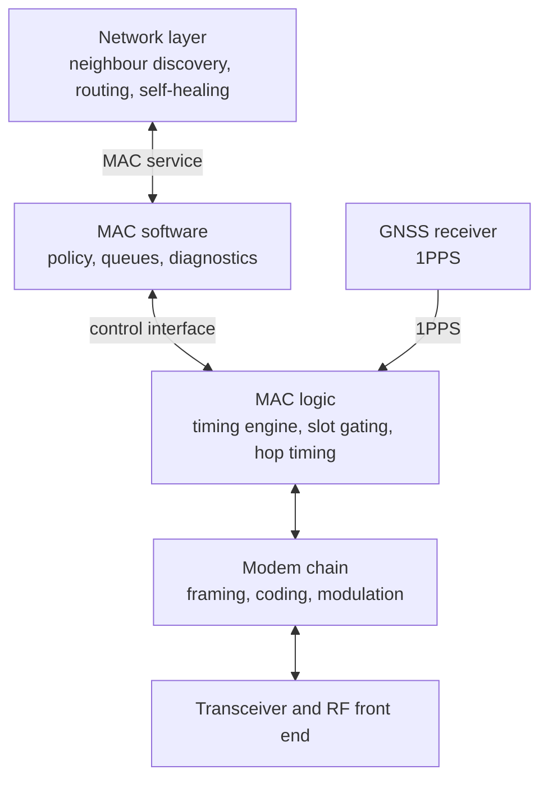

## 2. Terms

| Term | Meaning |
|---|---|
| Logic | The programmable logic (FPGA fabric) |
| Software | Code running on the processor under Linux |
| `mac_pl` | The MAC timing engine in logic: slot timer, slot gating, PDU CRC, hop-synchronous framing, MANET STROBE |
| `mac_ps` | The MAC policy in software |
| Time base | Counters in logic for superframe, frame, slot, hop and fine time, disciplined by GNSS 1PPS |
| `fh_controller` | Logic block that retunes the local oscillator on each hop, with a trigger and acknowledge handshake |
| `rf_ctrl_fsm` | Logic state machine for RF state: RF_OFF, RX_PREP, RX, TX_PREP, TX, TURNAROUND, FAULT, SAFE |
| MANET STROBE | Signal from `mac_pl` that commands RF state |
| PDU | One MAC unit carried in one slot |
| Dwell | Time spent on one hop frequency |
| Slot, frame, superframe | Nested time divisions, defined in section 8 |
| ε | The largest error of a node's time base against GNSS time |

## 3. Known inputs

| Input | Value |
|---|---|
| Hop rate | 1000 hop/s, so one dwell is 1 ms |
| Time source | GNSS 1PPS only. There is no network time fallback |
| RF state authority | MANET STROBE is the only RF state authority. `rf_ctrl_fsm` may add safety but never contradict it |
| Network layer frame | Kind (beacon, routing, data), source id, destination id (0 means broadcast), payload up to 512 bytes |
| Network layer metrics per received frame | RSSI, SNR, packet error rate, PHY errors. Each with a flag that says whether it is valid |
| Network layer delivery | Send never blocks. Received frames are collected by the network layer about every 10 ms |
| Fastest network layer timer | A beacon every 200 ms during acquisition, every 1000 ms in steady state |
| Current waveform | Point-to-point FDD QPSK, continuous transmit, fixed 280-byte frames, no MAC, no addressing, no CRC, 15.36 Mbit/s |

Three consequences follow, and they shape the rest of the design.

1. **The MAC needs half-duplex burst operation.** All nodes share one
   frequency per hop and take turns to transmit. The current waveform
   transmits continuously, so a burst-mode modem is needed (OI-2).
2. **Without GNSS, a node can neither transmit nor receive.** The hop pattern
   is keyed to GNSS time, so a node without GNSS time does not know which
   frequency to listen on.
3. **A network layer frame may not fit one PHY frame.** The network layer
   allows 512 bytes and the current PHY frame carries 280. The MAC must
   fragment, or the slot must carry a larger PDU, or the network layer limit
   must be lowered (OI-2).

## 4. Design rules

1. **Timing in logic, policy in software.** Anything that must happen at a
   precise instant runs in logic. Anything that decides what should happen
   runs in software.
2. **Software is never on a slot deadline.** Software works one frame ahead.
   Its deadlines are a frame long, never a slot.
3. **Late means idle, never late transmit.** If a PDU is not ready in time,
   the slot stays silent and a counter goes up.
4. **Changes take effect only at a boundary.** A new slot map or hopset is
   written in advance and applied by logic at a superframe boundary.
5. **Logic protects the network on its own.** If sync is lost or software
   stops, logic stops transmitting without waiting for software. One node's
   software fault never harms other nodes.
6. **STROBE is the only RF authority.** Software never drives T/R switching
   or RF state.
7. **Every counter is stamped with GNSS time.** Records from different nodes
   can then be lined up against each other.
8. **Planes stay separate.** PDUs never travel over the radio control channel,
   and timing never waits behind control messages.

## 5. Split between logic and software

### 5.1 Placement test

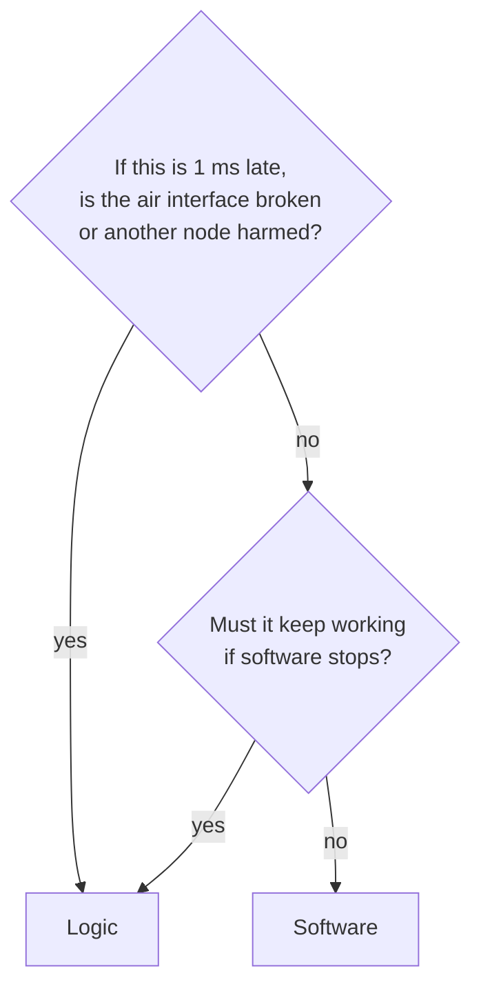

### 5.2 Function allocation

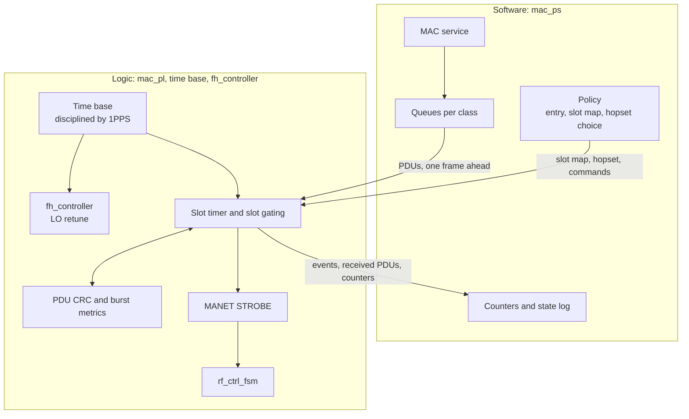

| Function | Side | Reason |
|---|---|---|
| Discipline the time base from 1PPS | Logic | Needs microsecond accuracy. Linux scheduling delay has no upper limit |
| Hop instant and LO retune | Logic | The dwell is 1 ms. A late hop transmits on the wrong frequency |
| Slot boundaries and guard enforcement | Logic | Precision needed is in microseconds (section 8) |
| T/R switching through STROBE | Logic | STROBE is the only RF authority |
| Transmit gating: only in own slot, only when in sync | Logic | Must hold even if software hangs |
| TX inhibit on loss of sync | Logic | Must act within one slot. Software is told afterwards |
| PDU CRC | Logic | Computed on the bit stream at line rate |
| Per-burst RSSI, SNR and arrival offset | Logic | Measured on the samples during the burst (OI-5) |
| Event counting at slot rate | Logic | Events can happen 1000 times a second |
| Which slots this node owns | Software | A decision that changes rarely. Logic only carries it out |
| Network entry and slot conflicts | Software | Policy (OI-3) |
| Hopset selection | Software | Changes rarely (OI-4) |
| Queues, priority, fragmentation | Software | Frame-scale work that needs memory and flexibility |
| Address filtering | Software | Not timing-critical. Logic passes every CRC-good PDU up so diagnostics see all traffic |
| Neighbour table and link metric averaging | Software | Already done by the network layer |
| Counter collection, time-stamped logs, reporting | Software | Off the fast path |

## 6. Service to the network layer

### 6.1 Service operations

| Operation | Behaviour |
|---|---|
| Open | Enable the MAC. The state machine starts in WAIT_TIME (section 9) |
| Close | Disable the MAC. Safe to call twice, and after a failed open |
| Send | Queue one frame with its kind, destination and payload. Returns at once. Success means accepted, not delivered. A full queue returns "try again" |
| Receive | Each CRC-good frame for this node, or broadcast, is handed up with its burst metrics when the network layer next collects |
| Status | Operational flag, MAC state, sync quality, time in holdover, schedule version, hopset id, frame counts |
| Link metrics | Averaged metrics for one neighbour |
| Channel select | With hopping, a single channel has no direct meaning. Whether this selects a hopset is TBD (OI-4) |

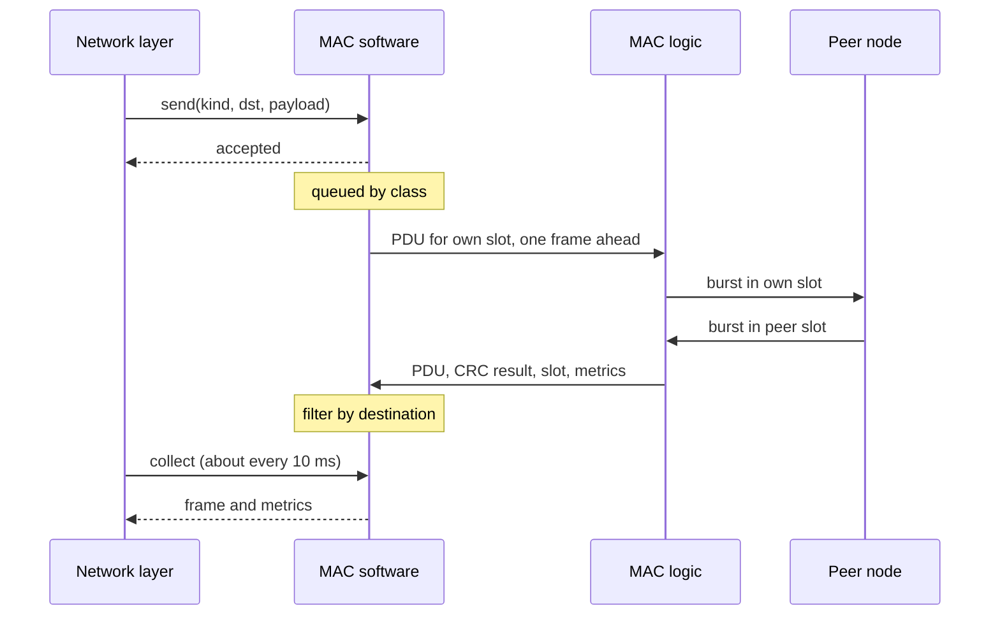

### 6.2 Priority classes

Two classes, taken from the frame kinds the network layer already sends:

- **control:** beacon and routing frames;
- **data:** data frames.

Control is always sent before data. A full data queue never blocks control.

### 6.3 Service guarantees

- Frames come back byte-identical.
- A broadcast reaches every node in range that is in STEADY or HOLDOVER.
- A queued frame waits at most one frame for its slot, plus time behind other
  queued frames, provided the node owns at least one slot per frame.
- Received frames are handed up only when the network layer collects them,
  never from another thread.
- Outside STEADY and HOLDOVER, send is refused with a "wrong state" result,
  and the state is visible in status.
- A metric that logic cannot measure has its valid flag false. No value is
  made up.

Still TBD: the MAC header on the air that carries source, destination, kind
and length, and the maximum frame size (OI-2).

## 7. Control interface between policy and timing engine

This is the interface where multi-node radios usually fail. It is kept small,
and every change on it takes effect at a known instant.

### 7.1 Interface overview

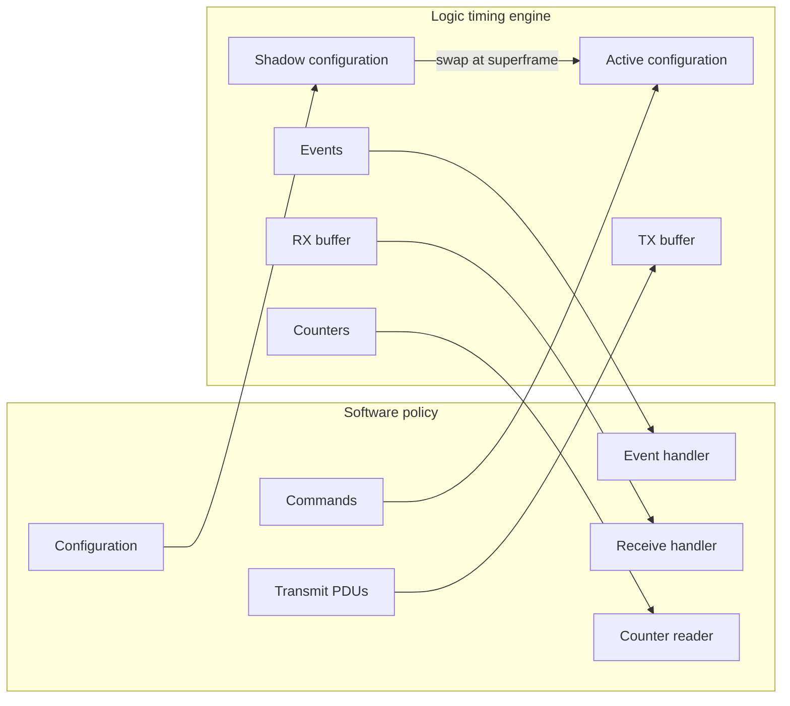

### 7.2 Configuration

Written to a shadow copy, then made active by logic at the superframe named
by software.

| Object | Content | Value |
|---|---|---|
| Frame parameters | Slot length, slots per frame, frames per superframe, guard time | Candidate in 8.1. Guard TBD (OI-1) |
| Slot map | For each slot in the frame: own TX, RX or idle | Set by policy |
| Hopset | Hopset id, and the superframe it starts from | Encoding TBD (OI-4) |
| Node id | This node's id, carried in the MAC header | Network layer node id |
| Apply at | Superframe number at which the shadow copy becomes active | Set by policy |
| Version | Number that goes up with every change | Set by policy |

### 7.3 Commands

| Command | Effect |
|---|---|
| Arm | Start the timing engine at the next 1PPS edge |
| TX enable | Allow transmit from the next frame boundary |
| TX disable | Stop transmit at the next frame boundary |
| Stop | Stop at the next frame boundary. STROBE takes RF to RF_OFF |

### 7.4 Transmit data

Software places one PDU per own slot in the TX buffer, a lead time before the
slot starts. The lead time depends on the transfer path from processor to
logic (OI-2). A PDU that misses the lead time is not sent (rule 3).

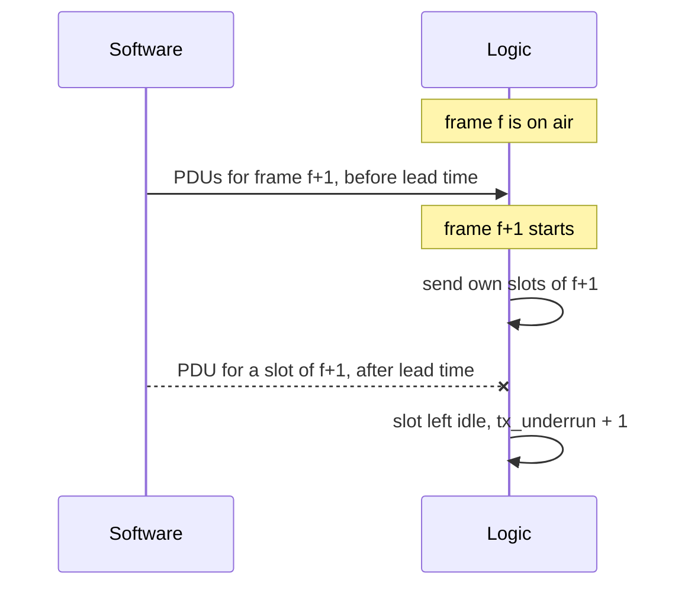

### 7.5 Events and received data

| Event | Meaning |
|---|---|
| Superframe tick | Once per 1PPS, with the superframe number. Software paces its work by it |
| Config applied | The shadow copy is now active, with its version |
| Sync change | 1PPS lost, 1PPS back, holdover started, holdover limit reached |
| TX inhibited | Logic stopped transmit by itself, with the reason |
| Fault | Repeated missed hops, interlock, or RF fault |

Each received PDU comes with its CRC result, slot number, superframe number,
arrival offset and burst metrics.

### 7.6 Applying a change at a boundary

A slot map or hopset change is the moment most likely to split a network,
because nodes that apply it at different times stop hearing each other. The
change is therefore written ahead and applied at a named superframe on every
node.

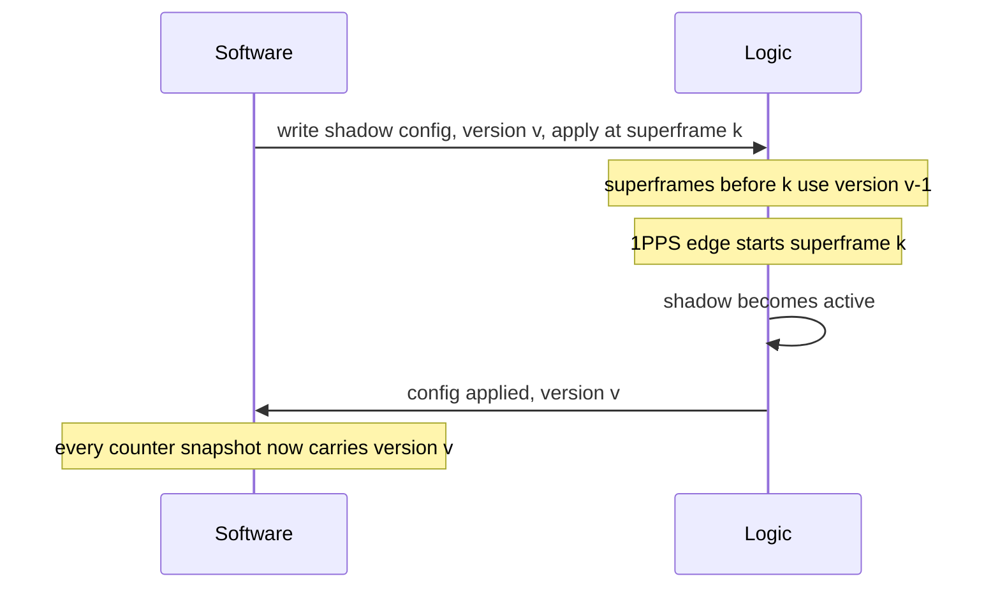

How the superframe number k is agreed between nodes depends on the entry and
allocation method (OI-3).

### 7.7 Software timing

Software has one frame (20 ms, candidate) to prepare the next frame's PDUs,
and one superframe (1 s) to plan a schedule change. It never has to act
within a slot. The share of that time Linux scheduling uses on the board is
TBD and must be measured before the frame length is fixed (OI-6).

## 8. Frame structure and timing precision

### 8.1 Frame structure

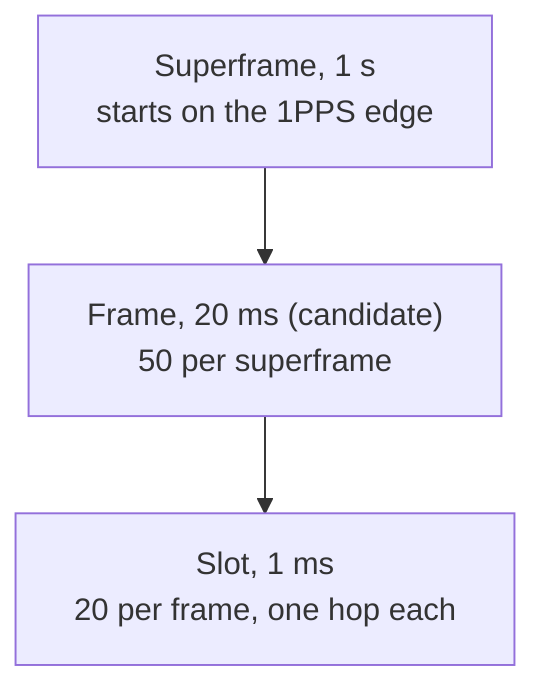

| Level | Length | Status | Reason |
|---|---|---|---|
| Slot | 1 ms, one hop | Fixed by the hop rate | The frame is hop-synchronous. A slot that crossed a hop would carry a retune inside its data |
| Frame | 20 ms, 20 slots | Candidate (OI-1) | Divides 1 s exactly, which keeps the logic counters simple. Gives 10 transmit chances inside the fastest network layer timer |
| Superframe | 1 s, 50 frames | Candidate (OI-1) | Starts on the 1PPS edge. Boundary for schedule and hopset changes and for counter snapshots |

Why 20 ms is only a candidate:

- Any whole divisor of 1 s (10, 20, 25, 40, 50 or 100 ms) meets the network
  layer timers. The choice rests on two values that are not yet known.
- **Maximum number of nodes.** With one slot per node per frame, 20 slots
  hold at most 20 nodes, fewer once control slots are reserved. A larger
  network needs a longer frame or shared slots.
- **Software slack.** Software must prepare each frame ahead (section 7.7).

Frame length must stay a parameter in both logic and software. Neither side
may fix it at 20.

### 8.2 Inside a slot

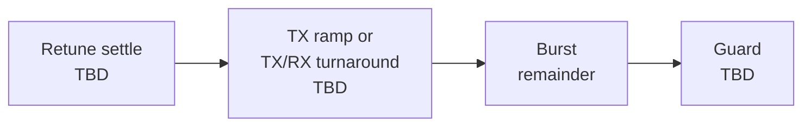

| Part | Length |
|---|---|
| Retune settle | Transceiver LO settle time on this board. TBD (OI-2) |
| TX ramp, TX/RX turnaround | TBD (OI-2) |
| Burst | What is left of 1 ms |
| Guard | Set by section 8.3. TBD (OI-1) |

Fit check: **if** the burst rate equals the current 15.36 Mbit/s, a 280-byte
PDU takes 146 µs and a 512-byte frame 267 µs. Both fit a 1 ms slot with room
for settle and guard. The burst rate is TBD (OI-2), so this is a check, not a
design value.

### 8.3 Timing precision requirement

Each node places its slot edges from its own copy of GNSS time, with an error
of at most ε. A burst from node A reaches node B shifted by up to:

```text
2ε + d / c
```

where d is the distance between the nodes and d/c is the propagation delay,
3.34 µs per km.

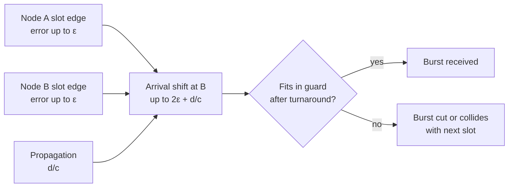

The shift must fit in the guard after the turnaround is taken out. The
**timing precision requirement** is therefore:

```text
ε  ≤  ( T_guard − T_turnaround − d_max / c ) / 2
```

The same ε applies to the hop instant: two nodes hop together to within 2ε.

ε is a budget shared by:

| Contributor | Status |
|---|---|
| GNSS 1PPS error | TBD, set by the receiver chosen (OI-7) |
| Time base discipline error | TBD (OI-7) |
| Drift during holdover | Section 8.4 |
| Slot edge rounding to one logic clock | Fixed once the logic clock is chosen |

T_guard, T_turnaround and d_max are TBD (OI-1, OI-2). Once they are known, ε
follows from the formula above and becomes the requirement on the time base.

Illustration only, not a requirement: a guard of 50 µs, a turnaround of
10 µs and a range of 10 km give ε ≤ (50 − 10 − 33.4) / 2 = 3.3 µs.

### 8.4 Holdover

When 1PPS is lost, the time base runs free and its error grows:

```text
ε(t) = ε_lock + drift × t
```

The node may keep transmitting until ε(t) reaches the budget from 8.3:

```text
t_holdover = ( ε_budget − ε_lock ) / drift
```

Drift depends on the oscillator, which is TBD (OI-7). GNSS is the only time
source, so when the holdover limit is reached the node must stop
transmitting.

## 9. State machine

### 9.1 States

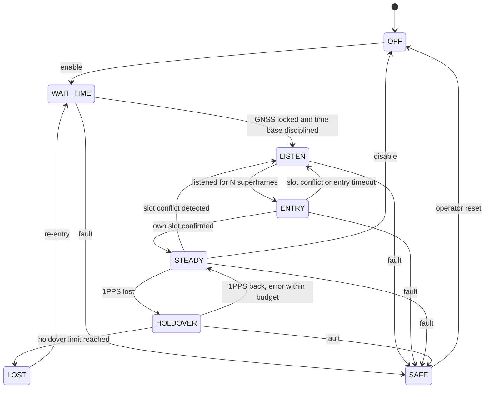

| State | TX | RX | Moved on by | Leaves when | TBD |
|---|---|---|---|---|---|
| OFF | No | No | Software | Enabled | |
| WAIT_TIME | No | No | Logic reports, software decides | GNSS locked and time base within budget | Lock criteria (OI-7) |
| LISTEN | No | Yes | Software | N superframes heard, slot use known | N (OI-3) |
| ENTRY | Entry or own slot only | Yes | Software | Own slot confirmed, or conflict | Entry method (OI-3) |
| STEADY | Own slots | Yes | Software; logic on sync loss | 1PPS lost, conflict, fault, disable | |
| HOLDOVER | Own slots | Yes | Logic | 1PPS back, or limit reached | Limit (OI-7) |
| LOST | **No, inhibited by logic** | Best effort | Logic stops TX, software starts re-entry | Re-entry begins | |
| SAFE | No | No | Logic or software on fault | Operator reset | Fault list (OI-8) |

Rules:

- **WAIT_TIME has no RX.** Without GNSS time the node does not know the hop
  pattern.
- **LOST never goes straight back to STEADY.** A node that lost sync goes
  through WAIT_TIME and LISTEN again, so it never transmits on an old
  schedule.
- **HOLDOVER returns to STEADY without re-entry** if the error never left the
  budget. Whether the time base then steps or slews back to GNSS time is TBD
  (OI-7). Either way, the correction is applied at a superframe boundary.
- **Logic moves into LOST and inhibits TX** within one slot. Software learns
  of it from the event.
- **STROBE drives RF state in every state.** In OFF, WAIT_TIME, LOST and SAFE
  it holds RF out of TX.

### 9.2 Network entry

How a node gets its slot is TBD (OI-3). There are two ways, and the choice
belongs to the network owner:

- **Fixed map:** the slot follows from the node id. No entry protocol is
  needed, and ENTRY only checks that the slot is free.
- **Dynamic map:** the node claims a free slot and resolves conflicts. An
  entry protocol is needed.

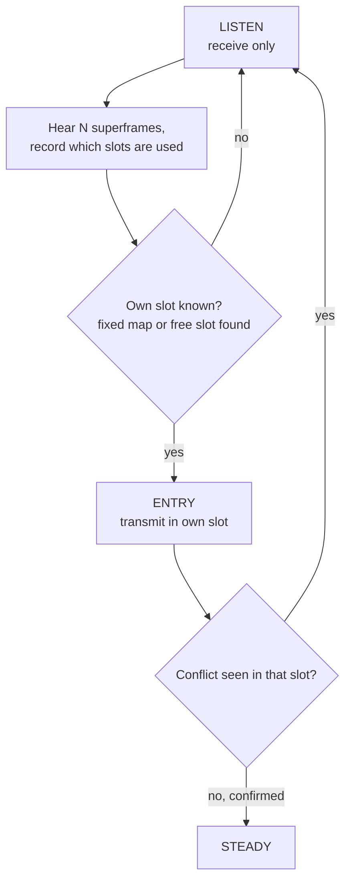

### 9.3 Loss of synchronisation and re-entry

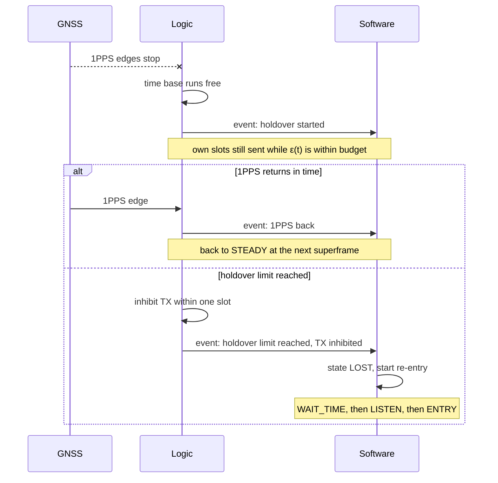

## 10. Counters and diagnostics

Every counter snapshot carries the superframe number (GNSS time), the
schedule version and the hopset id. With these, records from every node in a
failing network can be lined up slot by slot. That turns a multi-node failure
from a guess into a diagnosis.

### 10.1 Collection path

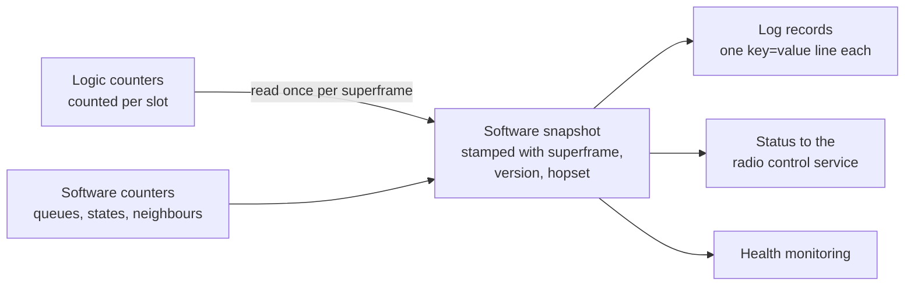

### 10.2 Logic counters

| Counter | Counts | Points to |
|---|---|---|
| `slots_tx` | Bursts sent | |
| `tx_underrun` | Own slots left idle because no PDU was ready in time | Software too slow |
| `tx_inhibit` | Slots not sent because logic inhibited TX | Sync loss or fault |
| `rx_ok` | CRC-good PDUs received | |
| `rx_crc_fail` | Bursts detected with a bad CRC | Collision or weak link |
| `rx_empty` | RX slots where nothing was detected | Peer absent or not heard |
| `rx_early`, `rx_late` | Bursts starting in the guard, before or after the expected edge | Timing error, or range beyond guard |
| `arrival_offset` | Per neighbour: burst start against expected edge, as min, max and mean | The main timing diagnostic |
| `hop_missed` | Hop triggers without an acknowledge | LO retune or transceiver fault |
| `pps_missing` | Expected 1PPS edges that did not arrive | GNSS |
| `pps_error` | 1PPS edge against the time base | Time base quality |
| `holdover_time` | Time spent in holdover | |
| `strobe_override` | Times `rf_ctrl_fsm` refused a STROBE request for safety | Interlock |
| `config_applied` | Version of the slot map and hopset now active | Schedule mismatch |

### 10.3 Software counters and records

| Item | Content |
|---|---|
| Queue depth and drops | Per class |
| Send refusals | By reason: state, queue full, too large |
| State transitions | One record per transition: old state, new state, reason, superframe number |
| Neighbour table | Per neighbour: last superframe heard, slot used, receive count, CRC fail count |
| Schedule history | Each version: what changed, when written, when applied |
| Frame preparation slack | How far ahead of the lead time each frame was ready. Measures the Linux margin |

### 10.4 Diagnosing a multi-node failure

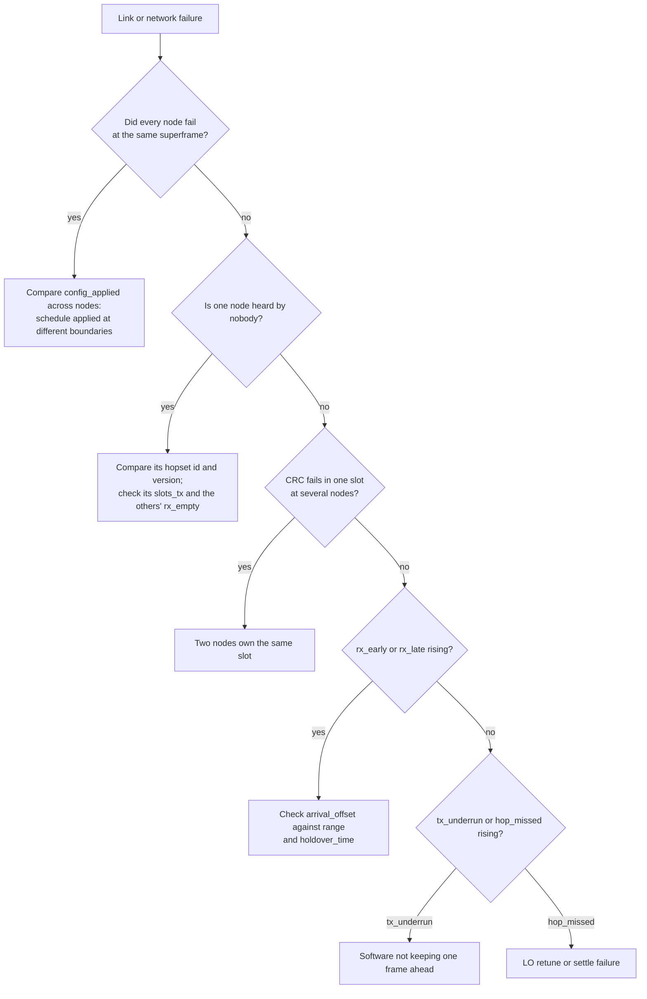

| Symptom | Counters to compare | Likely cause |
|---|---|---|
| One node heard by nobody | Its `slots_tx` rising, others' `rx_empty` rising in its slot | Hopset id or version differs, or its TX chain is down |
| CRC fails in one slot at several nodes | `rx_crc_fail` by slot, across nodes | Two nodes own the same slot |
| Links fail with distance | `rx_early`, `rx_late` and `arrival_offset` grow with range | Propagation larger than the guard allows |
| Whole network drops at one superframe | `config_applied` differs between nodes at that superframe | Schedule applied at different boundaries |
| One node fails some time after GNSS loss | `holdover_time` at failure, `arrival_offset` drifting | Holdover drift beyond budget |
| One node leaves gaps | `tx_underrun` rising, low preparation slack | Software not keeping one frame ahead |
| Random loss on all links of one node | `hop_missed` rising | LO retune or settle failure |

## 11. Open items

| Id | Item | Owner |
|---|---|---|
| OI-1 | Frame and slot structure: final frame length, slots per frame, guard time, maximum number of nodes, maximum range | Logic and network |
| OI-2 | Burst-mode air interface: half-duplex operation, LO settle and TX/RX turnaround times, burst rate, maximum PDU, MAC header, fragmentation, transmit lead time | Logic |
| OI-3 | Network entry and slot allocation: fixed or dynamic map, listen time N, conflict handling, how the apply-at superframe is agreed | Network |
| OI-4 | Hopset: id and encoding, who selects it, what channel select means under hopping, behaviour on a missed hop | Logic and system |
| OI-5 | Per-burst RSSI, SNR and arrival offset: whether logic can measure them, and in what units | Logic |
| OI-6 | Frame preparation slack: how far ahead Linux software can prepare frames on the board | Software |
| OI-7 | Time base: GNSS receiver 1PPS accuracy, lock criteria, discipline error, oscillator drift, holdover limit, step or slew on 1PPS return | Logic and hardware |
| OI-8 | Fault list for SAFE: which faults stop the MAC and how they are reported | System |

## 12. Sign-off

The architecture is agreed when each owner accepts their part and answers
their open items.

| Owner | Accepts | Answers |
|---|---|---|
| Logic | Sections 5, 7, 8, the logic parts of 9, and 10.2. Rules 3 to 6 | OI-1 guard, OI-2, OI-4, OI-5, OI-7 |
| Software | Sections 6, 7, 9 and 10.3. Rules 2, 3 and 7 | OI-6 |
| Network | Section 6 and the candidate frame structure | OI-1 nodes and range, OI-3 |

| Owner | Name | Date | Agreed |
|---|---|---|---|
| Logic | | | |
| Software | | | |
| Network | | | |
