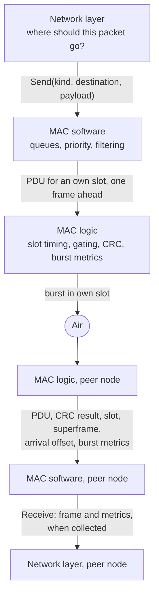
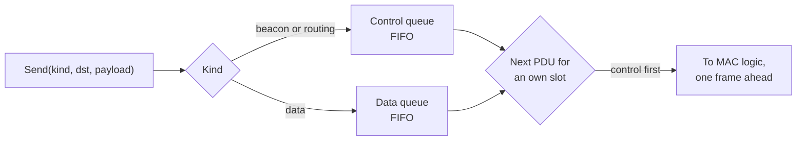
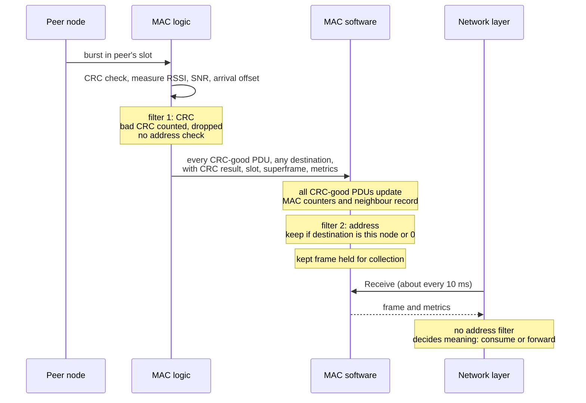
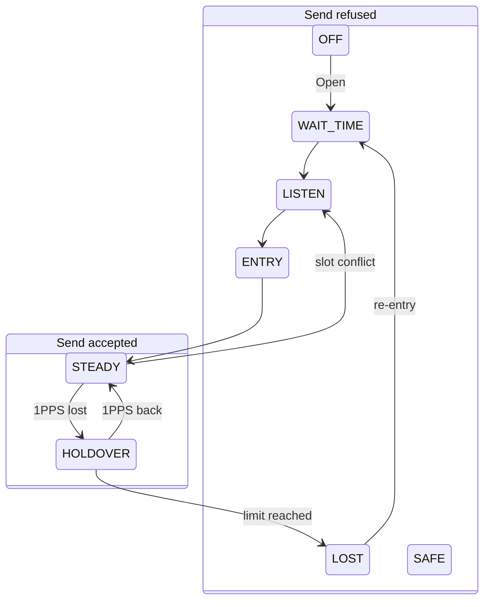
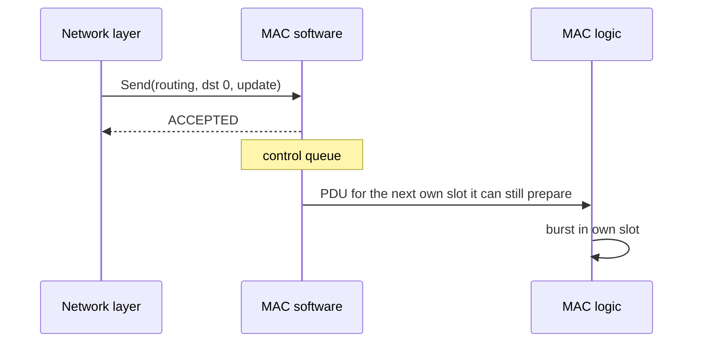

# HH-SDR MAC ↔ Network Layer Interface Specification

| Item | Value |
|---|---|
| Version | 1.0 |
| Date | 2026-10-06 |
| Task | F01-AK-3 |
| Status | Draft for review |
| Based on | HH-SDR Medium Access (MAC) Architecture, version 1.0 |

## Revision history

| Version | Date | Change |
|---|---|---|
| 1.0 | 2026-10-06 | First issue, draft for review |

## Contents

- [1. Purpose](#1-purpose)
- [2. Scope](#2-scope)
- [3. Conventions](#3-conventions)
- [4. Layer responsibilities](#4-layer-responsibilities)
- [5. Interface model](#5-interface-model)
- [6. MAC service primitives](#6-mac-service-primitives)
- [7. Transmit request](#7-transmit-request)
- [8. Received frame](#8-received-frame)
- [9. Queue model](#9-queue-model)
- [10. Priority handling](#10-priority-handling)
- [11. Slot and scheduling interaction](#11-slot-and-scheduling-interaction)
- [12. Link quality interface](#12-link-quality-interface)
- [13. Link metric reporting model](#13-link-metric-reporting-model)
- [14. Receive model](#14-receive-model)
- [15. Broadcast](#15-broadcast)
- [16. Error model](#16-error-model)
- [17. Retransmission ownership](#17-retransmission-ownership)
- [18. Fragmentation ownership](#18-fragmentation-ownership)
- [19. Status interface](#19-status-interface)
- [20. Channel select](#20-channel-select)
- [21. State-dependent behaviour](#21-state-dependent-behaviour)
- [22. Ownership boundaries](#22-ownership-boundaries)
- [23. Timing contract](#23-timing-contract)
- [24. Fixed and TBD items](#24-fixed-and-tbd-items)
- [25. Example scenarios](#25-example-scenarios)
- [26. Interface contract summary](#26-interface-contract-summary)
- [27. Inherited open items](#27-inherited-open-items)
- [28. F01 acceptance matrix](#28-f01-acceptance-matrix)
- [29. Review checklist](#29-review-checklist)
- [30. Sign-off](#30-sign-off)
- [31. Decision pending matrix](#31-decision-pending-matrix)

## 1. Purpose

The HH-SDR radio splits the job of moving a packet between two layers.

| Layer | Question it answers |
|---|---|
| Network layer | **Where** should this packet go? |
| MAC | **How and when** can this packet use the radio? |

The network layer runs neighbour discovery, routing and self-healing. It
chooses the next hop. The MAC owns access to the shared radio channel: it
queues frames, applies priority, and transmits them in the slots the node is
allowed to use. It also measures each received burst and hands those
measurements up.

The two layers have different owners. The MAC is built by the logic and
software owners. The network layer is built by the network owner. This
document is the contract between them. It states exactly what crosses the
boundary, what each side may assume about the other, and what is still open.

The design named in "Based on" above already names the service operations
and the main guarantees. It does not give each operation's inputs, outputs, results, queue behaviour,
error cases or metric reporting in enough detail for two teams to build
against independently. This document adds that detail.

This document freezes the **software-visible contract** only. It does not
freeze anything at register or buffer level in logic. Those depend on open
items of that design that are not yet answered (section 27).

## 2. Scope

**Included:**

- the MAC service primitives offered to the network layer;
- the logical content of a transmit request and of a received frame;
- queue behaviour and priority;
- status;
- link metrics and how they are reported;
- error and result cases;
- ownership boundaries between the network layer, MAC software and MAC logic;
- broadcast;
- how the interface behaves in each MAC state.

**Not included:**

- logic register map;
- hardware buffer layout or transfer mechanism between processor and logic;
- modem, waveform and PHY details;
- the final on-air MAC header;
- the final slot allocation algorithm and network entry protocol;
- the final fragmentation format;
- any retransmission algorithm;
- GNSS, time base and holdover implementation;
- the routing protocol itself.

The interface between MAC software and MAC logic is referred to where it affects this contract, but it is not specified here.

## 3. Conventions

| Word | Meaning in this document |
|---|---|
| **MUST** | An established contract. Used only for statements marked Fixed |
| **SHOULD** | An engineering recommendation made by this document. It becomes a MUST once it is agreed |
| **MAY** | Permitted, not required |
| **TBD** | Not decided. Every TBD names an open item (OI-n) or a pending decision (DP-n) |

Open items:

- **OI-1 to OI-8** are open items inherited from the design named in "Based
  on" above. Their numbers and meaning are unchanged. They are listed in
  section 27.
- **DP-1 to DP-15** are decisions about the MAC to network boundary that are
  still to be made. Each place in the text that depends on one says so and
  gives the options. All of them are collected, with their options, in the
  decision pending matrix (section 31).

Each statement carries one of these markers, written in front of it or after
it in brackets:

| Marker | Meaning |
|---|---|
| Fixed | An established requirement. Not open for change in this document |
| Consequence | Not stated in words but follows directly from what is stated. Where it still needs a decision, the DP number is given |
| Proposed | Proposed by this document. Not yet agreed |
| TBD | Open. OI or DP number given |

Names written in capitals such as `ACCEPTED` or `TRY_AGAIN` are **proposed
logical names**. They show meaning, not final spelling, numeric values or
language binding (DP-13).

Terms used:

| Term | Meaning |
|---|---|
| Frame | The unit the network layer gives to and gets from the MAC: kind, source, destination, payload |
| PDU | One MAC unit carried in one slot |
| Burst | One transmission in one slot |
| Collect | The network layer taking received frames from the MAC |
| Control class | Beacon and routing frames |
| Data class | Data frames |
| Node id | This node's identifier, shared by the network layer and the MAC |

## 4. Layer responsibilities

"MAC software" is the MAC policy running on the processor. "MAC logic" is the
timing engine in the programmable logic.

| Responsibility | Network layer | MAC software | MAC logic |
|--------------------|--------------|----------------|--------------|
| Route computation (Fixed) | Owns | None | None |
| Next-hop selection (Fixed) | Owns | None | None |
| Neighbour table and its interpretation (Fixed) | Owns | Keeps its own MAC-level neighbour record for diagnostics | None |
| Generating beacon, routing and data frames (Fixed) | Owns | None | None |
| Choosing the frame kind (Fixed) | Owns | Uses it to pick the class | None |
| Queueing accepted frames (Fixed) | None | Owns | None |
| Priority between classes (Fixed) | None | Owns | None |
| Which slots this node owns (Fixed. Method TBD, OI-3) | None | Owns | Carries it out |
| Slot timing, guard, hop instant (Fixed) | None | None | Owns |
| Transmit gating (own slot only, in sync only) (Fixed) | None | None | Owns |
| TX inhibit on loss of sync (Fixed) | None | Told afterwards | Owns |
| RF state and T/R switching (Fixed) | None | None | Owns, through STROBE |
| PDU CRC (Fixed) | None | None | Owns |
| Per-burst RSSI, SNR, arrival offset (Fixed. Feasibility and units TBD, OI-5) | None | None | Measures |
| Address filtering of received frames (Fixed) | None | Owns | Passes every CRC-good PDU up |
| Link metric averaging (Fixed. Which software layer: decision pending, DP-6) | Decision pending (DP-6) | Decision pending (DP-6) | None |
| Interpreting link quality for routing (Fixed) | Owns | None | None |
| Retransmission decision (TBD, DP-1) | TBD | TBD | TBD |
| Fragmentation, if needed (Fixed. Whether it happens: TBD, OI-2) | None | Owns, if MAC fragments | None |
| Broadcast transmission and acceptance (Fixed) | Decides network meaning | Accepts and queues | Transmits in own slot |
| MAC state machine (Fixed) | Observes through Status | Owns most transitions | Owns sync-loss and holdover transitions |

## 5. Interface model



This is a logical model. It shows what crosses each boundary and in which
direction. It is not a binary ABI, and it does not say whether the boundary
is a function call, a queue between processes or a message on a socket. That
binding is TBD (DP-13). Whatever binding is chosen MUST keep the behaviour
specified here: Send never blocks, and received frames reach the network
layer only when it collects them.

The two halves are independent:

- Transmit path: the network layer hands a frame down. The call returns at
  once. Everything after that happens on the MAC's own schedule.
- Receive path: the MAC holds received frames until the network layer
  collects them, about every 10 ms.

## 6. MAC service primitives

There are seven operations. Each is specified
below. The direction is always "Network layer calls MAC". Results flow back
as the return of the call.

### 6.1 Open

| Field | Content |
|--------------|--------------------------------------------------------------------------------|
| Direction | Network layer to MAC |
| Purpose | Enable the MAC |
| Inputs | None at this interface. MAC configuration (node id, frame parameters) is supplied through the MAC's own configuration path |
| Outputs | Result |
| Blocking | SHOULD return without waiting for synchronisation (Proposed) |
| Success means | The MAC is enabled and its state machine has entered WAIT_TIME (Fixed). It does **not** mean the node is synchronised or can transmit |
| Failure | MAC could not be enabled, for example a logic or configuration fault. Result names are Proposed: `FAULT`, `INVALID_CONFIG` |
| Owner | MAC software |
| Notes | After Open, the network layer reads Status to learn when Send will be accepted. Calling Open while already open: behaviour TBD (DP-13) |

### 6.2 Close

| Field | Content |
|--------------|--------------------------------------------------------------------------------|
| Direction | Network layer to MAC |
| Purpose | Disable the MAC |
| Inputs | None |
| Outputs | Result |
| Blocking | SHOULD return without waiting for the next frame boundary (Proposed) |
| Success means | MAC software accepts no further Send, hands no further PDU to logic, and has commanded logic to stop. Logic stops at the next frame boundary, and STROBE then takes RF to RF_OFF (Fixed). PDUs already handed to logic for the frame in progress MAY still be transmitted between the return of Close and that boundary. After the boundary the node does not transmit |
| Failure | None expected. Close MUST be safe to call twice and after a failed Open (Fixed) |
| Owner | MAC software |
| Notes | Frames still in the MAC software queues at Close are discarded and counted as drops (Proposed. Decision pending, DP-3). The network layer receives no per-frame notice of them, which is the same as any accepted frame that is never delivered (section 16.1). Whether undelivered received frames can still be collected after Close is TBD (DP-13) |

### 6.3 Send

| Field | Content |
|--------------|--------------------------------------------------------------------------------|
| Direction | Network layer to MAC |
| Purpose | Ask the MAC to transmit one frame |
| Inputs | Frame kind, destination id, payload (Fixed). Full content in section 7 |
| Outputs | Result |
| Blocking | MUST NOT block. Returns at once (Fixed) |
| Success means | **The MAC accepted the frame into its queue.** It does **not** mean the frame was transmitted, and it does **not** mean any node received it |
| Failure | Queue for that class full: "try again" (Fixed). MAC not in STEADY or HOLDOVER: "wrong state" (Fixed). Payload too large: "too large" (Fixed as a refusal reason). Malformed request: Proposed. Full list in section 16 |
| Owner | MAC software |
| Notes | After acceptance, the network layer gets no per-frame report of transmission (Consequence: none is defined). Whether one should exist is TBD (DP-12) |

### 6.4 Receive (collect)

| Field | Content |
|--------------|--------------------------------------------------------------------------------|
| Direction | Network layer to MAC. Frames flow MAC to network layer as the result |
| Purpose | Collect received frames that are addressed to this node or broadcast |
| Inputs | None, or a buffer for the frames (binding TBD, DP-13) |
| Outputs | Zero or more received frames, each with its metrics (section 8) |
| Blocking | SHOULD NOT block (Proposed). The network layer collects on its own timer, about every 10 ms. Returning "nothing available" is a normal result |
| Success means | The returned frames were CRC-good and addressed to this node or broadcast (Fixed). Each payload is byte-identical to the payload the sender's network layer gave its MAC (Fixed). Kind and destination have the values given to the sender's Send, and source is the sender's node id (section 8.1) |
| Failure | Not open (Proposed). RX holding buffer overflowed since the last collect: reported through a counter, not as a failure of this call (Proposed, DP-5) |
| Owner | MAC software |
| Notes | Frames are handed up only when the network layer collects them, never from another thread (Fixed). Whether one call returns one frame or a batch is TBD (DP-13) |

### 6.5 Status

| Field | Content |
|--------------|--------------------------------------------------------------------------------|
| Direction | Network layer to MAC |
| Purpose | Read the MAC's current condition |
| Inputs | None |
| Outputs | Operational flag, MAC state, sync quality, time in holdover, schedule version, hopset id, frame counts (Fixed). Detail in section 19 |
| Blocking | MUST NOT block (Proposed: it is a read of state the MAC already holds) |
| Success means | The returned values are the MAC's current view |
| Failure | Not open (Proposed) |
| Owner | MAC software |

### 6.6 Link metrics

| Field | Content |
|--------------|--------------------------------------------------------------------------------|
| Direction | Network layer to MAC |
| Purpose | Read averaged link metrics for one neighbour |
| Inputs | Neighbour id |
| Outputs | Averaged metrics for that neighbour, each with a valid flag (Fixed). Detail in section 12 |
| Blocking | MUST NOT block (Proposed) |
| Success means | The MAC holds metrics for that neighbour and returns them |
| Failure | No record for that neighbour: Proposed `NOT_FOUND`. Not open: Proposed |
| Owner | MAC software |
| Notes | Averaging window and method are TBD (DP-6) |

### 6.7 Channel select

| Field | Content |
|--------------|--------------------------------------------------------------------------------|
| Direction | Network layer to MAC |
| Purpose | Not yet defined. With frequency hopping, a single channel has no direct meaning (Fixed) |
| Inputs | TBD (OI-4) |
| Outputs | Result |
| Blocking | SHOULD NOT block (Proposed). Any change applies at a superframe boundary |
| Success means | TBD (OI-4) |
| Failure | Until OI-4 is closed, Channel select SHOULD return `UNSUPPORTED` (Proposed) |
| Owner | MAC software |
| Notes | See section 20 |

## 7. Transmit request

The transmit request is the logical content of a Send call. It is not a
binary layout.

| Field | Meaning | Supplied by |
|------------|----------------------|--------------|
| Kind | Fixed: One of: beacon, routing, data | Network layer |
| Destination id | Fixed: Node that should receive the frame. 0 means broadcast | Network layer |
| Payload | Fixed: Opaque bytes. The MAC never reads or changes them | Network layer |
| Payload length | Fixed: Number of payload bytes. Up to 512. Final limit TBD (OI-2) | Network layer |
| Source id | Consequence: This node's id. Send takes kind, destination and payload only, and the MAC header carries this node's id. Decision pending (DP-8) | **MAC**, from its configured node id |
| Priority class | Fixed: Control or data | **MAC**, derived from kind |

### 7.1 Kind and class

| Kind | Class | Typical content |
|---|---|---|
| Beacon | Control | Discovery and heartbeat |
| Routing | Control | Route updates |
| Data | Data | Application traffic |

The class is derived from the kind. The network layer does not pass a separate
priority. This keeps one source of truth: a frame cannot be marked "data" and
"control" at once. Additional classes, for example to separate voice from
other data, are not defined. Adding one would be a change to this contract
(DP-10).

### 7.2 Source and destination are one-hop addresses

Send has no source parameter, and the MAC delivers a received frame only if
its destination is this node or broadcast. Together these mean:

- the **destination** in Send is the **next hop** chosen by routing, or 0 for
  broadcast;
- the **source** on a received frame is the **node that transmitted it**, not
  necessarily the node that originated the packet.

Example: A sends a packet to C through B.

| Hop | Send at | Destination given to MAC | Source seen by receiver |
|---|---|---|---|
| A to B | A | B | A |
| B to C | B | C | B |

If the network layer needs the originator (A) or the final destination (C),
it carries them inside its own payload. The MAC does not know or care.

This follows from the fixed operations but is not stated anywhere as a
requirement. It is a decision to be made (DP-8). The options are:

- accept the one-hop meaning above, with end-to-end addresses carried in the
  network payload;
- extend Send to carry the originator and the final destination, which
  changes the fixed Send operation and needs both addresses in the on-air
  MAC header (OI-2).

This document assumes the first option.

### 7.3 What the MAC checks

| Check | Result if it fails |
|---|---|
| MAC is in STEADY or HOLDOVER (Fixed) | `WRONG_STATE` |
| Payload length within the current limit (Fixed) | `TOO_LARGE` |
| Kind is one of the three known kinds (Proposed) | `INVALID_ARGUMENT` |
| Destination id is valid (Proposed. What counts as invalid, for example own id is TBD, DP-11) | `INVALID_ARGUMENT` |
| Queue for the frame's class has room (Fixed) | `TRY_AGAIN` |

The MAC does **not** check whether the destination is a current neighbour.
Reachability is a routing question. A unicast frame to a node that is not in
range is transmitted and simply not received.

## 8. Received frame

The received frame is what the network layer gets from Receive.

### 8.1 Frame fields

| Field | Meaning |
|---|---|
| Kind | Fixed: Beacon, routing or data, as sent |
| Source id | Fixed: The transmitting node (section 7.2). Its one-hop meaning is a Consequence (DP-8) |
| Destination id | Fixed: This node's id, or 0 for broadcast |
| Payload length | Fixed: As sent |
| Payload | Fixed: Byte-identical to what the sender's network layer passed to Send |

The guarantee is **payload byte-identical**, not frame byte-identical. The
original service guarantee reads "frames come back byte-identical". Only the
payload can carry a byte-level promise, for two reasons:

- Kind, source, destination and length travel in the on-air MAC header, whose
  encoding is TBD (OI-2). What reaches the receiver is the same **values**,
  re-encoded by the MAC, not the same bytes.
- The received frame contains more than the sender passed down: the per-frame
  metrics of section 8.2 are added by the receiving MAC.

So the contract is: payload bytes equal, and kind, source, destination and
length equal in value. Whether this is the intended meaning of the original
guarantee is a decision to be made (DP-15). The options are:

- payload byte-identical, with kind, source, destination and length equal in
  value, as above;
- whole frame byte-identical, which first needs the on-air header encoding
  fixed (OI-2) and a frame layout shared by both network layers.

This document assumes the first option.

### 8.2 Metrics delivered with each frame

There are four per-frame metrics, each with its own valid flag (Fixed).

| Metric | Measured by | Valid flag | Units |
|------------|------------------------------|--------|--------------|
| RSSI (Fixed) | MAC logic, per burst | Yes | TBD (OI-5) |
| SNR (Fixed) | MAC logic, per burst | Yes | TBD (OI-5) |
| Packet error rate (Fixed. Definition TBD, DP-14) | TBD: a rate is not a property of one burst, so some layer computes it over several bursts | Yes | Ratio 0 to 1 (Proposed) |
| PHY errors (Fixed. Source depends on modem, OI-2) | MAC logic or modem | Yes | Count (Proposed) |

A metric that cannot be measured MUST have its valid flag false. No value may
be made up (Fixed). A false flag means "no information", not
"zero".

### 8.3 Timing information

Logic gives MAC software, with each received PDU: CRC result, slot number,
superframe number, arrival offset and burst metrics.

| Item | Passed to network layer? |
|---|---|
| CRC result | Fixed: No. Only CRC-good frames are delivered, so it is always "good" |
| Burst metrics | Fixed: Yes, as in 8.2 |
| Superframe number | Proposed (DP-7): SHOULD be passed as a receive timestamp in GNSS time, so network logs line up across nodes |
| Slot number | TBD (DP-7) |
| Arrival offset | TBD (DP-7). It is a timing diagnostic, and routing has no use for it today |

### 8.4 Measured versus interpreted

| MAC measures and reports | Routing interprets and decides |
|---|---|
| "The last burst from node 7 had RSSI X, SNR Y" | "Node 7 is a good or bad next hop" |
| "PER towards node 7 is Z, valid" | "Node 7's link is degrading, prefer another route" |
| "RSSI not valid for this burst" | "Ignore RSSI for this sample" |

The MAC MUST NOT choose routes or rank neighbours for routing. The network
layer MUST NOT change radio timing, slots or RF state to influence a link
.

## 9. Queue model

### 9.1 Logical queues



| Property | Contract |
|------------------|----------------------------------------------|
| Number of queues | Fixed: One per class: control and data |
| Shared or per destination | Consequence: One queue per class, shared by all destinations, because queues are fixed per class only. Unicast and broadcast frames of the same class share that queue. Per-destination queues are not defined |
| Order within a class | Proposed: First in, first out |
| Send never blocks | Fixed: Send returns at once, whether or not there is room |
| Full queue | Fixed: Send returns `TRY_AGAIN` and the frame is not queued. Proposed: nothing already queued is removed |
| Control not blocked by data | Fixed: A full data queue MUST NOT stop a control frame being accepted |
| Control evicting data | Proposed: not needed, because separate queues mean a full data queue leaves control room untouched. Eviction is not defined and SHOULD NOT be added |
| Depth per class | TBD (DP-4). Proposed: a configuration parameter, not a constant |
| Depth unit | TBD (DP-4): frames or bytes |
| Counters | Fixed: Depth and drops per class; Send refusals by reason (state, queue full, too large) |

### 9.2 What "try again" asks of the network layer

`TRY_AGAIN` means: "the MAC has no room for this class now; nothing was
queued." The network layer decides what to do. It may hold the frame and try
on its next cycle, drop it, or replace it with a fresher one. A routing update
that is several cycles old is often worth less than a new one. That choice is
the network layer's and is outside this contract.

The network layer SHOULD NOT retry `TRY_AGAIN` in a tight loop. The queue
drains at the slot rate, so space appears at frame boundaries, not
microseconds later (Proposed).

### 9.3 Frames that are accepted but never transmitted

An accepted frame can still fail to go on air. The logic-side counters for
this are fixed, but what happens to the frame itself is not.

| Case | What logic does | What happens to the frame | Network layer told? |
|------------------|----------------------------|------------------------------|--------------------|
| PDU not ready by the lead time | Slot left idle, `tx_underrun` + 1 | TBD: re-queued for the next own slot, or discarded (DP-2) | No (DP-12) |
| Logic inhibits TX (sync loss, holdover limit) | Slot not sent, `tx_inhibit` + 1 | TBD (DP-3) | Indirectly, through Status state change |
| MAC leaves STEADY or HOLDOVER with frames queued | New Sends refused | TBD: flushed or kept (DP-3) | Indirectly, through Status |
| Close | Sends PDUs already handed to it until the next frame boundary, then stops | Frames in MAC software queues: discarded (Proposed, DP-3). PDUs already in logic: may still be sent before the boundary | Caller knows it closed. No per-frame notice |

## 10. Priority handling

### 10.1 Why priority exists

Beacons and routing updates keep the network alive. If data fills the radio,
and beacons cannot get out, neighbours declare this node lost, routes are
torn down, and then the data cannot be delivered either. Control traffic is
small and regular. Data traffic can be large and bursty. Priority stops the
second from starving the first.

### 10.2 The rule

```text
CONTROL  >  DATA
```

Control is always sent before data (Fixed).

### 10.3 Selecting the next PDU

When the MAC fills an own slot for the next frame:

1. If the control queue is not empty, take the oldest control frame.
2. Otherwise, if the data queue is not empty, take the oldest data frame.
3. Otherwise the slot carries nothing.

Step 1 before step 2 is Fixed. Oldest-first inside a class is
Proposed (section 9.1).

### 10.4 Starvation

The fixed rule is that control is **always** sent before data. That is
strict priority. Under strict priority, data waits as long as control is
queued.

This is not expected to be a problem with today's traffic. The fastest
network timer is one beacon every 200 ms during acquisition. With
the candidate 20 ms frame, a node with one own slot per frame has 10 slots in
that time.

It becomes a problem if routing traffic grows, for example under heavy
topology change, or if the node owns few slots. This document does not change
the strict rule. Whether to change it is a decision to be made (DP-10). The
options are:

- keep strict priority, as the fixed rule states;
- the network layer bounds its own control rate;
- the MAC guarantees data a minimum share, for example one slot in N.

The second and third options change the fixed priority rule. This document
assumes the first option.

## 11. Slot and scheduling interaction

### 11.1 Who does what

| Activity | Owner |
|---|---|
| Executing slot timing to the microsecond | Fixed: MAC logic |
| Deciding which slots this node owns | Fixed: MAC software policy. Method TBD (OI-3) |
| Filling own slots from the queues, one frame ahead | Fixed: MAC software |
| Choosing when to call Send | Fixed: Network layer |
| Meeting any slot deadline | Fixed: **Nobody in the network layer** |

The network layer never sees slots. It hands frames down early. The MAC puts
them into the next own slot it can still fill.

### 11.2 Simple example

Four nodes, A, B, C and D. Suppose, for this example only, that each owns one
slot in a four-slot frame:

```text
slot:   1     2     3     4     1     2     3     4
owner:  A     B     C     D     A     B     C     D
```

At the start of slot 2's preparation, B and C both have a frame queued.

- B's frame goes in B's next own slot, slot 2.
- C's frame waits for slot 3.
- Neither transmits "immediately". Each waits for its own permitted slot.
- If B's frame had been handed to logic after the lead time for slot 2, slot 2
  stays silent and B's frame waits (DP-2) for B's next slot 2.

From the network layer's point of view, both Sends returned `ACCEPTED` at
once, and the frames left some time later. The fixed service guarantee bounds that
wait: at most one frame for the slot, plus time behind other queued frames,
provided the node owns at least one slot per frame.

### 11.3 Why one-node-one-slot is not assumed

In the example, every node waits up to a full frame even when the channel is
idle, and the frame length grows with the number of nodes. With the candidate
frame of 20 slots, at most 20 nodes fit, fewer once control slots are
reserved. A larger network needs a longer frame, which lengthens
every node's wait, or shared slots, which needs an allocation scheme.

How slots are allocated is open (OI-3). Two options are
known, a fixed map and a dynamic map, and the choice belongs to
the network owner. Dynamic allocation and spatial reuse are possibilities, not
approved design.

This contract is written so that it does not depend on the answer. Send,
Receive and the queues behave the same way whatever the allocation scheme.
Only the delay a frame sees changes.

## 12. Link quality interface

### 12.1 Per-frame metrics

Every frame delivered by Receive carries the four per-frame metrics of
section 8.2, each with a valid flag. This is the primary link-quality input
to routing (Fixed).

### 12.2 Per-neighbour metrics through Link metrics

| Item | Meaning | Source |
|----------------|------------------|------------------|
| Neighbour id | Fixed: The neighbour the record is for | Request |
| Averaged RSSI, valid flag | Fixed: Average over a window. Window TBD (DP-6). Units TBD (OI-5) | Logic per-burst values, averaged in software |
| Averaged SNR, valid flag | As above | As above |
| Packet error rate, valid flag | Fixed: Rate over a window. Definition TBD (DP-14) | Software |
| PHY errors, valid flag | Fixed: Count over a window. Window TBD (DP-6) | Logic or modem |
| Last heard | Kept by the MAC: Superframe number of the last frame received from this neighbour. Exposure Proposed | MAC software neighbour record |
| Receive count | Kept by the MAC: Frames received from this neighbour. Exposure Proposed | MAC software neighbour record |
| CRC fail count | Kept by the MAC: Bad-CRC bursts attributed to this neighbour. Exposure Proposed. A bad-CRC burst has no readable header, so it can only be attributed through the slot owner, which depends on OI-3 | MAC software neighbour record |
| Arrival offset (min, max, mean) | Fixed as a diagnostic: Timing of this neighbour's bursts. Exposure to routing not proposed (DP-7) | Logic counter |

### 12.3 Not provided

- The MAC does not report a "link good / link bad" verdict.
- The MAC does not report an ETX, cost or any composite metric. Composing
  measurements into a routing cost is a routing decision.
- The MAC does not report neighbour up or down. Neighbour state belongs to
  the network layer's discovery and neighbour table.

## 13. Link metric reporting model

| Way metrics reach routing | Supported? |
|---|---|
| Per received frame, attached to the frame | Fixed: Yes |
| On request, per neighbour, through Link metrics | Fixed: Yes |
| Averaged over a window | Fixed: Yes, in Link metrics. Window length and method TBD (DP-6) |
| Pushed periodically by the MAC | Consequence: No. Not defined, and it would conflict with "handed up only when collected" |

### 13.1 Why validity flags exist

Three cases make a measurement unavailable:

- logic cannot measure it on this hardware or waveform (OI-5);
- the burst was too short or too weak to measure;
- the window does not yet contain enough samples.

Without a flag, the MAC would have to send some number, and routing would
treat it as real. A value of 0 dB SNR or −120 dBm RSSI looks like a very bad
link. Routing would then reject a good neighbour because of a missing
measurement. The flag lets routing ignore the field instead.

Rule for both sides:

- MAC: when the flag is false, the value field has no meaning.
- Network layer: when the flag is false, the value MUST NOT be used.

## 14. Receive model

### 14.1 Received by the radio versus delivered to the network layer

These are different events.



| Stage | Where | Event | Visible to network layer? |
|------|--------------|--------------------------------------------------------------|------------|
| 1 | MAC logic | Burst detected in an RX slot | No |
| 2 | MAC logic | CRC checked. A bad-CRC burst is counted in `rx_crc_fail` and goes no further | No |
| 3 | MAC logic to MAC software | **Every** CRC-good PDU is passed up, whatever its destination, so diagnostics see all traffic | No |
| 4 | MAC software | MAC counters and the MAC's own neighbour record are updated from every CRC-good PDU, including PDUs addressed to other nodes | No |
| 5 | MAC software | Address filter: kept only if destination is this node's id or 0 | No |
| 6 | MAC software | Kept frame held until collected | No |
| 7 | Network layer | **Delivered** when the network layer calls Receive | Yes |

### 14.2 Filtering by layer

Each layer applies exactly one kind of filter. No layer repeats another's.

| Layer | Gets | Filter it applies | Passes on |
|----------|--------------|--------------------------|------------------|
| MAC logic | Every burst detected in an RX slot | Fixed: CRC only. Logic does **not** filter by address | Every CRC-good PDU, with CRC result, slot, superframe, arrival offset and burst metrics |
| MAC software | Every CRC-good PDU, for any destination | Fixed: Address, destination equal to this node's id, or 0. Consequence: before filtering, it uses every PDU for its own counters and neighbour record, because logic passes all traffic up for diagnostics | Only frames for this node or broadcast, with the per-frame metrics of section 8.2 |
| Network layer | Only frames for this node or broadcast | Fixed: None by address. It decides what the frame means: consume it, or forward it towards a final destination carried in its own payload. End-to-end addressing in the payload is a Consequence (DP-8) | Not applicable |

What follows from this split:

- **The network layer never sees frames addressed to other nodes.** It
  cannot overhear unicast traffic between two neighbours. A promiscuous or
  monitor mode is not defined, and this document does not propose one.
- **The MAC's neighbour record is wider than what the network layer sees.**
  MAC software counts frames from a neighbour even when they were addressed
  to someone else. The receive count returned by Link metrics (section 12.2)
  can therefore be higher than the number of frames the network layer
  received from that neighbour. This is expected, not an error.
- **Address filtering never happens in logic.** A change to the address rule
  is a software change only.
- **The network layer must not re-filter by address.** A frame it receives
  has already passed the address filter. Whether the frame is for the local
  node or must be forwarded is a routing decision, made from the payload.

### 14.3 Delivery rules

| Rule |
|---|
| Fixed: Only CRC-good frames are delivered |
| Fixed: Only frames for this node or broadcast are delivered |
| Fixed: Delivery happens only when the network layer collects. The MAC never calls into the network layer, and never from another thread |
| Fixed: Payload is byte-identical to the sender's |
| Fixed: The network layer collects about every 10 ms |
| Proposed: Frames are delivered in the order received |
| Consequence: A node never receives its own transmission: it transmits only in its own slots, and operation is half-duplex |
| Proposed: A frame is delivered once. Whether the air interface can produce duplicates depends on retransmission (DP-1) |

### 14.4 The holding buffer

Between stage 5 and stage 7, frames wait in a buffer in MAC software. At about
10 ms between collections, and with one slot per millisecond, up to about 10
frames can arrive between collections in the candidate frame structure. This
is an illustration, not a sizing rule.

If the network layer stops collecting, the buffer fills. What then happens is
not defined. This document proposes that the MAC drops the **newest** frame,
counts it, and exposes the count in Status, so that a stalled network layer
cannot hide lost frames. Depth and policy are TBD (DP-5).

## 15. Broadcast

| Behaviour | Contract |
|---|---|
| Broadcast address | Fixed: Destination id 0 |
| Sending | Fixed: A broadcast is sent through Send like any frame. Its class follows its kind |
| On air | Consequence: One transmission in an own slot. Every node listening on that slot can receive it |
| Reach | Fixed: Every node in range that is in STEADY or HOLDOVER |
| Receiving | Fixed: A CRC-good broadcast is delivered to the network layer like a frame addressed to this node |
| Acknowledgement | Consequence: None, because no acknowledgement is defined |
| Meaning at network level | Fixed: Decided by the network layer. The MAC does not rebroadcast, flood or relay |

"Reach every node in range" is the MAC's statement about who **can** hear the
burst. It is not a delivery guarantee. A node with a weak link, a collision in
that slot, or no free buffer can still miss it.

## 16. Error model

### 16.1 Three different kinds of failure

| Kind | When | How the network layer learns of it |
|---|---|---|
| API rejection | At the call | The call's result. The frame was not accepted |
| Transmission failure | After acceptance, at the radio | Not per frame. Logic counters (`tx_underrun`, `tx_inhibit`) and Status. Per-frame report TBD (DP-12) |
| Delivery failure | The remote node did not receive the frame | Not by the MAC. No acknowledgement is defined. Routing infers it from missing beacons or traffic |

`ACCEPTED` from Send means only "the MAC accepted and queued the frame". It
MUST NOT be read as "transmitted" or "received".

### 16.2 Results

Names are proposed logical names (DP-13).

| Result | Meaning | Detected by | Returned to | Action by the network layer |
|--------------|------------------|----------|----------|----------------------|
| `ACCEPTED` | Fixed: Frame queued | MAC software | Send caller | None |
| `TRY_AGAIN` | Fixed: Queue for this class full. Nothing queued | MAC software | Send caller | Hold, drop or replace the frame. Try at a later cycle |
| `WRONG_STATE` | Fixed: MAC not in STEADY or HOLDOVER | MAC software | Send caller | Read Status. Wait for STEADY. Treat the node as not able to transmit |
| `TOO_LARGE` | Fixed: Payload above the current limit | MAC software | Send caller | Do not retry unchanged. Network-layer bug or configuration mismatch |
| `INVALID_ARGUMENT` | Proposed: Unknown kind, invalid destination, missing payload | MAC software | Caller | Do not retry unchanged |
| `NOT_OPEN` | Proposed: Called before Open or after Close | MAC software | Caller | Open first |
| `NOT_FOUND` | Proposed: Link metrics: no record for that neighbour | MAC software | Link metrics caller | Treat as "no measurement", not as "bad link" |
| `UNSUPPORTED` | Proposed: Operation not available, for example Channel select before OI-4 | MAC software | Caller | Do without it |
| `FAULT` | Proposed name: MAC cannot operate. The SAFE state is Fixed. Fault list TBD (OI-8) | MAC software | Open caller, and visible in Status | Report. Recovery needs an operator reset |

### 16.3 Conditions that are not Send results

These conditions are real, but they happen after a frame has been accepted,
inside logic, at slot rate. They are not returned by Send. They are reported
through counters and Status.

| Condition | Meaning | Detected by | Reported through |
|----------------|----------------------|------------|--------------------------|
| Not synchronised | Fixed: No GNSS time or holdover limit reached | MAC logic | Status (state WAIT_TIME or LOST). New Sends get `WRONG_STATE` |
| TX inhibited | Fixed: Logic stopped transmit by itself | MAC logic | Event to MAC software, `tx_inhibit` counter, Status |
| TX underrun | Fixed: PDU not ready by the lead time. Slot left idle | MAC logic | `tx_underrun` counter |
| CRC failure on receive | Fixed: Burst received with bad CRC. Not delivered | MAC logic | `rx_crc_fail` counter, neighbour CRC fail count |
| RX holding buffer overflow | Proposed (DP-5): Network layer did not collect in time | MAC software | Proposed counter in Status |

A separate "not synchronised" Send result is not proposed. The fixed
contract already gives one refusal for every state outside STEADY and HOLDOVER, and the
reason is visible in Status.

## 17. Retransmission ownership

**Not defined. Remains TBD (DP-1).**

No acknowledgement and no retry on the air is defined. Retransmission is not
among the inherited open items either. This document does
not define one.

What is known today:

- Send success means only "queued". Nothing reports delivery.
- Routing traffic (beacons, route updates) is periodic. A lost update is
  replaced by the next one. It does not need retransmission to be correct.
- For unicast data, whether lost frames are recovered, and by whom, is open.

Who owns retransmission is a decision to be made (DP-1). The options are:

| Candidate owner | Implication for this interface |
|---|---|
| Nobody at MAC or network level (end-to-end, above the network layer) | No change to this contract |
| Network layer, per hop | Needs a per-hop acknowledgement carried in network payload. No change to this contract |
| MAC | Needs an acknowledgement on air (OI-2 header), slot space for it (OI-3), and a defined meaning of Send success. Changes this contract |

Until DP-1 is closed, the MAC MUST NOT retransmit on its own, and the network
layer MUST NOT assume that it does.

## 18. Fragmentation ownership

The network layer allows a payload up to 512 bytes. The current
waveform carries a fixed 280-byte frame. A 512-byte network frame
therefore does not fit one PDU of the current waveform.

There are three ways out, and the choice is open (OI-2):

| Option | Who does the work | Effect on this interface |
|---|---|---|
| MAC fragments and reassembles | MAC software (Fixed: fragmentation is placed in software) | None for the network layer. Send still takes 512 bytes |
| The slot carries a larger PDU | Logic and modem (burst-mode air interface) | None for the network layer |
| The network layer limit is lowered | Network layer | The `TOO_LARGE` limit drops below 512 |

What is fixed: **if** the MAC fragments, it does so in MAC software, not
logic, and not in the network layer.

What is not fixed: whether fragmentation happens at all, the fragment format,
how a lost fragment is handled, and the final maximum payload. These must be
settled (OI-2) before the on-air frame can be frozen.

For this interface, the network layer MUST read the maximum payload as a
value that may change, not as a constant 512.

The 280-byte figure belongs to today's continuous point-to-point waveform,
which has no MAC and no addressing. The burst-mode waveform that the
MAC needs may have a different PDU size (OI-2).

## 19. Status interface

| Field | Meaning | Use by the network layer |
|--------------|------------------|------------------------|
| Operational | Fixed: MAC can perform its function | False: stop relying on this radio. Self-healing treats the node's own radio as failed |
| MAC state | Fixed: OFF, WAIT_TIME, LISTEN, ENTRY, STEADY, HOLDOVER, LOST or SAFE | Decide whether Send will be accepted (section 21). Log transitions |
| Sync quality | Fixed: How good the time base is. Detail TBD (OI-7) | Diagnostic. Units and scale TBD |
| Time in holdover | Fixed: How long the node has run without 1PPS. Limit TBD (OI-7) | Expect a move to LOST as it grows |
| Schedule version | Fixed: Version of the active slot map and hopset | Compare across nodes when diagnosing a split network |
| Hopset id | Fixed: Active hopset. Encoding TBD (OI-4) | As above |
| Frame counts | Fixed: Frames sent and received. Which counters exactly: TBD (DP-13) | Diagnostics, health reporting |
| Queue depth and drops per class | Kept by the MAC. Exposure in Status Proposed | Detect congestion |
| Send refusals by reason | Kept by the MAC. Exposure in Status Proposed | Detect a misbehaving client |
| RX overflow count | Proposed (DP-5) | Detect a slow collector |

The network layer SHOULD read Status at least as often as it sends beacons,
so that it never keeps advertising itself while the MAC cannot transmit
(Proposed).

## 20. Channel select

Channel select is one of the fixed service operations. Its
meaning is open: with frequency hopping, a single channel has no direct
meaning, and whether this operation selects a hopset is TBD (OI-4).

This document does not define it. Until OI-4 is closed:

- Channel select SHOULD return `UNSUPPORTED` (Proposed).
- The network layer MUST NOT depend on Channel select for recovery. A
  self-healing action that would retune a channel falls back to route-based
  recovery.
- If OI-4 makes it a hopset select, the change MUST take effect at a
  superframe boundary, like every other schedule or hopset change
 .

## 21. State-dependent behaviour

| MAC state | Send | Receive | MAC transmits | Status operational |
|----------|----------------|------------------|--------------|----------|
| OFF (Fixed) | `WRONG_STATE` (or `NOT_OPEN` before Open) | Nothing to collect | No | False |
| WAIT_TIME (Fixed) | `WRONG_STATE` | Nothing to collect. No RX without GNSS time | No | Not defined (DP-9) |
| LISTEN (Fixed. Delivery TBD, DP-9) | `WRONG_STATE` | Frames may arrive. Delivery in this state not defined | No | Not defined (DP-9) |
| ENTRY (Fixed. Entry method TBD, OI-3) | `WRONG_STATE` | As LISTEN | Entry or own slot only, for the MAC's own entry use | Not defined (DP-9) |
| STEADY (Fixed) | **Accepted**, subject to queue room and size | Delivered | Own slots | True |
| HOLDOVER (Fixed. Limit TBD, OI-7) | **Accepted**, subject to queue room and size | Delivered | Own slots, while the time error is within budget | True |
| LOST (Fixed) | `WRONG_STATE` | Best effort. Delivery not defined | No, inhibited by logic | Not defined (DP-9) |
| SAFE (Fixed. Fault list TBD, OI-8) | `WRONG_STATE` | Nothing to collect | No | False |



The diagram shows only the transitions that change what Send does. The full
state machine also has transitions to SAFE from every state.

Three points the network layer must handle:

- **Beacons during ENTRY.** Send is refused in ENTRY, so the network layer
  cannot beacon until the MAC reaches STEADY. What the MAC itself transmits
  during ENTRY belongs to the entry method (OI-3).
- **STEADY to LISTEN on a slot conflict.** Send stops being accepted with no
  action by the network layer. Frames already queued: TBD (DP-3).
- **HOLDOVER to LOST.** Logic stops transmitting within one slot.
  Frames already handed to logic are not sent.

## 22. Ownership boundaries

| Decision | Owner |
|----------------------------|----------------------------|
| Route selection | Fixed: Network layer |
| Next hop | Fixed: Network layer |
| Frame kind, therefore class | Fixed: Network layer |
| Queue policy (depth, order, full behaviour) | Fixed: MAC software. Values TBD (DP-4) |
| Priority between classes | Fixed: MAC software, rule CONTROL > DATA |
| Which slots this node owns | Fixed: MAC software policy. Method TBD (OI-3) |
| Slot timing and TX gating | Fixed: MAC logic |
| RF state | Fixed: MAC logic, through MANET STROBE only |
| Link measurement | Fixed: MAC logic. Feasibility TBD (OI-5) |
| Link metric averaging | Fixed: Software. Which layer: TBD. Detail TBD (DP-6) |
| Link metric interpretation | Fixed: Network layer |
| Address filtering on receive | Fixed: MAC software |
| Fragmentation | Fixed: MAC software, if the MAC fragments. Whether: TBD (OI-2) |
| Retransmission | TBD (DP-1) |
| Meaning of Send success | Fixed: accepted and queued |
| Meaning of broadcast at network level | Fixed: Network layer |

## 23. Timing contract

| Statement |
|---|
| Fixed: The network layer's fastest timer is a beacon every 200 ms (acquisition) or 1000 ms (steady) |
| Fixed: The network layer collects received frames about every 10 ms |
| Fixed: The network layer is never on a slot deadline. It only needs Send to return |
| Fixed: MAC software works one frame ahead. Its deadline is a frame, never a slot |
| Fixed: MAC logic owns precise timing: slot edges, guard, hop instant |
| Fixed: A PDU must reach logic a lead time before its slot. Lead time TBD (OI-2) |
| Fixed: A late PDU is not sent. The slot stays idle and `tx_underrun` goes up |
| TBD (OI-6): How far ahead Linux can prepare frames on the board |
| Fixed: Frame length is a parameter on both sides. Neither may assume 20 ms |

What this means for the network layer: a frame handed to Send just before an
own slot will usually not make that slot. It goes in the next own slot that
MAC software can still prepare. The network layer gains nothing by trying to
time its Sends to slots, and MUST NOT try.

Worst-case queueing delay, as fixed by the service guarantee: one frame for the slot,
plus the time behind other queued frames, provided the node owns at least one
slot per frame. With the candidate frame this is 20 ms plus queueing. It is
an illustration until OI-1 and OI-3 are closed.

## 24. Fixed and TBD items

| Item | Current contract | Status | Open item |
|----------------------|----------------------------------------|----------------|--------------------|
| Send is non-blocking | Returns at once | Fixed |  |
| Send success | Accepted and queued, not delivered | Fixed |  |
| Full queue | "Try again" result | Fixed |  |
| Send state rule | Accepted only in STEADY and HOLDOVER, else "wrong state" | Fixed |  |
| Receive delivery | Only when collected, never from another thread | Fixed |  |
| Collection interval | About 10 ms | Fixed |  |
| CRC-good RX delivery | Only CRC-good frames | Fixed |  |
| Address filtering | For this node or broadcast. Done in MAC software | Fixed |  |
| Payload byte-identical | Payload bytes equal. Kind, source, destination and length equal in value. Header encoding TBD | Fixed. Wording: decision pending | OI-2, DP-15 |
| Queued frames at Close | Software queues discarded. PDUs already in logic may still go out before the next frame boundary | Proposed | DP-3 |
| Control > data | Control always first. Full data queue never blocks control | Fixed |  |
| Queues per class | Control and data | Fixed |  |
| FIFO within a class | Oldest first | Proposed | 9.1 |
| Queue depth and unit | Configurable | TBD | DP-4 |
| Broadcast | Destination 0 | Fixed |  |
| Frame fields | Kind, source, destination, payload | Fixed |  |
| Source id supplied by MAC | From configured node id | Consequence. Decision pending | DP-8 |
| One-hop meaning of source and destination | Transmitter and next hop | Consequence. Decision pending | DP-8 |
| Link metric fields | RSSI, SNR, PER, PHY errors, each with a valid flag | Fixed |  |
| No invented metric values | Valid flag false instead | Fixed |  |
| RSSI and SNR measurability and units | | TBD | OI-5 |
| PER definition | | TBD | DP-14 |
| Averaging window | | TBD | DP-6 |
| Timing metadata to network layer | | TBD | DP-7 |
| 512-byte network payload | Current limit | Fixed now, may change | OI-2 |
| 280-byte current waveform frame | Current continuous waveform only | Fact about today's waveform |  |
| Maximum PDU | | TBD | OI-2 |
| Fragmentation | In MAC software if it happens | Whether and format TBD | OI-2 |
| Retransmission | Not defined | TBD | DP-1 |
| On-air MAC header | | TBD | OI-2 |
| Slot allocation | Fixed or dynamic map | TBD | OI-3 |
| Network entry | | TBD | OI-3 |
| Frame and slot structure | 1 ms slot fixed. 20 ms frame and 1 s superframe candidate | Candidate | OI-1 |
| Transmit lead time | | TBD | OI-2 |
| Linux preparation slack | | TBD | OI-6 |
| Time base, holdover limit | | TBD | OI-7 |
| Channel select meaning | | TBD | OI-4 |
| SAFE fault list | | TBD | OI-8 |
| Fate of late or stranded frames | | TBD | DP-2, DP-3 |
| Per-frame TX outcome to network layer | None | TBD | DP-12 |
| RX holding buffer depth and overflow | | TBD | DP-5 |
| Call binding and result encoding | | TBD | DP-13 |

## 25. Example scenarios

Each scenario assumes the MAC is open and in STEADY unless it says otherwise.

### Scenario 1: the network layer sends a routing update



1. Routing calls Send with kind routing, destination 0 (broadcast), payload
   the update.
2. MAC software checks state (STEADY), size (within limit), class (control),
   room in the control queue. It queues the frame and returns `ACCEPTED`.
3. When MAC software prepares the next frame, it takes this frame ahead of any
   data and hands it to logic before the lead time.
4. Logic transmits it in the node's own slot.

The network layer sees only `ACCEPTED`. It learns nothing about the burst.

### Scenario 2: data is sent while a control frame is queued

1. The control queue holds a beacon. The data queue holds two data frames.
2. Routing sends another data frame. It is accepted into the data queue.
3. At the next own slot, MAC software takes the beacon first, because control
   is always sent before data.
4. The data frames go in the following own slots, oldest first.

The network layer sees `ACCEPTED` for each Send. The data frames leave later
than they would have without the beacon.

### Scenario 3: the data queue is full

1. The data queue is full. The control queue has room.
2. Routing sends a data frame. MAC software returns `TRY_AGAIN`. Nothing is
   queued and nothing already queued is removed.
3. Routing sends a beacon. It is accepted into the control queue. A full data
   queue never blocks control.
4. The network layer decides whether to keep the refused data frame for a
   later attempt or drop it.

### Scenario 4: the node is not synchronised

1. GNSS 1PPS is lost. Logic enters holdover. Status shows HOLDOVER. Sends are
   still accepted.
2. The holdover limit is reached. Logic inhibits TX within one slot and
   reports it. MAC software sets state LOST and starts re-entry.
3. The next Send returns `WRONG_STATE`. Status shows LOST, then WAIT_TIME.
4. Frames that were already queued: TBD (DP-3).
5. The network layer stops relying on this node's radio until Status shows
   STEADY again. Its peers detect the silence through missing beacons.

### Scenario 5: a frame addressed to this node is received with good CRC

1. A peer transmits in its slot. Logic checks the CRC (good), measures RSSI
   and SNR, and passes the PDU with its slot, superframe, arrival offset and
   metrics to MAC software.
2. MAC software sees the destination is this node. It updates its neighbour
   record and holds the frame.
3. Within about 10 ms, routing calls Receive and gets the frame: kind,
   source, destination, payload, and the per-frame metrics with their flags.
4. Routing decides what the frame means and how the metrics affect its view
   of the link.

If the CRC had been bad, the frame would not appear at all. Only
`rx_crc_fail` would rise.

### Scenario 6: a broadcast frame is received

As scenario 5, except the destination is 0. MAC software keeps the frame
because 0 means broadcast, and delivers it in the same way. Whether the
network layer forwards it, floods it or only reads it is the network layer's
decision. The MAC does not rebroadcast.

### Scenario 7: two nodes want to transmit at the same time

Case A, normal: B and C each own a different slot. Both Send calls return
`ACCEPTED` at once. B's frame goes in B's slot, C's in C's slot. They never
overlap. Neither network layer sees any difference.

Case B, conflict: B and C both believe they own the same slot. Their bursts
collide. Receivers count `rx_crc_fail` in that slot and deliver nothing. When
the MAC detects the slot conflict, it moves from STEADY to LISTEN.
From then on, Send returns `WRONG_STATE` until the node re-enters. How the
conflict is detected and resolved is part of OI-3.

### Scenario 8: the payload is larger than the supported size

1. Routing calls Send with a payload larger than the current maximum (512
   bytes today, final value OI-2).
2. MAC software returns `TOO_LARGE`. Nothing is queued. The refusal is
   counted.
3. The network layer must not retry the same frame. It is a sizing error on
   its side or a configuration mismatch.

If OI-2 settles on MAC fragmentation, a payload of up to 512 bytes would be
accepted and split by MAC software, and this scenario would only apply above
512. If OI-2 lowers the network limit instead, the `TOO_LARGE` threshold
drops, and the network layer must size its frames to the new limit.

## 26. Interface contract summary

**Network layer to MAC:** "Here is a frame I want sent to this next hop, or
to everyone."

**MAC to network layer:** "Here is a frame I received for you, or for
everyone, together with what I measured about it."

**The MAC guarantees:**

- Send never blocks.
- Send success means accepted and queued, nothing more.
- Control is always sent before data. A full data queue never blocks control.
- A full queue is reported at once as "try again". Nothing is silently lost at
  Send.
- Send is refused outside STEADY and HOLDOVER, and the state is visible in
  Status.
- Only CRC-good frames for this node or broadcast are delivered.
- Delivered payloads are byte-identical to what the sender's network layer
  sent. Kind, source and destination arrive with the same values.
- Frames are delivered only when the network layer collects them.
- Every metric carries a valid flag. No value is made up.
- Precise timing, slot gating and RF state are handled by the MAC and never
  depend on the network layer's timing.

**The network layer guarantees:**

- It passes a valid kind, a valid destination and a payload within the
  current limit.
- It chooses the next hop. The MAC does not route.
- It collects received frames about every 10 ms.
- It handles "try again" and "wrong state" itself, without spinning.
- It interprets link metrics, and ignores any metric whose flag is false.
- It does not assume delivery, acknowledgement or retransmission by the MAC.
- It reads the maximum payload as a value that may change.

**Still open:** the inherited open items OI-1 to OI-8 (section 27), and the
pending decisions DP-1 to DP-15 (section 31).

## 27. Inherited open items

These open items come from the design named in "Based on" at the top. This
interface depends on them as follows.

| Id | What this interface needs from it |
|---|---|
| OI-1 | Frame length and slots per frame, which set the queueing delay a frame sees |
| OI-2 | Maximum PDU, MAC header, fragmentation and transmit lead time. Sets the `TOO_LARGE` limit and the meaning of PHY errors |
| OI-3 | Slot allocation and entry. Sets how many own slots a node has, what ENTRY transmits, and how a bad-CRC burst is attributed to a neighbour |
| OI-4 | Meaning of Channel select. Hopset id encoding in Status |
| OI-5 | Whether RSSI, SNR and arrival offset can be measured, and their units |
| OI-6 | How far ahead Linux can prepare frames. Sets the real queueing delay |
| OI-7 | Sync quality units, holdover limit. Sets how long Send stays accepted after 1PPS loss |
| OI-8 | Faults that lead to SAFE. Sets when `FAULT` is reported |

## 28. F01 acceptance matrix

This matrix maps each requirement of task F01-AK-3 to the place in this
document that answers it. It is the evidence for the F01 review.

How to read the "State of the answer" column:

- **Fixed:** the answer is an established requirement.
- **Proposed:** the answer is this document's proposal and is not yet
  agreed.
- **Open, identified:** the question has no answer yet, but it is recorded
  as an open item (OI-n) or a pending decision (DP-n) with an owner.

An "Open, identified" answer can still meet the acceptance criterion: for
those rows the criterion is that the gap is recorded, not that it is closed.

The last column is completed at the F01 review.

### 28.1 Task deliverables

| Id | F01-AK-3 requirement | Answered in | State of the answer | Acceptance criterion | Met |
|--------|------------|---------|---------------------------------|------------------------|------|
| D-1 | Define primitives | 6 | Fixed: the seven operations. Proposed: blocking for all but Send, result names. Open, identified: Channel select (OI-4), binding (DP-13) | Each primitive states direction, purpose, inputs, outputs, blocking, success meaning and failures | [ ] |
| D-2 | Define message formats | 7, 8 | Fixed: frame fields, per-frame metrics, payload byte-identical. Consequence: one-hop source and destination (DP-8). Open, identified: timing metadata (DP-7), binary encoding (OI-2, DP-13) | Logical content of the transmit request and of the received frame is listed field by field, with who supplies each | [ ] |
| D-3 | Define queues | 9 | Fixed: one queue per class, try again when full, control never blocked by data. Proposed: FIFO, nothing removed when full. Open, identified: depth and unit (DP-4), late and stranded frames (DP-2, DP-3) | Number of queues, full behaviour and counters are stated. Every undecided value has an item number | [ ] |
| D-4 | Define priority handling | 10 | Fixed: CONTROL > DATA, always. Open, identified: starvation bound (DP-10) | The selection rule for the next PDU is stated step by step | [ ] |
| D-5 | Define link quality reporting to routing | 12, 13 | Fixed: RSSI, SNR, PER, PHY errors, each with a valid flag, per frame and per neighbour. Open, identified: units (OI-5), averaging (DP-6), PER definition (DP-14) | Fields, valid-flag rule, delivery paths and the measure versus interpret split are stated | [ ] |
| D-6 | Define error cases | 16 | Fixed: try again, wrong state, too large. Proposed: invalid argument, not open, not found, unsupported, fault | Every result has meaning, detector, receiver and action. API rejection, transmission failure and delivery failure are kept apart | [ ] |

### 28.2 Questions the document must answer

| Id | Question | Answered in | State of the answer | Met |
|--------|--------------------------|----------|------------------------------------|------|
| Q-1 | What does the network layer give the MAC? | 7 | Fixed: kind, destination, payload. Consequence: MAC supplies source (DP-8) | [ ] |
| Q-2 | What does the MAC give back? | 6.4 to 6.6, 8 | Fixed: received frames with metrics, status, link metrics. Open, identified: timing metadata (DP-7) | [ ] |
| Q-3 | What operations exist? | 6 | Fixed: Open, Close, Send, Receive, Status, Link metrics, Channel select | [ ] |
| Q-4 | What does each operation mean? | 6.1 to 6.7 | Fixed, except Channel select: open, identified (OI-4) | [ ] |
| Q-5 | Blocking or non-blocking? | 6 | Fixed for Send. Proposed for the others | [ ] |
| Q-6 | What does success mean? | 6.3, 16.1 | Fixed: accepted and queued, not delivered | [ ] |
| Q-7 | What happens when a queue is full? | 9.1, 9.2, 16.2 | Fixed: try again. Open, identified: depth (DP-4) | [ ] |
| Q-8 | How are control and data prioritised? | 10 | Fixed: control always first. Open, identified: starvation (DP-10) | [ ] |
| Q-9 | What link quality information does routing get? | 8.2, 12, 13 | Fixed fields with valid flags. Open, identified: units, averaging, PER (OI-5, DP-6, DP-14) | [ ] |
| Q-10 | What errors can occur? | 16 | Fixed and Proposed results listed | [ ] |
| Q-11 | Who owns retransmission? | 17 | Open, identified (DP-1). Candidates listed. MAC must not retransmit meanwhile | [ ] |
| Q-12 | Who owns fragmentation? | 18 | Fixed: MAC software, if it happens. Open, identified: whether it happens (OI-2) | [ ] |
| Q-13 | How does broadcast work? | 15 | Fixed: destination 0. Network layer decides its meaning | [ ] |
| Q-14 | How are received frames delivered? | 14 | Fixed: CRC filter in logic, address filter in MAC software, delivery only when collected | [ ] |
| Q-15 | What accompanies a received frame? | 8 | Fixed: per-frame metrics with valid flags. Open, identified: timing metadata (DP-7) | [ ] |
| Q-16 | What is fixed now? | 24 | Listed | [ ] |
| Q-17 | What remains TBD? | 24, 27 | Listed with item numbers | [ ] |
| Q-18 | Which items depend on OI-1, OI-2, OI-3, OI-5, OI-6, OI-7, OI-8? | 27.1 | Listed per item | [ ] |

### 28.3 Goals of the task

| Id | Goal | Answered in | State of the answer | Acceptance criterion | Met |
|--------|--------------|---------|---------------------------|----------------------------|------|
| G-1 | MAC and network engineers can implement independently | 26 | Possible for all software-visible behaviour. A shared binding (DP-13) is needed before the two sides link together | Each side can build and unit-test against section 26 without a decision from the other, except the listed open items | [ ] |
| G-2 | Unresolved decisions are marked, not assumed | 24, 27 | Every TBD carries OI-n or DP-n | No TBD without an item number. No MUST on an open item | [ ] |
| G-3 | Logic, buffer and PHY details stay outside the contract | 2, 5 | No register, buffer or waveform content | The logic engineer can see what crosses the software to logic boundary (8.3, 14.2) without a binary layout being fixed | [ ] |

## 29. Review checklist

| Question | Section | Answer |
|---|---|---|
| Are Send and Receive semantics clear? | 6.3, 6.4, 14 | [ ] |
| Is success clearly separated from delivery? | 6.3, 16.1 | [ ] |
| Are the queues defined? | 9 | [ ] |
| Is priority defined? | 10 | [ ] |
| Is queue-full behaviour defined? | 9.1, 9.2, 16.2 | [ ] |
| Is broadcast defined? | 15 | [ ] |
| Is the receive filtering split between logic, MAC software and network layer clear? | 14.2 | [ ] |
| Is link-quality reporting defined? | 12, 13 | [ ] |
| Are metric valid flags defined? | 8.2, 13.1 | [ ] |
| Are error cases defined? | 16 | [ ] |
| Is retransmission ownership identified? | 17 | [ ] |
| Is fragmentation ownership identified? | 18 | [ ] |
| Is slot allocation kept separate from the interface? | 11 | [ ] |
| Are all TBDs marked with an item number? | 24, 27 | [ ] |
| Are logic and PHY details kept outside this contract? | 2, 5 | [ ] |
| Is the one-hop meaning of source and destination accepted (DP-8)? | 7.2 | [ ] |
| Can the network and MAC engineers now build independently? | All | [ ] |

## 30. Sign-off

| Owner | Accepts | Answers |
|------------|--------------------------------------------|----------------------------------------|
| Network | Sections 6, 7, 8, 12 to 16, 21, 26 | DP-1, DP-3, DP-6 to DP-12, DP-14, DP-15 |
| Software | Sections 6, 9, 10, 14, 16, 19, 21, 23 | DP-2 to DP-6, DP-9, DP-12, DP-13, DP-15 |
| Logic | Sections 4, 8.2, 8.3, 16.3, 23 | DP-1, DP-14 |

| Owner | Name | Date | Agreed |
|---|---|---|---|
| Network | | | |
| Software | | | |
| Logic | | | |

## 31. Decision pending matrix

Each row is a decision about the MAC to network boundary that has not been
made yet. The text that depends on it carries its DP number. Where this
document has to assume an answer in order to describe the interface, the
assumption is shown in the "Assumed in this document" column. Until a decision
is made, an implementation SHOULD follow that assumption and keep the
alternative easy to add.

| Id | Decision to be made | Options | Assumed in this document | Owner and sections |
|---------|-----------------|------------------------------------------|----------------|----------------|
| DP-1 | Who retransmits a lost unicast frame, if anyone | (a) Nobody at MAC or network level. Recovery, if needed, is end to end above the network layer. (b) The network layer, per hop, with an acknowledgement carried in its payload. (c) The MAC, with an acknowledgement on air, which needs the MAC header (OI-2) and slot space (OI-3), and changes the meaning of Send success | None. Until decided, the MAC does not retransmit and the network layer does not assume it does | Network and logic. Sections 4, 14.3, 17 |
| DP-2 | What happens to a PDU that misses its lead time | (a) Put back at the head of its queue for the next own slot. (b) Discard it and count it | None | Software. Sections 9.3, 11.2 |
| DP-3 | What happens to queued frames when the MAC leaves STEADY or HOLDOVER, or at Close, and whether the network layer is told | (a) Discard all and count. (b) Keep all and send after return to STEADY. (c) Keep control frames, discard data. Notice: (i) none, (ii) a count in Status | At Close: discard and count. On leaving STEADY or HOLDOVER: none | Software and network. Sections 6.2, 9.3, 21, 25 |
| DP-4 | Queue depth per class, and its unit | Unit: (a) frames, (b) bytes. Depth: a configuration value per class, with a default to be set | Depth is a configuration parameter, never a constant | Software and network. Section 9.1 |
| DP-5 | Receive holding buffer depth and overflow policy | (a) Drop the newest frame. (b) Drop the oldest frame. Either way, count the drop | Drop the newest frame and count it in Status | Software. Sections 6.4, 14.4, 16.3, 19 |
| DP-6 | Which layer averages link metrics, over what window, and by what method | (a) MAC software averages, and routing uses Link metrics. (b) The network layer averages the per-frame metrics itself, and Link metrics is for diagnostics only. (c) Both, with routing told which one to use. Window and method (for example a moving average) are set with the choice. Background: averaging is placed in software, described as "already done by the network layer", while the fixed Link metrics operation returns averaged metrics | None | Network and software. Sections 4, 6.6, 12, 13, 22 |
| DP-7 | Which timing information travels with each received frame | (a) None. (b) Superframe number only, as a receive timestamp in GNSS time. (c) Superframe number, slot number and arrival offset | (b) | Network and software. Sections 8.3, 12.2 |
| DP-8 | Meaning of source and destination, and who fills the source | (a) One-hop: destination is the next hop, source is the transmitter, the MAC fills the source from its node id, end-to-end addresses travel in the network payload. (b) Send carries originator and final destination, and the MAC header carries both, which changes the fixed Send operation and the header (OI-2) | (a) | Network. Sections 7, 8.1, 14.2, 24 |
| DP-9 | Whether frames received in LISTEN, ENTRY and LOST are delivered, and the operational flag in WAIT_TIME, LISTEN, ENTRY and LOST | Delivery: (a) deliver CRC-good frames in every state that receives, (b) deliver only in STEADY and HOLDOVER. Flag: (i) true whenever the MAC is working, even if it cannot transmit, (ii) true only when Send is accepted | None | Network and software. Sections 19, 21 |
| DP-10 | Data starvation under strict priority, and whether more classes are needed | (a) Keep strict priority. (b) The network layer bounds its control rate. (c) The MAC guarantees data a minimum share, for example one slot in N. Separately: (i) two classes, (ii) add a class, for example voice. (b) and (c) change the fixed priority rule | (a) with two classes | Network. Sections 7.1, 10.4 |
| DP-11 | Which destination ids are invalid at Send | (a) Reject this node's own id only. (b) Also reject ids outside the configured node id range. (c) Reject nothing except malformed values | None | Network. Sections 7.3, 16.2 |
| DP-12 | Whether the network layer gets a per-frame transmit outcome | (a) No. Counters and Status only. (b) Yes, a notice per frame (sent, discarded), collected the same way as received frames | (a), as nothing else is defined | Network and software. Sections 6.3, 9.3, 16.1 |
| DP-13 | How the interface is bound and encoded | Binding: (a) function calls in one process, (b) a queue between processes, (c) a socket. Also to settle: result names and values, one frame or a batch per Receive, Open when already open, collecting after Close, and the exact frame counts in Status | Result names in section 16.2 as logical names only | Software. Sections 5, 6, 16.2, 19 |
| DP-14 | How packet error rate is defined for a received frame | (a) MAC software computes it per neighbour over a window of expected bursts, which needs slot ownership (OI-3). (b) The network layer computes it from beacon loss. (c) The valid flag stays false until a definition is agreed | None | Logic and network. Sections 8.2, 12.2 |
| DP-15 | Meaning of "byte-identical" in the original service guarantee | (a) Payload bytes identical, other fields equal in value. (b) Whole frame bytes identical, which needs the header encoding (OI-2) and a shared frame layout | (a) | Network and software. Sections 8.1, 14.3, 24, 26 |
