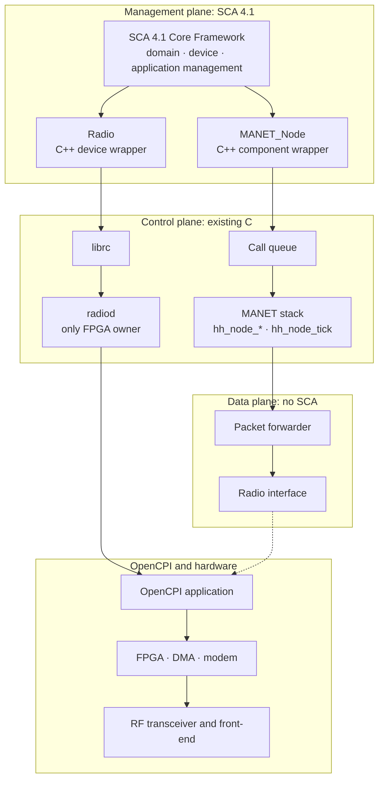

# SCA 4.1 Framework and Tooling Research

This document records the research into SCA 4.1 for HH-SDR: what SCA 4.1
requires, which frameworks and tools can provide it, how REDHAWK and GEON
Technologies based approaches compare, and how SCA 4.1 would fit the current
HH-SDR architecture.

## Contents

- [1. Summary](#1-summary)
- [2. SCA 4.1 compared with SCA 2.2.2](#2-sca-41-compared-with-sca-222)
- [3. Descriptor requirements](#3-descriptor-requirements)
- [4. Framework and tooling options](#4-framework-and-tooling-options)
- [5. GEON sca-jtnc assessment](#5-geon-sca-jtnc-assessment)
- [6. REDHAWK assessment](#6-redhawk-assessment)
- [7. Applicability to the current architecture](#7-applicability-to-the-current-architecture)
- [8. Integration approach](#8-integration-approach)
- [9. Readiness of the current codebase](#9-readiness-of-the-current-codebase)
- [10. Target platform considerations](#10-target-platform-considerations)
- [11. Ways to proceed](#11-ways-to-proceed)
- [12. Recommendation](#12-recommendation)
- [13. Open questions](#13-open-questions)
- [Appendix A. Evidence](#appendix-a-evidence)

## 1. Summary

| Question | Answer |
|---|---|
| Can HH-SDR adopt SCA 4.1? | Yes. The HH-SDR changes are small, because the MANET stack, `radiod` and the radio interface do not depend on any SCA version. |
| Can GEON `sca-jtnc` be the SCA 4.1 Core Framework? | No. It provides the SCA 4.1 interface definitions, schemas and base classes for components and devices, but not the Core Framework itself: no domain, device or application management, no deployment and no file services. |
| Can REDHAWK be used for SCA 4.1? | No. REDHAWK 2.2 is a complete framework, but for SCA 2.2.2, not SCA 4.1. |
| What blocks SCA 4.1? | Choosing a complete SCA 4.1 Core Framework. |
| What can be done now? | Framework-independent preparation: port interface definitions, SCA 4.1 property kinds and test interface in the SCA model, a node reconfiguration call, and an SCA 4.1 output in the descriptor generator. |
| Should the SCA 2.2.2 work be removed? | No. Most of it is version-neutral and reused under SCA 4.1. The small SCA 2.2.2-specific part should be frozen and retired only when its SCA 4.1 replacement passes tests. |

## 2. SCA 4.1 compared with SCA 2.2.2

The main differences that affect HH-SDR. Items marked *(verify)* must be
confirmed against the SCA 4.1 specification text, which was not reachable
during this research.

| Area | SCA 2.2.2 | SCA 4.1 | Effect on HH-SDR |
|---|---|---|---|
| Component base interface | `CF::Resource` with LifeCycle, PropertySet, PortSupplier, TestableObject | Separate interfaces combined into a base component: LifeCycle, ControllableInterface (start and stop), PropertySet, PortAccessor, TestableInterface, ComponentIdentifier | Adapter operations are renamed and regrouped |
| Ports | `getPort` per port | `connectUsesPorts`, `disconnectPorts`, `getProvidedPorts` in bulk | Port handling changes in the adapter |
| Test | `runTest(id, values)` | `runTest(id, values)` on TestableInterface; tests declared as `test` properties in the property file | Test ids become declared properties; the in-tree `runTest` needs a values parameter |
| Property kinds | configure, execparam, allocation, test, factoryparam | Property kinds revised *(verify exact set)* | Kind names in the SCA model and descriptors change |
| Profiles | One profile | Several profiles and optional units of functionality | The required profile must be chosen |
| Middleware | CORBA required | CORBA as the defined transfer mechanism, with provision for others *(verify)* | Decides whether a CORBA runtime must run on the radio |
| Components and devices | Resource and Device | Base component, base device, executable, loadable, aggregate, and component factories | Radio maps to a device; MANET node maps to a component |
| Descriptors | DTDs | DTDs and schemas for SCA 4.1 (Appendix D-1) | New descriptor set required |

## 3. Descriptor requirements

| Descriptor | Purpose | HH-SDR need | Current state |
|---|---|---|---|
| SPD (software package) | Describes a component's implementations and code | MANET_Node, Radio device, OpenCPI-derived components | SCA 2.2.2 SPD for MANET_Node, with x86_64 target values |
| SCD (component descriptor) | Interfaces and ports | MANET_Node, Radio device | SCA 2.2.2 SCD for MANET_Node; port interfaces are placeholders with no interface definition |
| PRF (properties) | Properties and kinds | MANET_Node (23 properties), Radio device | SCA 2.2.2 PRF for MANET_Node; property table exists in code |
| SAD (application assembly) | Components, connections, assembly controller | The HH-SDR application | Not written |
| DCD (device configuration) | Devices on a node | Radio device per node | Not written |
| DMD (domain manager) | Domain identity | One per domain | Not written; domain topology undecided |
| Platform and application deployment descriptors | Deployment in SCA 4.1 | If the chosen profile requires them *(verify)* | Not written |

Descriptor tooling:

| Tool | What it does | SCA version | Status |
|---|---|---|---|
| `ocpi2sca` (in-house) | Generates SPD, SCD and PRF from OpenCPI component metadata; validates against schemas | SCA 2.2.2 | Working first version; SCA 4.1 output needed |
| `sca-convert` (GEON) | Converts REDHAWK component projects to SCA 4.1 | REDHAWK to SCA 4.1 | SPD, SCD and PRF only; no SAD or DCD; needs REDHAWK installed |
| `sca-codegen` (GEON) | Generates C++ and Python component projects | SCA 4.1 (REDHAWK generator renamed) | Tooling only |
| SCA 4.1 schemas | Validation | SCA 4.1 | Available in `sca-jtnc` (`xml/dtd`, `xml/xsd`) |

## 4. Framework and tooling options

| Option | SCA version | Complete Core Framework? | ARM32 / Yocto | Maintained | Fit |
|---|---|---|---|---|---|
| GEON `sca-jtnc` | Partial SCA 4.1 | No | Yocto layer tested on rocko only; not on PetaLinux | Dormant since 2019 | Base classes and schemas only |
| REDHAWK 2.2 | SCA 2.2.2 | Yes | `meta-redhawk-sdr` has a thud branch (the Yocto release under PetaLinux 2019.2) | No active releases | Complete, but not SCA 4.1 |
| `sca-jtnc` plus in-house Core Framework | SCA 4.1 | After building domain, device and application management, deployment, file services and a parser | Port required | In-house | Large effort, high risk |
| Commercial SCA 4.1 Core Framework | SCA 4.1 | To be evaluated | To be evaluated | Vendor | Needs evaluation: coverage, ARM32 support, memory, licence, cost |
| No framework (current SCA-compatible design) | SCA-compatible, not conformant | No | Native | In-house | Works today; no deployment or interoperability |

## 5. GEON sca-jtnc assessment

`sca-jtnc` describes itself as an implementation of part of SCA 4.1. It is
derived from REDHAWK 2.2, with REDHAWK's control layer removed and its
interfaces moved to the SCA 4.1 definitions.

| Area | Status |
|---|---|
| SCA 4.1 interface definitions and schemas | Provided |
| Component base class: initialize, release, configure, query | Implemented |
| Component start and stop | Flag only |
| Port connection | Connect implemented; disconnect and provided-port query empty |
| Test interface | Empty |
| Device base class | Partial: capacity allocation always succeeds; operational state always enabled |
| Executable device | Partial: loads components as libraries into the device process |
| Loadable and programmable devices, FPGA load | Empty, or code generator templates only |
| Aggregate devices | Implemented |
| Domain manager, device manager, application factory, component factory | Not implemented (interface definitions only) |
| File services, installation, deployment | Not implemented |
| Descriptor parsing | Python only; the C++ parser is empty |
| Logging | Not implemented |
| Events | Python only |
| Launching components and devices | Python 2 sandbox only |
| Middleware | CORBA (omniORB); multi-threaded |
| Tests | Five Python 2 sandbox tests, one recorded as failing; no C++ tests; no CI |
| Yocto layer | Depends on `meta-redhawk-sdr`; tested on rocko; no PetaLinux support; licence field inconsistent |
| Maintenance | Last commit May 2019; no releases |

**Conclusion:** `sca-jtnc` is useful as a reference and as a source of the
SCA 4.1 interface definitions and schemas. It is not a Core Framework HH-SDR
can deploy on.

## 6. REDHAWK assessment

| Aspect | Finding |
|---|---|
| SCA version | REDHAWK 2.2 targets SCA 2.2.2, not SCA 4.1 |
| Core Framework | Complete: domain manager, device manager, application factory, node booter, general-purpose processor device |
| Middleware | CORBA (omniORB), multi-threaded |
| Memory | Measured on x86 CentOS 7: framework idle about 37 MiB PSS; about 8 MiB per C++ component; about 20 MiB per Python component |
| Embedded build | `meta-redhawk-sdr` has a thud branch with omniORB 4.2.3 and REDHAWK 2.2.3; no evidence of a PetaLinux build |
| Role for HH-SDR | An interim SCA 2.2.2 path if SCA 4.1 cannot be met; the base that `sca-jtnc` was derived from |

## 7. Applicability to the current architecture

| HH-SDR element | SCA 4.1 role | How it fits |
|---|---|---|
| MANET stack (`hh_node_*`) | Component (MANET_Node) | A thin C++ wrapper calls `hh_node_init`, `configure`, `start`, `stop` and `release`. The C stack is unchanged. |
| `hh_node_tick` control loop | Not an SCA element | Stays the single thread that runs the stack. SCA calls are queued and executed by this loop. |
| `radiod` and `librc` | Backing for the Radio device | A thin C++ Radio device is a `librc` client. It never opens OpenCPI itself. |
| `hh_radio_ops_t` | Not an SCA element | Stays the hardware seam below the device. |
| OpenCPI application | Not an SCA element | Owned only by `radiod`. The SCA programmable-device model is not used for the FPGA. |
| MANET data path | Not an SCA element | Stays in C. No CORBA, SCA transport or control socket in the fast path. |
| SCA model (`resource.c`) | Source of the property file and port list | Property ids, bindings and ports are reused; kinds and the test interface change. |
| BIT | Test interface | BIT checks can be exposed as SCA 4.1 test properties. |

Conflicts and how they are handled:

| Conflict | Handling |
|---|---|
| CORBA runs calls on its own threads; the MANET stack is single-threaded | CORBA threads only enqueue; the control loop executes |
| SCA device models load FPGA images; `radiod` is the only FPGA owner | Radio device is a client of `radiod`; FPGA loading stays in `radiod` |
| New dependencies (C++, CORBA runtime) against the project's no-dependency rule | Confined to the SCA wrapper processes; the MANET stack and `radiod` stay free of them |
| Memory on the target | Measure the chosen framework on the target before committing |

## 8. Integration approach

| Boundary | Rule |
|---|---|
| SCA boundary | Ends at the two C++ wrappers. Nothing below them uses CORBA. |
| Control boundary | SCA calls are queued and run by the existing control loop. The MANET fast path never waits on SCA. |
| Radio boundary | The Radio device reaches the radio only through `librc` and `radiod`. |
| OpenCPI boundary | Only `radiod` opens the OpenCPI application. |
| Data boundary | MANET traffic never passes through the SCA framework. |

Stages:

1. **Select the framework.** Evaluate complete SCA 4.1 Core Frameworks against
   the target (ARM32, PetaLinux, about 117 MB usable memory) and record the
   decision.
2. **Framework-independent preparation**, which can start now:
   - port interface definitions for MANET_Node and Radio;
   - SCA 4.1 property kinds and a test interface with values in the SCA model;
   - a node call for runtime reconfiguration;
   - an SCA 4.1 output in `ocpi2sca`, beside the SCA 2.2.2 one.
3. **Wrappers.** Build the MANET_Node component and the Radio device against
   the chosen framework, with the call queue.
4. **Descriptors.** SCA 4.1 SPD, SCD and PRF for both, plus DCD, SAD and DMD.
5. **Target.** Yocto recipes, PetaLinux image, boot order, memory and boot-time
   measurement.
6. **Retire SCA 2.2.2 artifacts** once their SCA 4.1 replacements pass tests.

## 9. Readiness of the current codebase

| Item | SCA 2.2.2 dependency | SCA 4.1 action |
|---|---|---|
| MANET stack, `radiod`, `librc`, radio interface | None | Keep unchanged |
| SCA model (`src/sca/resource.c`, `include/hhsdr/sca/resource.h`), 469 lines | About 70 lines: kind names, test interface shape | Modify |
| MANET_Node wrapper (REDHAWK branch): C adapter and 56 tests | Operation names | Reuse as the C side of the new wrapper |
| MANET_Node property file | SCA 2.2.2 document type and kinds | Modify |
| MANET_Node package and component descriptors | SCA 2.2.2 document type, interfaces, x86_64 target | Replace |
| `ocpi2sca` reader and model | None | Keep |
| `ocpi2sca` mapping and validation | Kinds, component interface, schema layer | Modify |
| `ocpi2sca` emitter and vendored schemas | SCA 2.2.2 | Replace, or keep beside a new SCA 4.1 emitter |
| SCA compatibility document | SCA 2.2.2 | Rewrite for the chosen target |

No branch has a build dependency on REDHAWK, CORBA or omniORB.

## 10. Target platform considerations

| Consideration | Finding |
|---|---|
| Processor | Zynq-7000, dual Cortex-A9, ARM32. No framework examined needs x86 or 64-bit. |
| Operating system | PetaLinux 2019.2 (Yocto thud). No framework examined has evidence of a PetaLinux build. |
| Memory | About 117 MB usable after the OpenCPI DMA reservation. A REDHAWK-class framework used about 37 MiB idle on x86. Target measurement is required. |
| Init system | BusyBox init. No framework examined requires systemd. |
| Python | `sca-jtnc` and REDHAWK tooling depend on Python 2. Runtime use of Python should be avoided on the target. |
| Boot time | Target 120 s. The framework adds start-up steps that must be measured. |

## 11. Ways to proceed

| Path | What it means | Effort | Risk | Choose when |
|---|---|---|---|---|
| **A. Adopt a commercial SCA 4.1 Core Framework** | Buy or license a complete framework; build the two HH-SDR wrappers on it | Medium | Medium: cost, licence, ARM32 support | A suitable framework runs on the target within the memory budget |
| **B. Build the Core Framework on `sca-jtnc`** | Write the missing domain, device and application management, deployment and parser on GEON's base classes | Very large | High: dormant base, Python 2, no PetaLinux evidence | No suitable framework exists and SCA 4.1 is mandatory |
| **C. Use REDHAWK 2.2 now, move to SCA 4.1 later** | Deploy with a complete SCA 2.2.2 framework; keep the design version-neutral for a later SCA 4.1 move | Medium | Medium: two migrations; SCA 2.2.2 only | A working SCA domain is needed soon and SCA 4.1 can wait |
| **D. Stay SCA-compatible without a framework** | Keep the current in-process SCA model; do only the framework-independent preparation | Small | Low now; defers the decision | SCA 4.1 conformance is not yet a firm requirement |

All four paths share the framework-independent preparation in
[section 8](#8-integration-approach), stage 2, so it can start now whatever is
chosen.

## 12. Recommendation

1. **Target SCA 4.1**, with a staged migration.
2. **Do not use `sca-jtnc` as the Core Framework.** Use its SCA 4.1 interface
   definitions and schemas as references.
3. **Make the Core Framework selection the first task.** Evaluate complete
   SCA 4.1 Core Frameworks for ARM32 PetaLinux and the memory budget.
4. **Start the framework-independent preparation now** (section 8, stage 2).
5. **Keep the existing SCA work.** Freeze the SCA 2.2.2 descriptors and retire
   them only after their SCA 4.1 replacements pass tests.
6. **Keep SCA out of the fast path and away from the FPGA.** CORBA calls are
   queued into the control loop; `radiod` stays the only FPGA owner.

If no complete SCA 4.1 Core Framework fits the target, the choice is between
building the missing control layer on `sca-jtnc` (large effort, high risk) and
staying on SCA 2.2.2 with REDHAWK for now. That is a cost and schedule
decision.

## 13. Open questions

**Decisions for the project:**

| # | Question |
|---|---|
| 1 | Which SCA 4.1 profile and units of functionality are required? |
| 2 | Is formal SCA 4.1 compliance testing required, or compatibility only? |
| 3 | Which SCA 4.1 Core Framework will be used? |
| 4 | One SCA domain per node, or one across the mesh? |
| 5 | Is CORBA acceptable on the radio, or is another transfer mechanism required? |
| 6 | What memory budget can the SCA framework have? |

**Questions for GEON Technologies:**

| # | Question |
|---|---|
| 1 | Is `sca-jtnc` maintained, and is there a newer version with domain, device and application management? |
| 2 | Which SCA 4.1 profile was it written for, and was compliance testing attempted? |
| 3 | What launched devices and components outside the Python sandbox? |
| 4 | Has it run on Zynq-7000 ARM32, on which Yocto release, and with what memory use? |
| 5 | Has `meta-sca-jtnc` been used with PetaLinux? |
| 6 | Which licence applies: the GPL-3.0 in the recipe or the LGPL-3.0 in the code? |
| 7 | Was FPGA loading ever implemented against a real loader? |
| 8 | Is there a Python 3 version, or a plan to remove Python from the runtime? |
| 9 | Does GEON offer a newer or commercial SCA 4.1 Core Framework, and what are its profile, memory use and ARM support? |

## Appendix A. Evidence

`sca-jtnc` at commit `9059fc2` (May 2019); `meta-sca-jtnc` at `5eef057`.

| Finding | Location |
|---|---|
| Implements part of SCA 4.1 | `sca-jtnc/README.md:2` |
| C++ descriptor parser is empty | `sca-jtnc/base/parser/stub.cpp` |
| Capacity allocation always succeeds; operational state constant | `sca-jtnc/base/framework/DeviceComponent.cpp:158-167` |
| Test, disconnect and provided-port operations empty | `sca-jtnc/base/framework/ResourceComponent.cpp:327-334` |
| Load, unload and terminate empty | `sca-jtnc/base/framework/DeviceComponent.cpp:509-522` |
| FPGA load stub in the programmable-device template | `sca-jtnc/.../programmable/templates/programmable_base.h:739-776` |
| omniORB and Python 2 required | `sca-jtnc/configure.ac:87-114,218-227` |
| Yocto layer tested on rocko only; no compatibility declaration | `meta-sca-jtnc/README.md:4`; `meta-sca-jtnc/conf/layer.conf` |
| Recipe licence and compiler flags | `meta-sca-jtnc/recipes-core/sca-jtnc/sca-jtnc_4.1.0.bb:22,97` |
| HH-SDR SCA model | `src/sca/resource.c`, `include/hhsdr/sca/resource.h` |
| HH-SDR node lifecycle | `include/hhsdr/manet/node.h:66-85` |
| MANET_Node SCA 2.2.2 descriptors and adapter | branch `feature/redhawk-sca-integration`, `sca/MANET_Node/` |
| REDHAWK memory measurement | `docs/CF-RAM-MEASUREMENT.md` |
| Full assessment | `temp/SCA41-SCA-JTNC-ASSESSMENT.md` |
