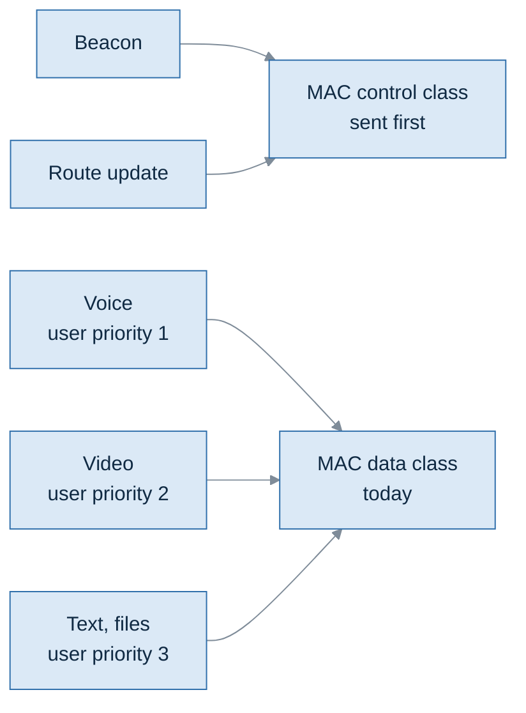

# HH-SDR December Demonstration Traffic Profile

| Item | Value |
|---|---|
| Version | 1.0 |
| Date | 2026-10-07 |
| Task | F01-AK-4 |
| Status | Draft |

## Revision history

| Version | Date | Change |
|---|---|---|
| 1.0 | 2026-10-07 | First issue |

## Contents

- [HH-SDR December Demonstration Traffic Profile](#hh-sdr-december-demonstration-traffic-profile)
  - [Revision history](#revision-history)
  - [Contents](#contents)
  - [1. Purpose](#1-purpose)
  - [2. Known inputs](#2-known-inputs)
  - [3. Traffic profile sheet](#3-traffic-profile-sheet)
    - [3.1 Proposed beacon fields](#31-proposed-beacon-fields)
    - [3.2 Proposed route update fields](#32-proposed-route-update-fields)
  - [4. Network control traffic](#4-network-control-traffic)
  - [5. Voice](#5-voice)
  - [6. Video](#6-video)
  - [7. Data](#7-data)
  - [8. Priority classes](#8-priority-classes)
  - [9. Worked link-load examples](#9-worked-link-load-examples)
    - [9.1 One voice call, by candidate rate](#91-one-voice-call-by-candidate-rate)
    - [9.2 Four nodes](#92-four-nodes)
    - [9.3 Voice delay, one hop and three hops](#93-voice-delay-one-hop-and-three-hops)
  - [10. To raise at the 11:00 blocker call](#10-to-raise-at-the-1100-blocker-call)
  - [11. Open items](#11-open-items)

## 1. Purpose

This sheet defines each type of traffic the December demonstration carries:
its rate, its packet size, its latency need and its priority class.

Routing, MAC slots and the link budget are sized from these numbers. Where a
number is not known yet, this sheet says so, marks it **TBD** with an open
item (OI-n, section 11), and does not fill it in.

Section 9 shows worked examples of link load. They are there to show how much
each open choice matters. They are **examples, not decisions**.

## 2. Known inputs

| Input | Value | Status |
|---|---|---|
| Nodes in the demonstration | 4 | Given for F01 |
| Traffic priority | Audio > Video > Data | Given for F01 |
| Voice coding | A vocoder. The target design names MELPe, fed with 8 kHz PCM audio | Vocoder type and rate TBD (OI-1) |
| Data message types | Text / chat messages, and file or image transfer | Given for F01 |
| Network frame | Kind (beacon, routing, data), source, destination, payload up to 512 bytes | Fixed |
| MAC priority classes | Two: control (beacon, routing) before data | Fixed |
| MAC timing | 1 ms slot (one hop). 20 ms frame and 1 s superframe are candidates | Slot fixed. Frame and superframe candidate |
| Current waveform | Point-to-point FDD QPSK, continuous transmit, fixed 280-byte frames, 15.36 Mbit/s, no MAC | Fact about today's waveform |
| Waveform for the MAC | Half-duplex burst mode. Burst rate and maximum PDU size not yet known | TBD (OI-9) |
| Network layer collection interval | About every 10 ms | Fixed |

**Link rate check (required before starting).** The only known link rate is
the 15.36 Mbit/s of today's continuous, point-to-point waveform. The MAC needs
a burst-mode waveform whose rate and PDU size are not known (OI-9). This is
raised at the 11:00 call (section 10). The examples in section 9 use
15.36 Mbit/s and the 280-byte frame only as placeholders.

## 3. Traffic profile sheet

| Traffic type | Rate | Packet size | Latency need | Priority | How the values are defined |
|---|---|---|---|---|---|
| Network control: beacon | 1 every 200 ms while acquiring, 1 every 1000 ms in steady state | Proposed: 48 bytes | TBD (OI-4) | Control, ahead of all user traffic in the MAC today | Interval: fixed by the network layer timers. Size: proposed, from the beacon fields in table 3.1 |
| Network control: route update | Proposed: 1 to each neighbour every 1000 ms, plus extra updates when a link changes | Proposed: 5 bytes + 11 bytes per route entry. Up to 27 bytes with 4 nodes | TBD (OI-4) | Control | Proposed, from the route update fields in table 3.2 |
| Voice | TBD (OI-1). Candidate rates in section 5 | TBD (OI-1, OI-2) | TBD (OI-4) | Audio: first among user traffic | Set by the vocoder standard once a vocoder and rate are chosen. Example: MELPe 2400 sends 54 bits (7 bytes) every 22.5 ms |
| Video | TBD (OI-5) | TBD (OI-5) | TBD (OI-4) | Video: second among user traffic | Not defined by any source yet. Comes from what the demonstration must show |
| Data: text / chat | TBD (OI-6) | TBD (OI-6). One network frame carries up to 512 bytes | TBD (OI-4) | Data: third among user traffic | Not defined by any source yet. Comes from what the demonstration must show |
| Data: file or image | TBD (OI-7) | TBD (OI-7). Larger than one network frame in general; how it is split is TBD (OI-8) | TBD (OI-4) | Data: third among user traffic | Not defined by any source yet. Comes from what the demonstration must show |

Packet sizes in this sheet are the payload the network layer hands down. The
headers added below it (transport headers if any, and the MAC header) are not
known yet (OI-8) and are not included unless an example says so. The real
on-air size of every packet is therefore larger than shown.

### 3.1 Proposed beacon fields

Every node broadcasts a beacon so that its neighbours learn it is in range.
The proposed layout has a fixed length, so every beacon is the same size.

| Field | Bytes | Purpose |
|---|---|---|
| Node id | 4 | Who sent the beacon |
| Protocol version | 2 | Lets the format change later without confusion |
| Sequence number | 4 | Detects lost and repeated beacons |
| Timestamp | 8 | When the beacon was sent |
| Capabilities | 4 | What the node can do |
| Radio capabilities | 4 | What the node's radio can do |
| Supported waveforms | 4 | Which waveforms the node can use |
| Channel frequency | 4 | The frequency the node is on |
| Flags | 1 | Whether the node routes, and whether position and battery are valid |
| Position x, y, z | 6 | Location, if known |
| Battery | 2 | Battery level, if known |
| Reserved | 1 | Spare |
| **Fields total** | **44** | |
| Padding | 4 | Brings the beacon to its fixed length |
| **Beacon total** | **48** | |

### 3.2 Proposed route update fields

Each node tells each neighbour which destinations it can reach and how well.
One update goes to each neighbour, because what a node may tell neighbour A
differs from what it may tell neighbour B. An update never describes the
neighbour it is sent to.

| Part | Field | Bytes |
|---|---|---|
| Header | Sender id | 4 |
| Header | Number of entries | 1 |
| Each entry | Destination id | 4 |
| Each entry | Sequence number | 4 |
| Each entry | Hop count | 1 |
| Each entry | Link quality | 2 |

Size of one update: 5 bytes + 11 bytes per entry.

With 4 nodes, a node knows at most 3 destinations. The update to a neighbour
leaves that neighbour out, so it carries at most 2 entries:
5 + 2 × 11 = **27 bytes**.

## 4. Network control traffic

Beacons and route updates keep the mesh running. They are carried by every
node whether or not users are talking.

| Item | Value | Status |
|---|---|---|
| Beacon size | 48 bytes | Current implementation value. Final on-air size depends on the MAC header (OI-8) |
| Beacon interval | 200 ms while acquiring, 1000 ms in steady state | Fixed |
| Route update size | 5 bytes + 11 bytes per route entry | Current implementation value |
| Route update size with 4 nodes | Up to 27 bytes. An update carries one entry per known destination except the neighbour it is sent to, so at most 2 entries | Example from the 4-node demonstration |
| Route update interval | One update to each neighbour every 1000 ms, plus extra updates when a link changes | Current implementation value |
| Neighbours per node with 4 nodes | Up to 3 (every node hears every other) | Example worst case |
| Load per node, steady state | 48 + 3 × 27 = 129 bytes/s, about 1.0 kbit/s, 4 PDUs per second | Example, 3 neighbours |
| Load per node, acquiring | 5 × 48 + 3 × 27 = 321 bytes/s, about 2.6 kbit/s, 8 PDUs per second | Example, 3 neighbours |

Control load is small in bits but each frame needs its own slot, so it is
counted in PDUs per second in section 9.

## 5. Voice

Voice is carried by a vocoder. Which vocoder rate is used is an open decision
(OI-1). The target design names MELPe. Its three standard rates are listed
here as the candidates, so their effect can be compared:

| Candidate | Bit rate | Vocoder frame time | Bits per frame | Bytes per frame (packed alone) |
|---|---|---|---|---|
| MELPe 2400 | 2400 bit/s | 22.5 ms | 54 | 7 |
| MELPe 1200 | 1200 bit/s | 67.5 ms | 81 | 11 |
| MELPe 600 | 600 bit/s | 90 ms | 54 | 7 |

Two further choices change the voice load and delay:

- **Frames per packet (OI-2).** Putting several vocoder frames in one packet
  saves headers and slots but adds delay: the first frame waits for the last.
- **Simultaneous calls (OI-3).** How many talkers the demonstration has at the
  same time is not known.

Voice priority: first among user traffic (given). Latency need: TBD (OI-4).

## 6. Video

Not known yet. Whether video is part of the December demonstration, and its
codec, resolution, frame rate and bit rate, are all TBD (OI-5).

Video priority, if it is carried: second among user traffic (given).

## 7. Data

Two kinds of data are carried:

| Kind | Message size | Rate | Latency need | Status |
|---|---|---|---|---|
| Text / chat | TBD | TBD | TBD | OI-6, OI-4 |
| File or image transfer | TBD | TBD | TBD | OI-7, OI-4 |

Data priority: third among user traffic (given).

One network frame carries at most 512 bytes of payload. A file or image
larger than that must be split into several frames. Who splits it and how is
not decided (OI-8).

## 8. Priority classes

The given order for user traffic is **Audio > Video > Data**. The MAC today has
two classes: control (beacons and route updates) is always sent before data.

| Traffic | User priority | MAC class today | Open question |
|---|---|---|---|
| Beacon, route update | Not a user class | Control | Order against voice: OI-10 |
| Voice | 1 | Data | Needs its own class to be served before video and data: OI-10 |
| Video | 2 | Data | As above: OI-10 |
| Text / chat, file or image | 3 | Data | None |

What this means: with only two MAC classes, voice, video and data share one
queue, and the MAC cannot put voice ahead of a file transfer. Giving the
Audio > Video > Data order effect in the MAC needs more classes, and how a
packet is marked with its class is not defined (OI-10).

## 9. Worked link-load examples

**These are examples, not decisions.** They use placeholder values where the
real ones are open, and each placeholder is named.

Placeholders used:

- Link: 15.36 Mbit/s and a PDU of up to 280 bytes, from today's waveform
  (real values OI-9).
- MAC: 20 ms frame (candidate), each node owning **one slot per frame**. One
  slot per node is only one possible allocation; how slots are allocated is
  not decided. With one slot per frame a node has 50 transmit chances per
  second.
- Headers: either none, or 40 bytes for RTP, UDP and IPv4 together, to show
  their weight (real headers OI-8). The MAC header is not included (OI-8).

### 9.1 One voice call, by candidate rate

| Candidate | Frames per packet | Packet interval | Vocoder bytes per packet | Bit rate, no headers | Bit rate, with 40-byte headers | Slots used per second | Share of one node's 50 slots |
|---|---|---|---|---|---|---|---|
| MELPe 2400 | 1 | 22.5 ms | 7 | 2.5 kbit/s | 16.7 kbit/s | 44.4 | 89 % |
| MELPe 2400 | 4 | 90 ms | 27 | 2.4 kbit/s | 6.0 kbit/s | 11.1 | 22 % |
| MELPe 1200 | 1 | 67.5 ms | 11 | 1.3 kbit/s | 6.0 kbit/s | 14.8 | 30 % |
| MELPe 600 | 1 | 90 ms | 7 | 0.6 kbit/s | 4.2 kbit/s | 11.1 | 22 % |

What it shows:

- In bits, every candidate is tiny against the link rate. The limit is
  **slots**, not bits: every packet needs a transmit chance.
- MELPe 2400 with one frame per packet would take almost all of one node's
  slots, leaving little room for beacons, route updates and data.
- Packing frames, or a lower rate, cuts slot use to about a quarter, at the
  cost of delay (9.3).

### 9.2 Four nodes

| Item | Example value |
|---|---|
| Slots used by owners, one slot per node | 4 of 20 per frame |
| Capacity of one owned slot | 280 bytes every 20 ms = 112 kbit/s per node |
| Control load per node, steady state | Up to 4 PDUs per second (section 4) |
| Control load per node, acquiring | Up to 8 PDUs per second (section 4) |
| Relaying | A node that relays a call spends its own slots on it as well. On a 4-node chain (3 hops), one call uses slots at 3 nodes |

### 9.3 Voice delay, one hop and three hops

Only the parts that follow from the numbers above are counted. Vocoder
processing time, the jitter buffer and the time to move a PDU from software to
logic are not known and are left out, so real delay is higher.

| Candidate, frames per packet | Packet fill time | MAC wait, up to one frame per hop | One hop | Three hops |
|---|---|---|---|---|
| MELPe 2400, 1 | 22.5 ms | 20 ms | up to 42.5 ms | up to 82.5 ms |
| MELPe 2400, 4 | 90 ms | 20 ms | up to 110 ms | up to 150 ms |
| MELPe 1200, 1 | 67.5 ms | 20 ms | up to 87.5 ms | up to 127.5 ms |
| MELPe 600, 1 | 90 ms | 20 ms | up to 110 ms | up to 150 ms |

Whether these delays are acceptable depends on the voice latency target,
which is TBD (OI-4).

## 10. To raise at the 11:00 blocker call

| Missing input | Why it blocks the sheet | Item |
|---|---|---|
| Burst-mode link rate and maximum PDU size | Every slot and capacity figure depends on it | OI-9 |
| Vocoder rate and frame size | Sets the voice rate and packet size | OI-1 |
| Number of simultaneous voice calls | Sets total voice load | OI-3 |
| Latency targets for voice, video and data | Sets frames per packet and how many hops are acceptable | OI-4 |
| Video in or out of the demonstration, and its parameters | Video could be the largest load by far | OI-5 |
| Text and file sizes and rates | Sets data load | OI-6, OI-7 |

## 11. Open items

| Id | Item | Proposed owner |
|---|---|---|
| OI-1 | Vocoder and rate: which vocoder, which rate, frame time and bits per frame | System |
| OI-2 | Voice packetisation: vocoder frames per packet | Network and software |
| OI-3 | Number of simultaneous voice calls in the demonstration | System |
| OI-4 | Latency need for each traffic type: voice, video, text / chat, file or image, and network control | System |
| OI-5 | Video: in or out of the demonstration; if in, codec, resolution, frame rate and bit rate | System |
| OI-6 | Text / chat: message size and rate | System |
| OI-7 | File or image transfer: size and rate | System |
| OI-8 | Headers below the network payload (transport and MAC header), and how a file larger than one network frame is split | Network and logic |
| OI-9 | Burst-mode waveform: link rate and maximum PDU size | Logic |
| OI-10 | Priority classes in the MAC: whether voice and video get their own classes, where network control sits against voice, and how each packet is marked with its class | Network and software |
