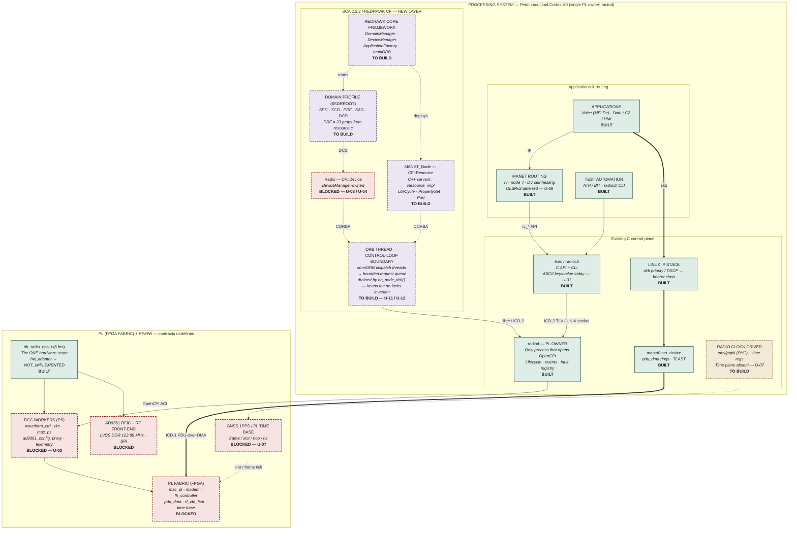

# HH-SDR + REDHAWK SCA 2.2.2 — integration architecture

Companion to `hh-sdr-redhawk-sca-bd.drawio` (OSL-628-BD-102, concept). Same
content, Mermaid form, for viewing inline on GitHub or in an editor preview.

Derived from the architecture baseline (OSL-628-BD-101 Rev 00) plus what is
actually on `main`. Blocks are marked **BUILT**, **TO BUILD** or **BLOCKED**;
BLOCKED items name the `unknown.md` U-number they wait on. Nothing unspecified
is invented.

## Placement decision

REDHAWK sits **above** radiod. The Core Framework reaches hardware only through
`librc` / ICD-2, so Note 1 of the baseline drawing — *"only radiod opens
OpenCPI. Never a second ACI instance"* — is preserved. The CF becomes another
control-plane client alongside `radioctl`, not a second owner of the PL.



## Line meanings

| Style | Plane |
|---|---|
| solid arrow | control — `rc_*` / ICD-2 / properties |
| dotted arrow | CORBA / GIOP — SCA control (**new**) |
| thick arrow | data — PDU / skb / DMA |
| dotted (time) | time — 1PPS / PHC |

## What the diagram asserts, and why

**The ORB boundary is drawn as its own block deliberately.** REDHAWK's ORB is
threaded: CORBA calls arrive on omniORB dispatch threads. This codebase has zero
`pthread` and a documented single-threaded, no-locks invariant, and
`hh_node_tick()` runs a 10 ms control loop. Those two facts collide. The block
names the resolution: ORB threads enqueue, the control loop drains, so every
call into `hh_node_*` still happens on one thread and the invariant holds. The
one lock lives in the servant, at the boundary, not inside the MANET stack.

**`Radio — CF::Device` is BLOCKED, not TO BUILD.** A Device wrapping real
hardware needs the PL contract (U-03/U-04). A Device wrapping the *mock* is
legitimate and would exercise the DCD/DeviceManager path without inventing a
register map.

**The PRF is not new work.** All 23 properties already exist in
`src/sca/resource.c` with stable ids, `configure`/`execparam`/`allocation`
kinds, and bindings to real `hh_config_t` keys.

## Open decisions this diagram does not settle

1. **Domain topology.** SCA assumes one domain per platform; this is a *mesh* of
   N self-healing nodes. One domain per node, or one spanning the mesh? The
   latter puts CORBA on the RF link and couples node survival to a remote
   DomainManager, which contradicts the self-healing premise. The sheet draws
   one node.
2. **Footprint.** DomainManager + DeviceManager + omniORB per node on a Zynq PS
   is unmeasured, and is the feasibility question for the whole approach.

## Regenerating

```bash
python3 docs/diagrams/build_redhawk_bd.py docs/diagrams/hh-sdr-redhawk-sca-bd.drawio
```

Edit the `CARDS`, `BANNERS` and `EDGES` tables at the top of that script; every
connector is placed by the obstacle-avoiding router, so nothing needs hand
routing. The authoritative render is draw.io itself (**File ▸ Export As**); the
checked-in PNG is a QC preview.
